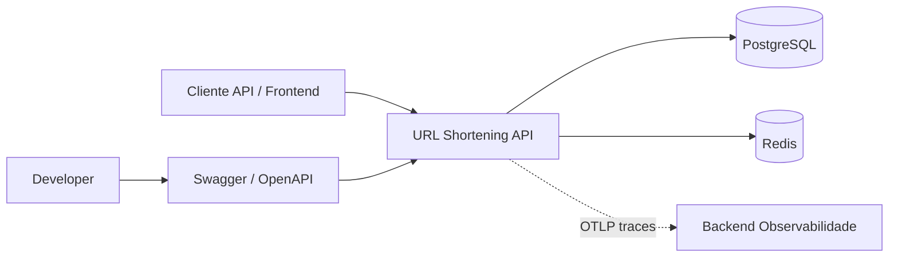
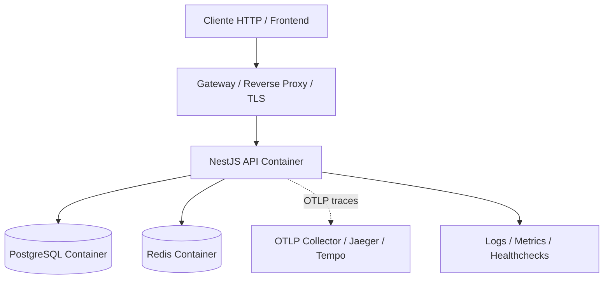
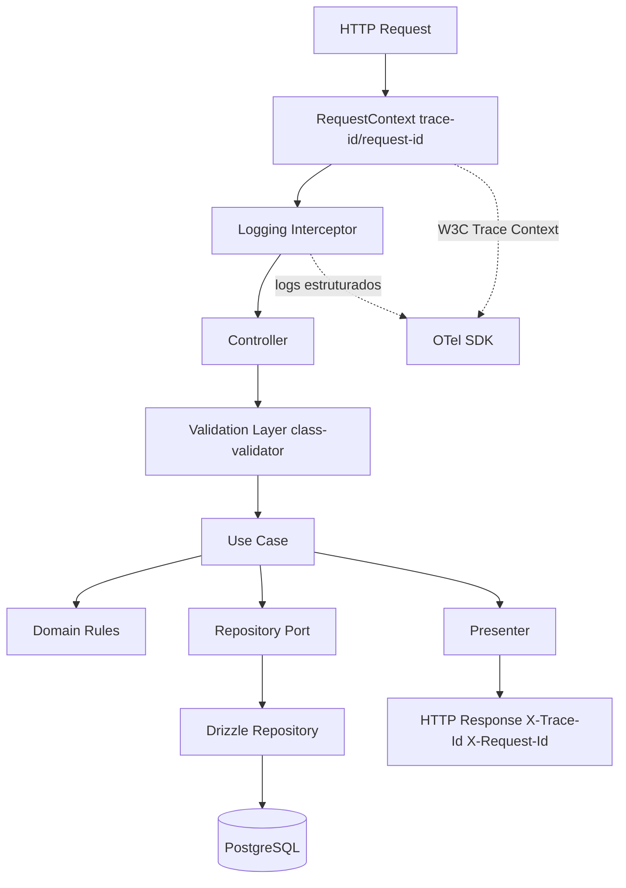
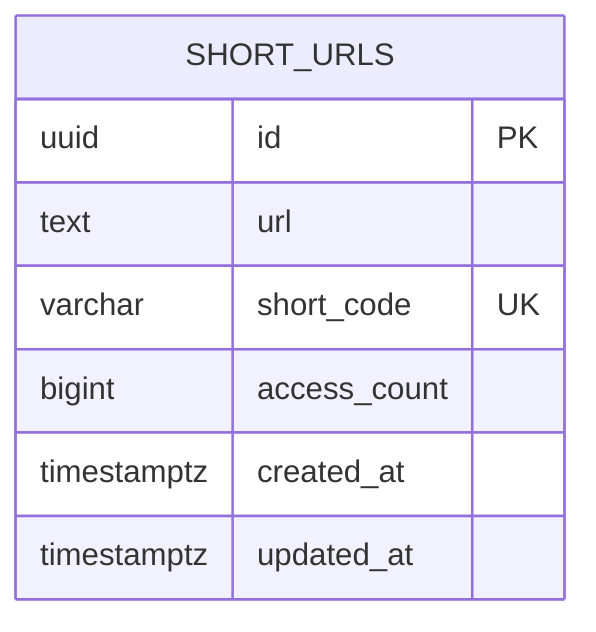

  


<br/>

API REST de encurtamento de URLs. Permite criar, consultar, atualizar e remover URLs curtas, além de consultar estatísticas de acesso. 
Arquitetura orientada por domínio, tipagem estrita, validação na borda HTTP com **class-validator** e **class-transformer** (ValidationPipe global), parâmetro `shortCode` com pipe dedicado, e alto foco em segurança, escalabilidade e qualidade guiada por **TDD (Test-Driven Development)**.

## Stack

- Node.js 20+
- TypeScript (strict mode)
- NestJS
- PostgreSQL
- Drizzle ORM
- class-validator / class-transformer
- Swagger/OpenAPI
- Docker Compose
- Redis

## Requisitos

### Funcionais
- Criar short URL
- Obter URL original por short code
- Atualizar short URL
- Deletar short URL
- Consultar estatísticas de acesso

### Não funcionais
- Rate limit: 12 req/min por IP em POST /shorten e GET /shorten/:shortCode (Throttler + Redis)
- Cache Redis para consultas por shortCode; invalidação em PUT e DELETE
- Validação com DTOs (class-validator); ValidationPipe global (`transform`, `whitelist`); `shortCode` validado por pipe dedicado
- Throttler distribuído via Redis (contador compartilhado entre instâncias)

### Análise técnica de capacidade
Com a arquitetura proposta utilizando PostgreSQL, o limite seguro de armazenamento comporta até 1,75 milhão de registros (3 KB/linha), o que representa aproximadamente 958 inserções por dia ao longo de 5 anos. A partir deste horizonte, recomenda-se adotar uma das seguintes abordagens:

- Migrar para um banco com escala horizontal (MongoDB Cluster, Cassandra, DynamoDB, PostgresSQL sharding - Citus)
- Implementar expiração automática de registros por inatividade (sem cliques registrados), seguindo uma política em camadas:
  - **1 ano** — registros de uso pontual ou campanhas curtas
  - **2 anos** — cobre bem campanhas recorrentes e QR codes em materiais impressos
  - **3 anos** *(recomendado como padrão)* — limiar seguro para itens "quase permanentes", equilibrando retenção útil e limpeza de base
- Remover registros antigos periodicamente via job agendado
- Particionar a tabela por data (table partitioning nativo do PostgreSQL)
- Arquivar registros frios em armazenamento barato (S3 + Athena)

### Detalhes críticos (evitar dor de cabeça)
- **Proxy**: Se a API estiver atrás de proxy (nginx, load balancer), configurar `trust proxy` no adapter HTTP para que o IP real venha de `X-Forwarded-For`. Sem isso, todos os clientes são vistos como o mesmo IP (o do proxy) e o rate limit não funciona por usuário.
- **Redis para rate limit**: Se Redis cair, o Throttler pode degradar; cache retorna miss e vai ao DB.

### Regras de negócio

**Aplicadas no código**
- URL válida (formato URI) em POST e PUT; validação em DTOs
- ShortCode único: gerado por ID sequencial (Redis INCR) + Base62; constraint UNIQUE no banco
- ShortCode 4-8 caracteres, apenas alfanuméricos; validado em parâmetros
- Idempotência em POST: mesma URL retorna shortCode existente (201)
- accessCount nunca negativo (check constraint); incremento atômico no DB
- Cache invalidado em PUT e DELETE

**Não aplicadas (podem causar dúvidas)**
- URL não é normalizada: `https://example.com`, `https://example.com/` e `https://www.example.com` são tratadas como distintas
- Sem autenticação: qualquer um pode criar, editar e deletar qualquer shortCode

**Melhorias de requisitos (a implementar)**
- Normalização de URL antes de criar/atualizar
- Autenticação/autorização para operações de escrita (PUT, DELETE)
- Performance: avaliar migração do adapter HTTP de Express para Fastify para melhor throughput sob alta carga

## Arquitetura e Soluções

O projeto foi desenhado buscando uma forte consistência estrutural. Abaixo detalhamos a modelagem através da visão de Contexto, Container, Componentes e Fluxo Interno.

### 1. Diagrama de Contexto


### 2. Diagrama de Container


### 3. Diagrama de Componente (Módulo: `short-url`)

```mermaid
flowchart LR
    RequestContext[RequestContextInterceptor]
    Logging[LoggingInterceptor]
    Controller[Controllers]
    Throttler[ThrottlerGuard]
    DtoValidation[ValidationPipe + DTOs e ShortCodeParamPipe]
    UseCases[Use Cases]
    Generator[ShortCodeGeneratorService]
    RepoPort[ShortUrlRepository Port]
    CachedRepo[CachedShortUrlRepository]
    DrizzleRepo[DrizzleShortUrlRepository]
    Redis[(Redis)]
    Mapper[Persistence Mapper]
    DrizzleSchema[Drizzle Schema]
    Postgres[(PostgreSQL)]
    Presenter[Presenters]
    OTel[OpenTelemetry SDK]

    Throttler --> RequestContext
    RequestContext --> Logging
    Logging --> Controller
    Controller --> DtoValidation
    DtoValidation --> UseCases
    UseCases --> Generator
    UseCases --> RepoPort
    RepoPort --> CachedRepo
    CachedRepo --> Redis
    CachedRepo --> DrizzleRepo
    DrizzleRepo --> Mapper
    DrizzleRepo --> DrizzleSchema
    DrizzleSchema --> Postgres
    UseCases --> Presenter
    RequestContext -.->|trace-id| OTel
    Logging -.->|correlacao| OTel
```


### 4. Fluxo Interno da Aplicação (Code Diagram)


Ordem real no NestJS (resumo): middleware, **guards** (por exemplo `SecurityInputGuard`, `ThrottlerGuard`), interceptors de pré-execução, **pipes** (`ValidationPipe` global e pipe de `shortCode`), e então o método do controller. O fluxograma acima é uma visão lógica simplificada, não a sequência exata.

## Modelo de Dados (ER)
Estrutura simples e objetiva em uma única tabela para suprir a necessidade de rastreio de URLs curtas e cliques totais.


## Escalabilidade e Segurança

O projeto adotou as seguintes práticas visando controle de concorrência massiva e proteção superficial de ataques comuns:

### Escalabilidade
- **Stateless API:** A API baseada em NestJS não retém estado na sua infraestrutura, os controles e cachês em requisições intensas são deslocados para serviços externos como o Redis, permitindo instanciar "N" réplicas no provisionamento cloud via Load Balancer.
- **Throttling Distribuído e Cache:** O Rate Limit utiliza o Redis como storage permitindo que o limite de bloqueio por IP ou chaves customizadas seja globalizado em todas as instâncias da API.
- **Isolamento e Índices do Banco:** A criação do índice simples e das constraints de integridade no banco delegam do motor NodeJS a responsabilidade de travar acessos concorrentes para criar nomes (short codes) já existentes.

### Segurança
- **Proteção do Endpoint e Headers:** A biblioteca `Helmet` embutida garante proteções contra Clickjacking (X-Frame-Options), restrições MIME e Sniffing de conteúdo, enquanto mantemos o `x-powered-by` oculto para ofuscar o Stack técnico utilizado. As regras de CORS são rigorosas para bloquear requests não autorizados num front-end externo.
- **Segurança Intransigente de Entrada:** Um Guard global inspeciona `body`, `params`, `query` e headers customizados e rejeita com `HTTP 400` qualquer payload suspeito. Cobertura: XSS (incluindo bypass por encoding URL e entidades HTML), data: URI perigosos (`text/html`, `text/javascript`, `image/svg+xml`), SQLi como defesa em profundidade. Headers padrao (Authorization, Content-Type, etc.) sao ignorados para reduzir falsos positivos.
- **Validação de contrato (DTOs):** O ValidationPipe global aplica class-validator nos bodies tipados; o parâmetro `shortCode` usa pipe dedicado com as mesmas regras de domínio antes dos Use Cases. O SecurityInputGuard permanece apenas como política transversal de rejeição de padrões perigosos (ordem: guard antes dos pipes).
- **Query Builds Seguras e Tratamento Drizzle:** Proteção contra SQL injections nativamente implementadas no uso restrito dos Query Builders. Não utilizamos concatenações abertas para evitar execução indevida. O Drizzle mapeia apenas tabelas autorizadas na memória e oculta relatórios de erro do DB.

## Observabilidade (compliance e rastreabilidade)

A observabilidade foi pensada desde o início: instrumentar cedo evita retrabalho quando compliance ou escala exigirem rastreabilidade completa. A escolha por OpenTelemetry (padrão CNCF) garante portabilidade - não ficamos presos a um fornecedor.

**Por que OpenTelemetry**
- Padrão aberto, sem lock-in; instrumentação pronta para qualquer consumidor OTLP.
- Decisão de backend (SaaS vs self-hosted) pode ser tomada depois, com base em custo e política de dados.

**Realidade da persistência**

| Cenário | Valor |
|---------|-------|
| Sem backend OTLP e sem agregação de logs | Limitado: correlação apenas durante a vida do request |
| Sem backend OTLP, com agregação de logs (CloudWatch, Loki, etc.) | Médio: logs com request-id permitem busca e correlação |
| Com backend OTLP configurado | Completo: traces persistidos, rastreabilidade ponta a ponta |

A instrumentação é carregada via `-r ./dist/instrumentation.js` antes do bootstrap NestJS (`start:prod`). O valor pleno depende de conectar um consumidor (OTLP ou agregação de logs).

**Consumidores compatíveis** (via OTLP): OpenTelemetry Collector, Jaeger, Grafana Tempo; SaaS: Datadog, Honeycomb, New Relic, SigNoz. Basta configurar `OTEL_EXPORTER_OTLP_ENDPOINT`.

**Detalhes técnicos**
- **Correlação**: trace-id (W3C) e request-id em logs estruturados e headers de resposta (`X-Trace-Id`, `X-Request-Id`).
- **Eventos auditáveis**: criação, atualização, exclusão e acesso a short URLs; erros HTTP 4xx/5xx. A auditoria é feita via correlação de logs estruturados (method, path, statusCode) e traces automáticos.
- **Governança**: mascaramento de dados sensíveis via `LOG_REDACT_SENSITIVE`; retenção e acesso definidos pelo backend de telemetria (SaaS ou self-hosted).
- **Variáveis opcionais**: `OTEL_SERVICE_NAME`, `OTEL_EXPORTER_OTLP_ENDPOINT`, `OTEL_TRACES_EXPORTER` (none para desabilitar).

## Estrutura do projeto

```
src/
  modules/short-url/     # Domínio short-url
    domain/              # Entidades, value objects, erros
    application/         # Use cases, serviços de aplicação
    infra/               # Repositórios (Drizzle)
    http/                # Controller, contracts, presenter
  shared/                # Base HTTP, contratos, pipes, interceptors
  config/                # Configuração e validação de env
  infra/                 # Database, migrations
```

Organização por feature/domínio. Regras de negócio nos use cases; controller apenas orquestra. Acesso a dados via repositório.

## Pré-requisitos

- Docker e Docker Compose
- Node.js 20+ (para rodar fora dos containers)
- npm

## Configuração de environment

1. Copie o arquivo de exemplo:
   ```bash
   cp .env.example .env
   ```
2. Ajuste valores conforme necessário. Variáveis obrigatórias: `DB_*`, `REDIS_*`, `APP_*`. O boot falha se env estiver inválida.
3. Para testes: existe `.env.test`; testes de integração e e2e usam esse arquivo automaticamente.

## Como subir localmente

1. Configure o env (ver seção anterior).
2. Instale dependências (necessário para migrations e comandos locais):
   ```bash
   npm install
   ```
3. Suba a infraestrutura:
   ```bash
   docker compose up -d
   ```
4. Aplique as migrations:
   ```bash
   npm run db:migrate
   ```
5. A API sobe no container com hot reload. Swagger em http://localhost:3000/api/docs.

Para rodar a API fora do container (com postgres e Redis já no ar via Docker):

```bash
npm install
npm run db:migrate
npm run start:dev
```

## Comandos úteis

| Comando | Descrição |
|---------|-----------|
| `docker compose up -d` | Sobe ambiente (api, postgres, redis) |
| `docker compose down` | Derruba ambiente |
| `npm run docker:api:refresh` | Rebuild e recria container da API com codigo e dependencias atualizados |
| `npm run start:dev` | App em modo dev (watch) |
| `npm run build` | Build de produção |
| `npm run start:prod` | Executa build com instrumentação OpenTelemetry (`-r ./dist/instrumentation.js`) |
| `npm run format` | Prettier (formata arquivos) |
| `npm run format:check` | Prettier (valida sem alterar) |
| `npm run lint` | ESLint (validação) |
| `npm run lint:fix` | ESLint (corrige automaticamente) |
| `npm run typecheck` | Checagem de tipos (tsc --noEmit) |
| `npm run test` | Testes unitários |
| `npm run test:unit` | Alias para testes unitários |
| `npm run test:integration` | Testes de integração |
| `npm run test:e2e` | Testes HTTP/e2e |
| `npm run test:http` | Alias para test:e2e |
| `npm run test:all` | Unit + integration + e2e |
| `npm run db:generate` | Gera migration a partir do schema |
| `npm run db:migrate` | Aplica migrations pendentes |
| `npm run db:create-test` | Cria banco `short_url_test` (para testes) |
| `npm run clear` | Remove artefatos locais (`node_modules`, `dist`, `coverage*`) |
| `npm run reset` | Executa `clear` e remove `package-lock.json` |

White flag: os scripts `clear` e `reset` usam Node (`node -e`) em vez de shell para manter comportamento consistente entre sistemas operacionais e evitar variações de comando entre Linux/macOS/Windows.

## Redis

O Redis e usado para **cache** e **seguranca**:

- **Rate limit distribuido**: Throttler com storage Redis; 12 req/min por IP em POST /shorten e GET /shorten/:shortCode
- **Cache**: consultas `findByShortCode` cacheadas com TTL configurável (`CACHE_TTL_SECONDS`); invalidacao em PUT e DELETE
- **Health**: `/health/ready` inclui Redis; retorna `degraded` se Redis estiver down

Variaveis: `REDIS_*`, `CACHE_TTL_SECONDS` (opcional, default 60).

## Banco de dados e migrations

- Banco: PostgreSQL
- ORM: Drizzle
- Migrations aplicadas via `npm run db:migrate`
- Novas migrations: edite o schema em `src/infra/database/schema/`, depois `npm run db:generate`
- **Não edite migrations já aplicadas**
- Seed: não implementado neste projeto

## Testes e Cobertura (TDD)

Toda essa feature foi construída estruturada na metodologia **Test-Driven Development (TDD)** focada na robustez e confiabilidade dos cenários base e fluxos alternativos da implementação do encurtador. Esta arquitetura reflete uma pirâmide abrangente:

### 1. Unitários (Regras de Domínio/Aplicação)

Rodam rapidamente em memória, abstraindo o contato de dependências reais (como Banco/Rede). Testamos pesadamente as regras dos UseCases usando um Repository "In-Memory" para cobrir 100% de cenários críticos.
```bash
npm run test
```
Arquivos: `src/**/*.spec.ts`.

### 2. Integração e E2E (Casos de uso completos e HTTP)

Os testes de integração focam na comunicação e comportamento persistente do Repositório (Drizzle) diretamente num banco efêmero de testes.
Em paralelo, os testes E2E validam fluxos da camada externa em diante, testando inclusive Headers HTTP e os erros formatados pelo Exception Filter, batendo do endpoint HTTP montado até o Banco.

Testes de integração (repositório contra banco real) e e2e (API completa via supertest) precisam de **PostgreSQL** e **Redis** rodando. Usam `.env.test` e o banco `short_url_test`.

**Passo a passo para rodar integration e e2e:**

1. Suba apenas postgres e redis (sem a API):
   ```bash
   docker compose up -d postgres redis
   ```

2. Crie o banco de teste:
   ```bash
   npm run db:create-test
   ```
   (ou `docker compose run --rm create-test-db`)

3. Execute os testes Específicos:
   ```bash
   npm run test:integration   # Repositório + banco de teste
   npm run test:e2e           # API completa acoplada HTTP supertest
   ```

   Ou ambos os escopos integrados: `npm run test:all`

**Observações Técnicas:**
- Os testes e2e bootam a aplicação NestJS em memória e fazem requisições simuladas via supertest; não é necessário rodar "npm run start" em background na maioria dos casos.
- O `.env.test` aponta para `localhost:5432` e `localhost:6379`; o Docker Compose expõe essas portas automaticamente nos serviços.
- Se o postgres isolado de teste ou o container do redis não estiverem acessíveis, eles apresentarão erro de pool conectction e falharão propositalmente.

## Swagger

- URL local: http://localhost:3000/api/docs
- Requer a aplicação rodando
- Documentação interativa da API

## Convenções do projeto

- Organização por feature/domínio
- Validação com class-validator nos contracts (DTOs); `exceptionFactory` alinha erros ao código `VALIDATION_ERROR`
- Regras de negócio nos use cases, não no controller
- Acesso a banco via repositório (interface no domain)
- TypeScript strict mode
- Contratos HTTP tipados e documentados com Swagger

## Fluxo de qualidade (antes de PR)

Execute localmente (ordem recomendada):

```bash
npm run format          # quando necessário
npm run lint
npm run typecheck
npm run test:all
npm run build
```

Commits devem seguir [Conventional Commits](https://www.conventionalcommits.org/): `tipo(escopo): descrição` (ex: `feat(short-url): add create endpoint`).