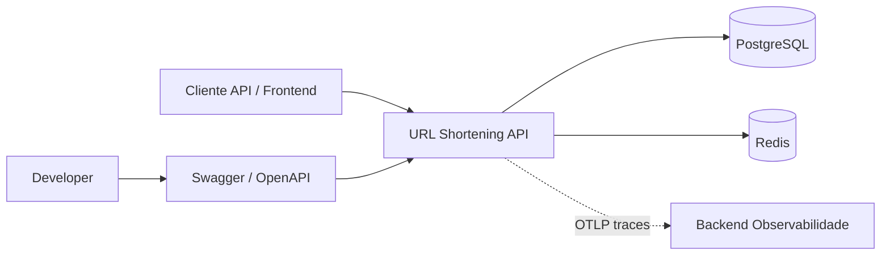
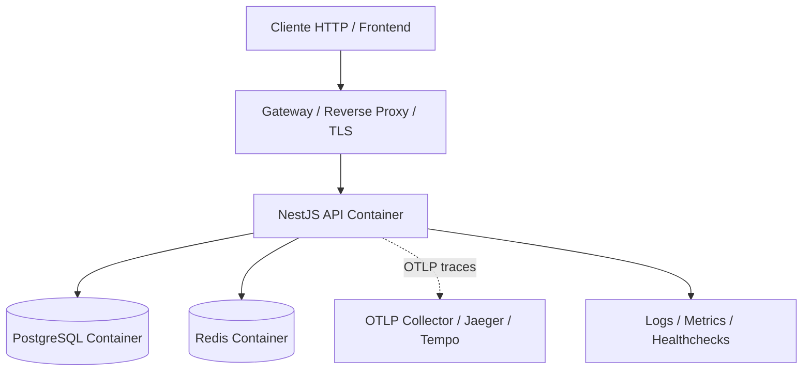
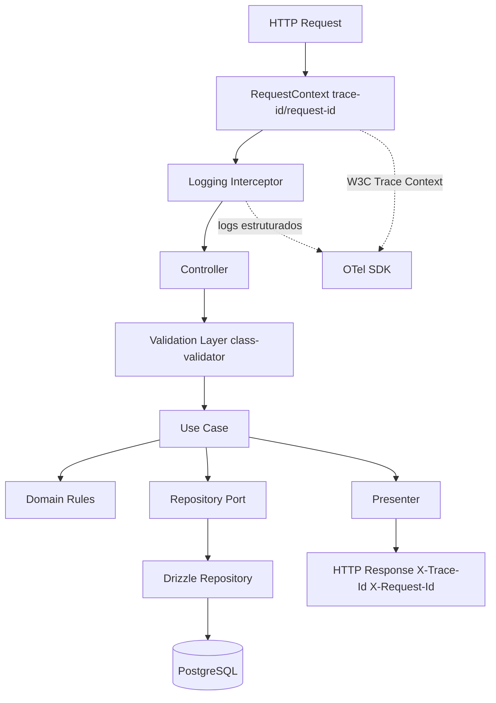
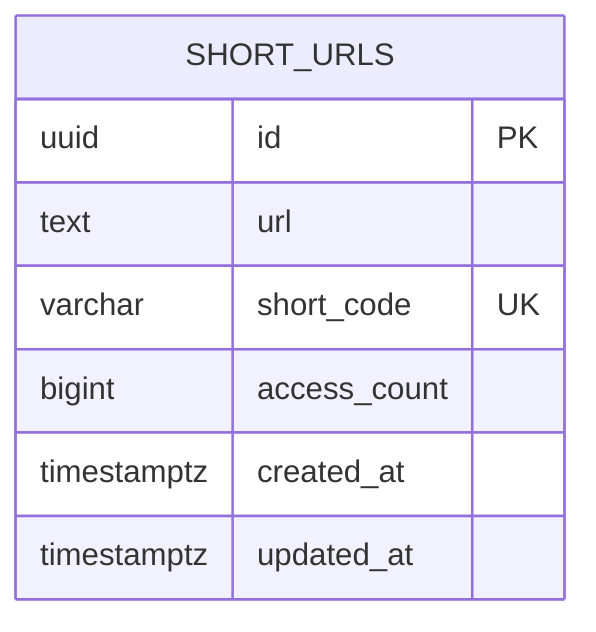

```mermaid
flowchart LR
    RequestContext[RequestContextInterceptor]
    Logging[LoggingInterceptor]
    Controller[Controllers]
    Throttler[ThrottlerGuard]
    DtoValidation[ValidationPipe + DTOs e ShortCodeParamPipe]
    UseCases[Use Cases]
    Generator[ShortCodeGeneratorService]
    RepoPort[ShortUrlRepository Port]
    CachedRepo[CachedShortUrlRepository]
    DrizzleRepo[DrizzleShortUrlRepository]
    Redis[(Redis)]
    Mapper[Persistence Mapper]
    DrizzleSchema[Drizzle Schema]
    Postgres[(PostgreSQL)]
    Presenter[Presenters]
    OTel[OpenTelemetry SDK]

    Throttler --> RequestContext
    RequestContext --> Logging
    Logging --> Controller
    Controller --> DtoValidation
    DtoValidation --> UseCases
    UseCases --> Generator
    UseCases --> RepoPort
    RepoPort --> CachedRepo
    CachedRepo --> Redis
    CachedRepo --> DrizzleRepo
    DrizzleRepo --> Mapper
    DrizzleRepo --> DrizzleSchema
    DrizzleSchema --> Postgres
    UseCases --> Presenter
    RequestContext -.->|trace-id| OTel
    Logging -.->|correlacao| OTel
```

<br/>

# Short URL API

API REST de encurtamento de URLs construída com NestJS, TypeScript, PostgreSQL, Drizzle e Redis.

A proposta deste projeto não foi só “resolver o desafio” e seguir em frente. A ideia foi construir uma solução simples de entender, agradável de evoluir e sólida o bastante para aguentar uma conversa séria sobre arquitetura, domínio, observabilidade, segurança e qualidade de código.

Em outras palavras: eu quis entregar algo que funcionasse bem hoje, sem virar uma dor de cabeça amanhã.

Se você quiser ver o racional da solução antes de mergulhar no código, vale começar pelo [planejamento arquitetural](docs/planejamento_feature_url_shortener_c_4.md). Lá estão o escopo pensado, os diagramas C4, o plano incremental e os trade-offs assumidos ao longo da implementação.

## O que esta API faz

De forma objetiva, a API permite:

* criar short URLs
* consultar a URL original a partir do `shortCode`
* atualizar uma short URL existente
* remover uma short URL
* consultar estatísticas de acesso

O projeto também foi pensado com algumas preocupações que costumam aparecer cedo em sistemas reais: validação consistente na borda HTTP, rate limit distribuído, cache, rastreabilidade mínima, separação clara de responsabilidades e testes cobrindo regras importantes.

## Stack

* Node.js 20+
* TypeScript (`strict`)
* NestJS
* PostgreSQL
* Drizzle ORM
* Redis
* class-validator / class-transformer
* Swagger / OpenAPI
* Docker Compose

## Requisitos atendidos

### Funcionais

* Criar short URL
* Obter URL original por short code
* Atualizar short URL
* Deletar short URL
* Consultar estatísticas de acesso

### Não funcionais

* Rate limit de **12 req/min por IP** em `POST /shorten` e `GET /shorten/:shortCode`, com Throttler usando Redis como storage compartilhado
* Cache Redis para consultas por `shortCode`, com invalidação em `PUT` e `DELETE`
* Validação com DTOs usando `class-validator`, `class-transformer` e `ValidationPipe` global
* Validação dedicada do parâmetro `shortCode` via pipe específico
* Suporte a throttling distribuído entre múltiplas instâncias

## Antes de entrar na arquitetura

Esse projeto foi estruturado com uma preocupação bem pragmática: manter o código legível sem sacrificar decisões importantes de engenharia.

Por isso, a base foi organizada por domínio/feature, com regras de negócio concentradas nos use cases, controllers finos, acesso a dados encapsulado via repositórios e contratos HTTP bem definidos. Não foi uma tentativa de “encaixar todas as siglas possíveis”; foi mais uma busca por equilíbrio entre clareza, isolamento de responsabilidade e custo de manutenção.

A filosofia aqui foi bem simples:

* deixar o fluxo fácil de seguir
* evitar acoplamento desnecessário
* proteger a borda HTTP
* preparar a aplicação para crescer sem precisar desmontar tudo depois

## Arquitetura e soluções adotadas

A modelagem do projeto segue uma visão de contexto, containers, componentes e fluxo interno. Os diagramas abaixo ajudam a visualizar como as peças conversam entre si.

### 1. Diagrama de contexto



### 2. Diagrama de container



### 3. Diagrama de componente (`short-url`)



### 4. Fluxo interno da aplicação



Na execução real do NestJS, a ordem passa por middleware, guards, interceptors de pré-execução, pipes e então o método do controller. O fluxo acima é uma visão lógica para facilitar leitura e entendimento do desenho.

## Modelo de dados

A modelagem foi mantida simples, direta e suficiente para o escopo da feature.



Uma única tabela resolve bem o domínio principal aqui: URL original, código curto, contagem de acessos e timestamps de controle.

## Regras de negócio

### Aplicadas no código

* URL válida em `POST` e `PUT`, validada em DTOs
* `shortCode` único, gerado a partir de ID sequencial (`Redis INCR`), permutação Feistel de 32 bits com segredo (`SHORT_CODE_FEISTEL_SECRET`) e Base62
* Constraint `UNIQUE` no banco para reforço de integridade
* `shortCode` com 4 a 8 caracteres alfanuméricos
* Idempotência em `POST`: a mesma URL retorna o mesmo `shortCode` já existente
* `accessCount` nunca negativo, protegido por regra e check constraint
* Incremento de acesso feito de forma atômica no banco
* Cache invalidado em `PUT` e `DELETE`

### Deliberadamente fora do escopo

Alguns pontos ficaram de fora de propósito, porque preferi manter o desafio bem resolvido antes de ampliar responsabilidade:

* A URL não é normalizada antes de persistir

  * `https://example.com`, `https://example.com/` e `https://www.example.com` são tratadas como entradas diferentes
* Não há autenticação/autorização

  * qualquer cliente pode criar, editar e deletar qualquer short code

### Próximos passos naturais

Se essa API fosse continuar evoluindo, os primeiros passos que eu atacaria seriam:

* normalização de URL antes de criar ou atualizar
* autenticação/autorização para operações de escrita
* avaliação de migração do adapter HTTP de Express para Fastify em cenários de throughput mais agressivos

## Escalabilidade e segurança

Mesmo sendo um desafio técnico, eu preferi não tratar escalabilidade e segurança como “assunto para depois”. Não precisava resolver o mundo, mas fazia sentido deixar a base preparada para cenários mais realistas.

### Escalabilidade

* **API stateless**: a aplicação não depende de estado local para funcionar, o que facilita replicação horizontal
* **Redis como apoio operacional**: rate limit e cache ficam fora da instância da API, o que ajuda quando há múltiplas réplicas
* **Banco com integridade explícita**: índices e constraints ajudam a empurrar para a camada certa a responsabilidade sobre consistência concorrente
* **Cache com invalidação clara**: leitura por `shortCode` ganha desempenho sem perder coerência nas operações de escrita

### Segurança

* **Helmet** para endurecimento básico de headers HTTP
* **CORS** controlado para reduzir exposição desnecessária
* **ValidationPipe global** com `transform` e `whitelist`
* **Pipe dedicado para `shortCode`** antes da entrada nos use cases
* **Guard global para padrões suspeitos** em `body`, `params`, `query` e alguns headers customizados
* **Defesa em profundidade contra entradas maliciosas**, incluindo padrões de XSS, payloads perigosos via `data:` URI e sinais comuns de SQL injection
* **Uso restrito do query builder do Drizzle**, evitando concatenação aberta e reduzindo risco de SQL injection

A ideia aqui não foi vender uma “fortaleza impenetrável”, e sim demonstrar cuidado real com a borda HTTP e com o que costuma quebrar primeiro quando um sistema sai do happy path.

## Observabilidade

A aplicação já sobe preparada para rastreabilidade mínima com OpenTelemetry. Eu gosto dessa abordagem porque ela evita retrabalho: mesmo num projeto pequeno, deixar contexto distribuído e correlação de logs prontos desde cedo costuma pagar a conta mais adiante.

### O que já está preparado

* propagação de contexto distribuído
* correlação por `traceId` e `requestId`
* headers de resposta `X-Trace-Id` e `X-Request-Id`
* exportação via OTLP
* base pronta para integrar com Jaeger, Tempo, Collector ou provedores SaaS

### Realidade prática

| Cenário                                     | Valor                                      |
| ------------------------------------------- | ------------------------------------------ |
| Sem backend OTLP e sem agregação de logs    | Correlação limitada ao ciclo da requisição |
| Sem backend OTLP, mas com agregação de logs | Busca e correlação por request-id          |
| Com backend OTLP configurado                | Rastreabilidade ponta a ponta              |

A instrumentação é carregada antes do bootstrap da aplicação via `-r ./dist/instrumentation.js` no `start:prod`, deixando o serviço pronto para evoluir a telemetria sem lock-in de fornecedor.

Consumidores compatíveis via OTLP incluem OpenTelemetry Collector, Jaeger, Grafana Tempo, além de serviços como Datadog, Honeycomb, New Relic e SigNoz.

## Análise técnica de capacidade

Com a arquitetura atual e assumindo aproximadamente **3 KB por linha**, o limite seguro projetado fica em torno de **1,75 milhão de registros**, o que daria algo próximo de **958 inserções por dia ao longo de 5 anos**.

Esse número obviamente depende de premissas, mas já serve como régua de planejamento. A partir daí, algumas estratégias naturais seriam:

* expiração automática por inatividade
* remoção periódica de registros antigos
* particionamento por data no PostgreSQL
* arquivamento de dados frios
* ou, em um cenário realmente mais agressivo, migração para uma solução com escala horizontal mais natural

Política de retenção possível por camadas:

* **1 ano** para links de uso pontual
* **2 anos** para campanhas recorrentes
* **3 anos** como padrão razoável para itens quase permanentes

## Estrutura do projeto

```text
src/
  modules/short-url/     # Domínio short-url
    domain/              # Entidades, value objects, erros
    application/         # Use cases, serviços de aplicação
    infra/               # Repositórios (Drizzle)
    http/                # Controller, contracts, presenter
  shared/                # Base HTTP, contratos, pipes, interceptors
  config/                # Configuração e validação de env
  infra/                 # Database, migrations
```

A organização é por feature/domínio. Regras de negócio vivem nos use cases; controllers apenas orquestram; persistência fica atrás de abstrações claras.

## Pré-requisitos

* Docker e Docker Compose
* Node.js 20+
* npm

## Configuração de ambiente

1. Copie o arquivo de exemplo:

```bash
cp .env.example .env
```

2. Ajuste os valores conforme necessário. Variáveis obrigatórias: `PG_*`, `REDIS_*`, `APP_*`.
3. Para testes, existe `.env.test`; integração e e2e usam esse arquivo automaticamente.

## Como subir localmente

1. Instale as dependências:

```bash
npm install
```

2. Suba a infraestrutura:

```bash
docker compose up -d
```

3. Rode as migrations:

```bash
npm run db:migrate
```

4. Acesse a documentação Swagger em:

```text
http://localhost:3000/api/docs
```

Para rodar a API fora do container, com PostgreSQL e Redis já de pé via Docker:

```bash
npm install
npm run db:migrate
npm run start:dev
```

## Comandos úteis

| Comando                      | Descrição                                         |
| ---------------------------- | ------------------------------------------------- |
| `docker compose up -d`       | Sobe api, postgres e redis                        |
| `docker compose down`        | Derruba ambiente                                  |
| `npm run docker:api:refresh` | Rebuild e recria o container da API               |
| `npm run start:dev`          | App em modo desenvolvimento                       |
| `npm run build`              | Build de produção                                 |
| `npm run start:prod`         | Executa build com instrumentação OpenTelemetry    |
| `npm run format`             | Formata arquivos com Prettier                     |
| `npm run format:check`       | Valida formatação sem alterar arquivos            |
| `npm run lint`               | Executa ESLint                                    |
| `npm run lint:fix`           | Corrige automaticamente problemas simples de lint |
| `npm run typecheck`          | Executa checagem de tipos                         |
| `npm run test`               | Testes unitários                                  |
| `npm run test:unit`          | Alias para unitários                              |
| `npm run test:integration`   | Testes de integração                              |
| `npm run test:e2e`           | Testes end-to-end                                 |
| `npm run test:http`          | Alias para e2e                                    |
| `npm run test:all`           | Unit + integration + e2e                          |
| `npm run db:generate`        | Gera migration a partir do schema                 |
| `npm run db:migrate`         | Aplica migrations pendentes                       |
| `npm run db:create-test`     | Cria banco de teste                               |
| `npm run clear`              | Remove artefatos locais                           |
| `npm run reset`              | Limpa artefatos e remove lockfile                 |

Os scripts `clear` e `reset` usam Node em vez de shell para manter comportamento consistente entre Linux, macOS e Windows.

## Redis no projeto

O Redis entra aqui com dois papéis principais:

* **rate limit distribuído**
* **cache de leitura por `shortCode`**

Além disso, o readiness check considera Redis, e a aplicação pode sinalizar estado degradado quando esse componente estiver indisponível.

Variáveis relacionadas: `REDIS_*` e `CACHE_TTL_SECONDS` (opcional, com default 60).

## Banco de dados e migrations

* Banco relacional: PostgreSQL
* ORM: Drizzle
* Migrations aplicadas via `npm run db:migrate`
* Novas migrations: ajustar schema em `src/infra/database/schema/` e executar `npm run db:generate`
* Migrations já aplicadas não devem ser editadas
* Seed não foi implementado neste projeto

## Testes e cobertura

Esse projeto foi desenvolvido com bastante apoio de **TDD**, principalmente na camada de regras de negócio e no desenho dos cenários principais.

### Unitários

Rodam rápido, isolam regras de domínio/aplicação e usam repositório em memória para validar comportamento sem depender de banco ou rede.

```bash
npm run test
```

Arquivos: `src/**/*.spec.ts`

### Integração e e2e

Os testes de integração validam o repositório contra banco real. Já os e2e exercitam a aplicação pela borda HTTP, incluindo headers, filtros e comportamento externo esperado.

Para integração e e2e, é necessário ter PostgreSQL e Redis disponíveis.

### Passo a passo

1. Suba postgres e redis:

```bash
docker compose up -d postgres redis
```

2. Crie o banco de teste:

```bash
npm run db:create-test
```

3. Rode os testes desejados:

```bash
npm run test:integration
npm run test:e2e
```

Ou tudo junto:

```bash
npm run test:all
```

### Resumo factual da suíte atual

| Escopo     | Quantidade de testes | Cobertura atual na aplicação                                       |
| ---------- | -------------------- | ------------------------------------------------------------------ |
| Unitário   | 85                   | 37.74% statements, 31.22% branches, 27.65% functions, 37.68% lines |
| Integração | 15                   | 14.54% statements, 14.70% branches, 16.83% functions, 14.34% lines |
| E2E        | 17                   | 46.98% statements, 54.52% branches, 38.04% functions, 45.68% lines |

Essas coberturas foram geradas por escopo isolado, e não por merge de relatórios.

## Swagger

* URL local: `http://localhost:3000/api/docs`
* Requer a aplicação rodando
* Documentação interativa da API

## Convenções do projeto

* Organização por feature/domínio
* Separação explícita entre `domain`, `application`, `http` e `infra`
* Imports absolutos via aliases `@config`, `@infra`, `@shared` e `@modules`
* Validação com `class-validator` nos DTOs
* `ValidationPipe` global para bodies tipados
* Pipe dedicado para `shortCode`
* `SecurityInputGuard` como proteção transversal na borda HTTP
* Regras de negócio nos use cases, não nos controllers
* Persistência via repositório, com portas no domínio e adaptadores na infraestrutura
* TypeScript em modo `strict`
* Contratos HTTP tipados e documentados via Swagger

No desenho do código, segui KISS e YAGNI de forma bastante pragmática. A intenção não foi “dogmatizar” Clean Architecture, e sim usar o que fazia sentido para manter o projeto claro, modular e sustentável.

## Fluxo de qualidade antes de PR

A sequência recomendada para validação local é:

```bash
npm run format
npm run lint
npm run typecheck
npm run test:all
npm run build
```

Os commits seguem o padrão [Conventional Commits](https://www.conventionalcommits.org/):

```text
tipo(escopo): descrição
```

Exemplo:

```text
feat(short-url): add create endpoint
```

## Fechamento

Se você quiser entender primeiro a linha de raciocínio da solução antes de sair navegando pelo código, o melhor ponto de entrada continua sendo o [planejamento arquitetural](docs/planejamento_feature_url_shortener_c_4.md). Ele mostra o desenho original da feature, os diagramas C4, a estratégia incremental e os trade-offs assumidos no caminho.

No fim das contas, este projeto é sobre uma coisa bem simples: pegar um problema pequeno, comum e aparentemente direto, e tratá-lo com o nível de cuidado que normalmente só aparece quando o software começa a crescer. Foi esse o espírito aqui.

---

Se esse README compilou bem por aí, talvez valha um `git clone` no meu [GitHub](https://github.com/joisiney) e uma passada no meu [LinkedIn](https://www.linkedin.com/in/joisiney/): tem mais projetos, mais contexto e alguns commits extras de teimosia saudável com arquitetura e código bem pensado.
