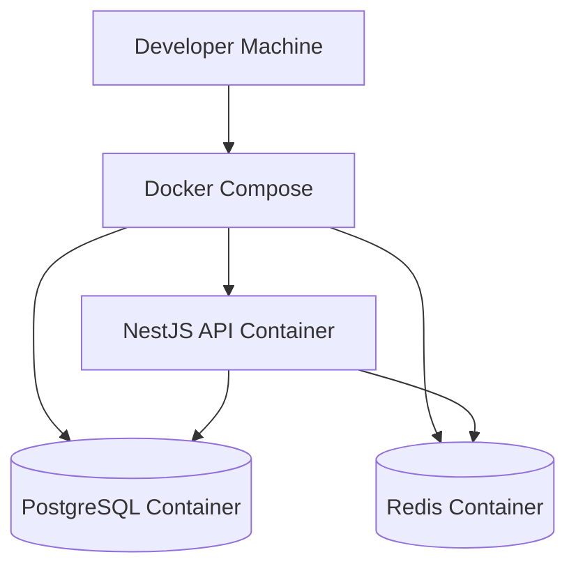

# ADR 02 — Infra local com Docker Compose

## Status

Proposto

## Contexto

A API de encurtamento de URLs precisa de um ambiente local previsível, reprodutível e simples de subir, para permitir desenvolvimento incremental, execução de testes de integração e validação manual dos endpoints desde os primeiros commits.

O projeto adota como stack principal:

- **NestJS**
- **TypeScript**
- **PostgreSQL**
- **Drizzle**
- **Redis**
- **Swagger**
- **Docker Compose**

Além disso, os requisitos arquiteturais pedem:

- containers separados para app, banco e Redis
- imagens pequenas e previsíveis
- healthcheck
- ambiente de desenvolvimento simples e reprodutível
- hot reload em desenvolvimento com isolamento razoável
- segurança em produção, mas sem sacrificar produtividade local
- graceful shutdown
- variáveis de ambiente seguras, sem hardcode de secrets

Como o objetivo deste ADR é tratar a **infra local**, ele deve definir a composição mínima para desenvolvimento e testes locais, sem misturar neste momento todas as decisões de produção.

## Decisão

Será adotado **Docker Compose** como padrão de infraestrutura local do projeto, com uma composição inicial formada por **três containers separados**:

1. `api`
2. `postgres`
3. `redis`

**Todos os containers devem ser agrupados dentro de um agrupador chamado `short-url`.**

A composição será orientada a desenvolvimento local e deverá ser simples de subir com um único comando.


## Objetivos da composição local

A infra local com Docker Compose deve permitir:

- subir toda a stack necessária ao desenvolvimento
- isolar dependências do ambiente da máquina do desenvolvedor
- garantir consistência entre diferentes ambientes locais
- suportar hot reload da aplicação NestJS
- preparar o terreno para testes de integração
- expor somente o necessário para uso local
- manter o banco e o Redis acessíveis apenas ao contexto do compose, salvo portas explicitamente publicadas para desenvolvimento

---

## Composição inicial dos serviços

### 1. Serviço `api`

Responsável por executar a aplicação NestJS em modo de desenvolvimento.

Regras:

- deve usar uma imagem baseada em Node.js com versão fixada
- deve montar volume do código-fonte para hot reload
- deve instalar dependências de forma reproduzível
- deve iniciar com comando de desenvolvimento
- deve depender de `postgres` e `redis`
- deve receber variáveis de ambiente via arquivo apropriado e/ou bloco `environment`

### 2. Serviço `postgres`

Responsável por armazenar a fonte primária de verdade da aplicação.

Regras:

- deve usar imagem oficial estável do PostgreSQL com versão fixada
- deve ter volume persistente para dados locais
- deve ter healthcheck
- deve expor porta para desenvolvimento local quando necessário
- credenciais não devem ser hardcoded no código da aplicação

### 3. Serviço `redis`

Responsável por suportar recursos auxiliares como throttling distribuído e cache pontual.

Regras:

- deve usar imagem estável com versão fixada
- deve ter healthcheck quando viável
- deve expor porta local apenas para desenvolvimento, se necessário
- não deve ser tratado como fonte primária de verdade

---

## Estrutura de arquivos esperada

A base de infraestrutura local deve prever ao menos:

```text
/
  docker-compose.yml
  Dockerfile
  .dockerignore
  .env.example
  .env.docker.example
```

Opcionalmente, conforme a evolução do projeto:

```text
/docker
  /api
    Dockerfile.dev
    Dockerfile.prod
```

### Decisão inicial de simplicidade

Na primeira fase, pode-se começar com:

- `docker-compose.yml`
- um `Dockerfile` para a aplicação
- `.dockerignore`

Se houver ganho real de clareza, a evolução para `Dockerfile.dev` e `Dockerfile.prod` pode ocorrer depois, em ADR específico ou refinamento posterior.

---

## Regras para o `Dockerfile`

Mesmo sendo um ambiente local, o `Dockerfile` já deve seguir boas práticas:

- usar imagem base com versão fixada
- evitar copiar arquivos desnecessários
- usar `.dockerignore`
- organizar camadas de forma previsível
- preparar caminho para multi-stage build futuro

### Regras mínimas

- não copiar `.env`
- não copiar `node_modules` da máquina host
- não incluir arquivos temporários, cache local, coverage e artefatos irrelevantes
- manter o build previsível

### Exemplo de `.dockerignore` esperado

```text
node_modules
npm-debug.log
.git
.gitignore
dist
coverage
.env
.env.*
!.env.example
README.md
```

Observação:

- a política exata de ignorar `README.md` pode variar; se ele for necessário na imagem final por alguma razão operacional, pode ser mantido. Para dev local normalmente não é essencial dentro da imagem.

---

## Estratégia para desenvolvimento local

### Hot reload

Em desenvolvimento, o container `api` deve suportar hot reload.

Decisão:

- montar o código local como volume
- executar Nest em modo watch
- manter isolamento razoável sem exigir rebuild completo a cada alteração

### Dependências Node

Decisão recomendada:

- manter `node_modules` dentro do container, evitando inconsistências entre SO host e container
- usar volume dedicado para `node_modules` quando necessário

### Motivo

Isso reduz problemas clássicos de compatibilidade entre ambiente local e ambiente containerizado.

---

## Rede e exposição de portas

### Regra geral

Cada serviço deve ficar na rede interna do compose, com publicação explícita apenas do que for necessário para desenvolvimento.

### Portas tipicamente expostas em dev

- `api`: porta HTTP da aplicação
- `postgres`: porta do banco para acesso local opcional
- `redis`: porta do Redis para inspeção local opcional

### Decisão

As portas podem ser expostas em dev para facilitar debugging e inspeção, mas isso não implica que a mesma política será usada em produção.

---

## Healthchecks

A composição local deve incluir healthchecks sempre que prático.

### Objetivo

- melhorar previsibilidade da subida do ambiente
- facilitar automação local e futura CI
- permitir dependências mais robustas entre containers

### Healthchecks mínimos esperados

- `postgres`: verificar readiness do banco
- `redis`: verificar disponibilidade do servidor Redis
- `api`: idealmente expor endpoint de health no futuro

### Observação

Neste ADR, o endpoint de health da API ainda pode estar em construção, mas a composição já deve deixar espaço para isso.

---

## Variáveis de ambiente

A infra local deve respeitar a política de configuração do projeto.

Regras:

- não versionar `.env` real
- manter `.env.example` sem valores sensíveis
- permitir um arquivo voltado ao contexto Docker, se necessário
- a aplicação deve validar ambiente no boot com Zod
- `docker-compose.yml` não deve embutir secrets sensíveis reais

### Exemplo de grupos de variáveis esperadas

- app
- banco
- redis
- observabilidade básica

---

## Persistência local

### PostgreSQL

Deve usar volume persistente para não perder dados a cada restart do ambiente.

### Redis

Persistência não é obrigatória para o propósito atual, pois seu papel inicial é auxiliar, não ser fonte de verdade.

### Decisão

- volume persistente obrigatório para `postgres`
- persistência de `redis` opcional nesta fase

---

## Segurança aplicada ao ambiente local

Mesmo sendo dev, a composição deve evitar más práticas que depois vazam para produção.

### Regras

- não bakear secrets na imagem
- não deixar credenciais hardcoded no código-fonte
- usar rede interna do compose
- publicar apenas portas realmente úteis
- separar containers por responsabilidade
- não executar banco e cache dentro do mesmo container da aplicação

### Observação

Regras como TLS interno, usuário não root em runtime final e imagem mínima endurecida são importantes, mas alguns pontos poderão ser refinados no fluxo de produção sem bloquear a ergonomia do ambiente local.

---

## Estratégia para banco e migrations

A infra local precisa conviver bem com o ciclo de schema.

### Decisão

O Docker Compose local deve suportar o fluxo em que:

- o banco sobe com volume persistente
- a aplicação consegue se conectar ao banco de forma previsível
- migrations possam ser executadas manualmente via comando do projeto
- seeds possam ser aplicadas posteriormente de forma idempotente

### Importante

Este ADR não define ainda a estratégia completa de migrations e seeds; ele apenas garante que a infra local suportará esse fluxo.

---

## Impacto em testes

A composição local serve também como fundação para:

- testes de integração com Postgres real
- testes envolvendo Redis quando necessário
- validação manual com Swagger

### Regra

Ambiente de teste não deve usar banco ou Redis de produção.

Para a fase inicial, o mesmo stack local pode ser reutilizado em pipelines simples, desde que com isolamento adequado por ambiente/compose.

---

## Consequências

### Positivas

- ambiente local consistente para todo o time
- onboarding mais simples
- reduz variação entre máquinas de desenvolvimento
- melhora confiança nos testes de integração
- acelera validação do projeto com Swagger e banco real
- prepara base para evolução futura de Docker em produção

### Negativas

- adiciona custo inicial de configuração de containers
- hot reload em container pode ser um pouco mais lento que execução totalmente nativa em algumas máquinas
- exige atenção a volumes, permissões e watch mode

### Trade-off assumido

Aceitamos uma leve complexidade inicial em troca de previsibilidade, isolamento e aderência aos requisitos do projeto.

---

## Alternativas consideradas

### 1. Rodar tudo nativamente na máquina do desenvolvedor

Rejeitada.

Motivo:

- aumenta inconsistência entre ambientes
- dificulta onboarding
- depende de instalação local de Postgres e Redis
- reduz reprodutibilidade

### 2. Rodar apenas banco em Docker e API fora do container

Parcialmente rejeitada como padrão oficial.

Motivo:

- pode ser útil em casos específicos, mas como padrão do projeto aumenta variação de setup
- o objetivo aqui é padronizar a experiência local o máximo possível

### 3. Usar um único container para app, banco e Redis

Rejeitada.

Motivo:

- viola separação de responsabilidades
- dificulta operação, debugging e evolução
- não reflete práticas saudáveis de infraestrutura

### 4. Ignorar Redis no ambiente local inicial

Rejeitada.

Motivo:

- o projeto já prevê uso de Redis para throttling distribuído e possivelmente cache
- incluir Redis desde cedo evita retrabalho de setup posterior

### 5. Criar desde já uma stack completa de produção no compose local

Rejeitada.

Motivo:

- complexidade excessiva para o estágio atual
- este ADR trata **infra local**, não toda a topologia de produção

---

## Escopo deste ADR

Este ADR define:

- uso de Docker Compose como padrão de infraestrutura local
- separação entre `api`, `postgres` e `redis`
- diretrizes para volumes, healthchecks, variáveis de ambiente e hot reload
- princípios mínimos de segurança e reprodutibilidade no ambiente local

Este ADR não define em detalhe:

- arquitetura final de produção
- estratégia completa de reverse proxy/TLS/WAF
- política de deploy
- orquestração em cloud
- estratégia completa de backup
- regras finais de health/readiness/liveness da aplicação
- pipeline CI/CD

---

## Critérios de aceite

A task de infra local com Docker Compose será considerada concluída quando existir:

- `docker-compose.yml` funcional
- `Dockerfile` funcional para a API
- `.dockerignore` configurado corretamente
- serviços separados para `api`, `postgres` e `redis`
- volume persistente para `postgres`
- variáveis de ambiente organizadas sem secrets versionados
- hot reload funcional para a API em dev
- healthcheck mínimo para `postgres`
- documentação no README explicando como subir e derrubar o ambiente

## Exemplo de resultado esperado

Ao final desta task, deve ser possível:

1. subir a stack local com um único comando
2. ter a API disponível localmente
3. ter Postgres e Redis acessíveis ao container da API
4. manter dados do banco entre reinícios do compose
5. iniciar o desenvolvimento da feature sem depender de instalações locais externas

---

## Diagrama simplificado da infra local



## Próximos ADRs relacionados

- ADR 03 — Configuração e validação de environment
- ADR 04 — Base compartilhada HTTP
- ADR 05 — Schema do banco e migrations
- ADR 09 — Observabilidade e hardening

