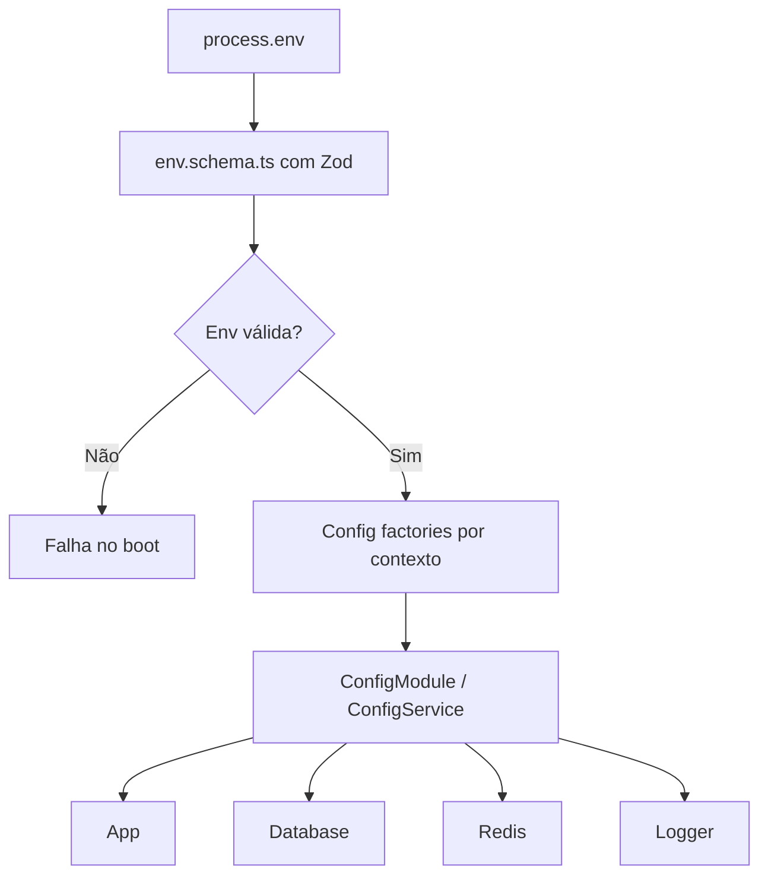

# ADR 03 — Configuração e validação de environment

## Status

Proposto

## Contexto

A aplicação de encurtamento de URLs depende de configuração externa para funcionar corretamente em diferentes ambientes, especialmente desenvolvimento local, testes e produção. Entre os contextos previstos para configuração estão:

- aplicação HTTP
- banco de dados PostgreSQL
- Redis
- observabilidade/logging
- documentação e comportamentos por ambiente

Os requisitos arquiteturais do projeto determinam que:

- secrets devem ficar fora do código e fora do repositório
- `.env` não deve ser versionado
- deve existir `.env.example` sem valores sensíveis
- variáveis de ambiente devem ser separadas por contexto
- a leitura de env deve ser centralizada com `@nestjs/config`
- a aplicação deve falhar no boot se env obrigatória estiver ausente ou inválida
- não se deve espalhar `process.env` pelo projeto
- configurações devem ser tipadas e com cache
- nomes de variáveis devem seguir padrão previsível
- a mesma env não deve ser reutilizada para contextos diferentes

Além disso, o projeto usa **Zod** como estratégia oficial de validação, então a camada de configuração também precisa seguir a mesma filosofia: contratos explícitos, validação forte e erro previsível logo na inicialização.

O objetivo deste ADR é definir como o projeto lerá, validará, tipará e exporá configurações de ambiente de forma segura, coesa e evolutiva.

## Decisão

A configuração da aplicação será centralizada com **`@nestjs/config`** e validada com **Zod** no momento do boot.

A estratégia adotada será composta por cinco pilares:

1. **schema global de env com Zod**
2. **config factories por contexto**
3. **tipagem forte para consumo interno**
4. **fail fast na inicialização**
5. **proibição de `process.env` espalhado no código de negócio**

---

## 1. Schema global de environment com Zod

Será criado um schema central de environment, responsável por validar todas as variáveis necessárias à inicialização do projeto.

Arquivo base sugerido:

```text
src/config/env.schema.ts
```

Esse schema deve:

- validar presença de variáveis obrigatórias
- validar formato e domínio dos valores
- aplicar transformações leves quando necessário
- normalizar tipos primitivos como número e boolean
- rejeitar ambientes inválidos antes da aplicação iniciar

### Exemplos de variáveis por contexto

#### App

- `NODE_ENV`
- `APP_PORT`
- `APP_HOST`
- `APP_GLOBAL_PREFIX`
- `APP_CORS_ORIGIN`
- `APP_BODY_LIMIT`
- `APP_ENABLE_SWAGGER`

#### Database

- `DB_HOST`
- `DB_PORT`
- `DB_NAME`
- `DB_USER`
- `DB_PASSWORD`
- `DB_SSL`
- `DB_POOL_MIN`
- `DB_POOL_MAX`
- `DB_IDLE_TIMEOUT_MS`
- `DB_CONNECTION_TIMEOUT_MS`

#### Redis

- `REDIS_HOST`
- `REDIS_PORT`
- `REDIS_PASSWORD`
- `REDIS_DB`
- `REDIS_TLS_ENABLED`
- `REDIS_CONNECT_TIMEOUT_MS`

#### Observabilidade / logging

- `LOG_LEVEL`
- `LOG_PRETTY`
- `LOG_REDACT_SENSITIVE`

### Regras do schema

- toda variável obrigatória deve ser explicitamente declarada
- defaults só devem existir onde fizer sentido e não esconder erro operacional
- números devem ser convertidos de string para number com validação
- booleans devem ser normalizados com regra clara
- listas, como origens CORS, devem ser transformadas explicitamente
- valores fora do conjunto permitido devem falhar no boot
- senhas (`DB_PASSWORD` e `REDIS_PASSWORD`) devem atender a regras de complexidade e tamanho (ex: mínimo de 8 caracteres, mescla de maiúsculas/minúsculas/números/especiais)
- conexões e pools devem prever limites numéricos (ex: timeouts de no máximo 24h) iterando restrições de domínios coerentes e ranges seguros

---

## 2. Config factories por contexto

Após validação global, a aplicação não deve consumir diretamente o objeto bruto do environment. Em vez disso, a configuração será exposta por **factories organizadas por contexto**.

Estrutura sugerida:

```text
src/config/
  env.schema.ts
  app.config.ts
  db.config.ts
  redis.config.ts
  logger.config.ts
```

### Objetivo das config factories

- separar responsabilidades por domínio de configuração
- evitar objeto gigante único e sem contexto
- facilitar leitura, testes e evolução
- permitir cache e tipagem forte

### Exemplos de contextos

#### `app.config.ts`

Responsável por:

- porta
- host
- prefixo global
- flags de swagger
- limites HTTP simples

#### `db.config.ts`

Responsável por:

- host, porta, database, user, password
- SSL
- pool de conexão
- timeouts de conexão

#### `redis.config.ts`

Responsável por:

- host
- porta
- credencial
- db index
- timeout
- TLS

#### `logger.config.ts`

Responsável por:

- nível de log
- formato amigável para dev
- política de redact

---

## 3. Tipagem forte para consumo interno

Todo acesso às configurações no projeto deve acontecer por objetos tipados derivados das config factories.

### Regra principal

Nenhum módulo de negócio, controller, use case, service ou repository deve ler `process.env` diretamente.

### Motivo

- evita inconsistência entre pontos do sistema
- reduz bugs de conversão manual
- centraliza defaults e validação
- simplifica testes
- permite refatoração segura

### Exemplo conceitual de retorno tipado

```ts
export type AppConfig = {
  nodeEnv: 'development' | 'test' | 'production';
  port: number;
  host: string;
  globalPrefix: string;
  enableSwagger: boolean;
  bodyLimit: string;
};
```

Esse mesmo princípio vale para `DbConfig`, `RedisConfig` e `LoggerConfig`.

---

## 4. Fail fast na inicialização

A aplicação deve interromper a inicialização quando as variáveis de ambiente obrigatórias estiverem ausentes, inválidas ou incoerentes.

### Exemplos de falhas que devem barrar o boot

- `DB_PORT` não numérica
- `NODE_ENV` fora do conjunto permitido
- `APP_PORT` inválida
- `DB_POOL_MAX` menor que `DB_POOL_MIN`
- `LOG_LEVEL` inválido
- `REDIS_TLS_ENABLED` com valor malformado

### Motivo

Falhar cedo é muito mais seguro do que permitir que a aplicação suba em estado parcialmente inválido e apresente erro só durante tráfego real.

---

## 5. Proibição de `process.env` espalhado

A leitura direta de `process.env` fora da camada de configuração será considerada antipadrão do projeto.

### Regra

`process.env` só pode ser tocado:

- no ponto central de validação/configuração
- em código estritamente relacionado ao bootstrap/config module

### Não permitido

- controller lendo env diretamente
- repository montando conexão via `process.env`
- serviço acessando flags com `process.env`
- helpers utilitários buscando env arbitrariamente

---

## Convenções de naming das variáveis

As variáveis de ambiente devem seguir convenção fixa e previsível.

### Regras

- nomes em `UPPER_SNAKE_CASE`
- prefixadas por contexto quando aplicável
- sem nomes genéricos ambíguos
- sem reaproveitar a mesma variável para contextos diferentes

### Exemplos bons

- `APP_PORT`
- `APP_GLOBAL_PREFIX`
- `DB_CONNECTION_TIMEOUT_MS`
- `REDIS_CONNECT_TIMEOUT_MS`
- `LOG_LEVEL`

### Exemplos ruins

- `PORT`
- `HOST`
- `TIMEOUT`
- `URL`
- `DEBUG_MODE` usado para múltiplos comportamentos não relacionados

---

## Estratégia de parsing e transformação

Como toda env nasce como string, será adotada uma política explícita de parsing com Zod.

### Números

Devem ser transformados com validação de faixa quando aplicável.

Exemplos:

- portas devem ser inteiros válidos
- pool deve ter mínimo e máximo coerentes
- timeouts devem ser positivos

### Booleanos

Devem seguir conversão explícita, por exemplo:

- `'true'` -> `true`
- `'false'` -> `false`

Não deve haver parsing implícito ambíguo.

### Listas

Campos como `APP_CORS_ORIGIN` podem ser aceitos como string delimitada e transformados para array de strings saneadas.

### Strings opcionais

Devem ser tratadas com cuidado para diferenciar:

- valor ausente
- string vazia
- valor opcional realmente intencional

---

## Segurança aplicada à configuração

A estratégia de environment deve proteger dados sensíveis e reduzir risco operacional.

### Regras obrigatórias

- `.env` real nunca vai para o git
- `.env.example` não contém segredo real
- logs de configuração não devem expor secrets
- senha de banco e senha do Redis não devem ser serializadas em logs
- mensagens de erro de validação de env devem ser claras, mas sem vazar conteúdo sensível

### Regras de operação

- secrets devem ser injetados em runtime
- não bakear secrets na imagem Docker
- ambientes diferentes devem poder usar arquivos/envs diferentes sem alterar código

---

## Integração com NestJS

A aplicação usará `ConfigModule.forRoot(...)` como ponto de entrada da configuração.

### Diretrizes

- `isGlobal: true`
- carregar envs de forma previsível
- validar antes do restante da aplicação consumir config
- registrar factories por contexto
- usar cache de config quando apropriado

### Resultado esperado

Outros módulos consumirão configuração via `ConfigService` tipado e/ou wrappers específicos, sem depender do formato cru do environment.

---

## Estrutura sugerida

```text
src/
  config/
    env.schema.ts
    env.parser.ts
    app.config.ts
    db.config.ts
    redis.config.ts
    logger.config.ts
    config.module.ts
```

### Responsabilidade dos arquivos

- `env.schema.ts`: contrato bruto validado pelo Zod
- `env.parser.ts`: função central que aplica parse/transform e falha cedo
- `app.config.ts`: factory do contexto app
- `db.config.ts`: factory do contexto banco
- `redis.config.ts`: factory do contexto redis
- `logger.config.ts`: factory do contexto logging
- `config.module.ts`: composição interna se o projeto optar por encapsular isso além do `ConfigModule`

---

## Exemplo conceitual de schema

```ts
import { z } from 'zod';

export const envSchema = z.object({
  NODE_ENV: z.enum(['development', 'test', 'production']),
  APP_PORT: z.coerce.number().int().min(1).max(65535),
  APP_HOST: z.string().trim().min(1),
  APP_GLOBAL_PREFIX: z.string().trim().min(1).default('api'),
  APP_ENABLE_SWAGGER: z
    .enum(['true', 'false'])
    .transform((value) => value === 'true'),

  DB_HOST: z.string().trim().min(1),
  DB_PORT: z.coerce.number().int().min(1).max(65535),
  DB_NAME: z.string().trim().min(1),
  DB_USER: z.string().trim().min(1),
  DB_PASSWORD: z
    .string()
    .min(8)
    .max(128)
    .refine((v) => /[A-Z]/.test(v))
    .refine((v) => /[a-z]/.test(v))
    .refine((v) => /\d/.test(v))
    .refine((v) => /[^A-Za-z0-9]/.test(v)),

  REDIS_HOST: z.string().trim().min(1),
  REDIS_PORT: z.coerce.number().int().min(1).max(65535),
  REDIS_PASSWORD: z.string().min(8).max(128),

  LOG_LEVEL: z.enum(['debug', 'log', 'warn', 'error']),
});
```

### Observação

O schema real pode crescer com o projeto, mas o padrão deve permanecer: pequeno, explícito, seguro e por contexto.

---

## Exemplo conceitual de parsing centralizado

```ts
export function parseEnv(input: Record<string, string | undefined>) {
  const result = envSchema.safeParse(input);

  if (!result.success) {
    throw new Error('Invalid environment configuration');
  }

  return result.data;
}
```

Na implementação real, o erro deve conter contexto suficiente para troubleshooting sem expor secrets.

---

## Relação com testes

A validação central de environment também melhora testes.

### Benefícios

- falhas de setup aparecem cedo
- fixtures de env ficam explícitas
- módulos podem ser testados com config controlada
- reduz dependência implícita do ambiente do executor

### Regra

Testes devem usar envs próprias e previsíveis, sem compartilhar configuração de produção.

---

## Relação com Docker Compose

A estratégia definida aqui precisa ser compatível com a infra local já decidida.

### Consequência prática

- `docker-compose.yml` injeta envs esperadas
- `.env.example` documenta as obrigatórias
- o boot da aplicação falha rapidamente se alguma estiver ausente ou inválida

Isso evita subir stack “aparentemente funcional” com configuração quebrada.

---

## Consequências

### Positivas

- elimina leitura ad hoc de `process.env`
- reduz erro de configuração silenciosa
- torna a aplicação mais previsível em qualquer ambiente
- melhora segurança e consistência operacional
- facilita testes e manutenção
- reforça a filosofia de contratos explícitos com Zod

### Negativas

- adiciona rigidez inicial ao bootstrap
- exige manutenção do schema sempre que novas envs forem adicionadas
- aumenta disciplina necessária para mudanças de configuração

### Trade-off assumido

Preferimos rigidez e clareza de configuração em vez de flexibilidade implícita e frágil.

---

## Alternativas consideradas

### 1. Ler `process.env` diretamente onde necessário

Rejeitada.

Motivo:

- espalha conhecimento operacional pelo código
- dificulta testes e refatoração
- aumenta risco de parsing inconsistente
- favorece bugs silenciosos

### 2. Usar `@nestjs/config` sem validação formal

Rejeitada.

Motivo:

- apenas centralizar leitura não é suficiente
- sem contrato explícito, o sistema continua vulnerável a erro de setup

### 3. Validar env manualmente com `if`s soltos

Rejeitada.

Motivo:

- baixa escalabilidade
- pouca legibilidade
- maior chance de inconsistência entre contextos
- contradiz o padrão oficial de validação do projeto com Zod

### 4. Um único objeto de configuração monolítico

Parcialmente rejeitada.

Motivo:

- pode funcionar no começo, mas escala mal
- factories por contexto são mais legíveis e testáveis

---

## Escopo deste ADR

Este ADR define:

- validação centralizada de env com Zod
- uso de `@nestjs/config`
- config factories por contexto
- fail fast no boot
- proibição de `process.env` espalhado
- convenções de naming e tipagem de configuração

Este ADR não define em detalhe:

- política de rotação de secrets em produção
- integração com secret managers externos
- configuração detalhada de cada client de banco/Redis/logger
- contratos HTTP de erro da aplicação
- implementação de throttling ou cache

---

## Critérios de aceite

A task de configuração e validação de environment será considerada concluída quando existir:

- schema central de env com Zod
- parsing centralizado com falha no boot em caso de erro
- `ConfigModule` configurado
- config factories separadas ao menos para `app`, `db`, `redis` e `logger`
- ausência de leitura direta de `process.env` fora da camada de configuração
- `.env.example` refletindo as variáveis obrigatórias
- documentação mínima no README sobre configuração do ambiente

## Exemplo de resultado esperado

Ao final desta task, o projeto deve:

1. iniciar corretamente quando o ambiente estiver válido
2. falhar imediatamente quando env obrigatória estiver ausente ou inválida
3. expor configuração tipada aos módulos internos
4. impedir parsing improvisado espalhado pelo código

---

## Diagrama simplificado do fluxo de configuração



## Próximos ADRs relacionados

- ADR 04 — Base compartilhada HTTP
- ADR 05 — Schema do banco e migrations
- ADR 09 — Observabilidade e hardening

