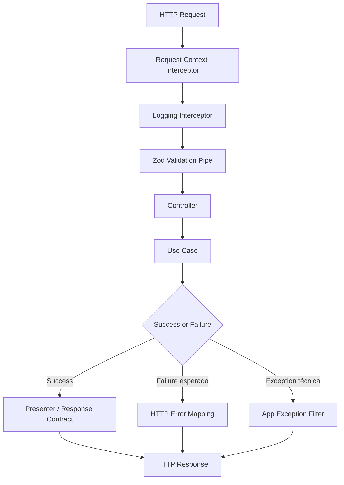

# ADR 04 — Base compartilhada HTTP

## Status

Proposto

## Contexto

A API de encurtamento de URLs precisa expor endpoints REST consistentes, previsíveis e fáceis de evoluir. Os requisitos do projeto pedem padronização forte de contratos HTTP, validação de entrada com Zod, tratamento consistente de erros, paginação previsível, observabilidade básica e bootstrap simples.

Além disso, as diretrizes arquiteturais definidas anteriormente já estabeleceram que:

- a aplicação usa **NestJS**
- a validação oficial do projeto é feita com **Zod**
- a configuração é centralizada com **@nestjs/config**
- o bootstrap deve ser mínimo, mas sólido
- controllers não devem conter regra de negócio
- erros internos não devem vazar para o cliente
- stack trace não deve ser exposto
- deve existir formato padrão de erro e resposta
- logs devem carregar contexto como `requestId` e `correlationId`
- interceptors, pipes e filters devem ser usados com responsabilidade bem definida

Neste cenário, a aplicação precisa de uma **base HTTP compartilhada**, isto é, um conjunto pequeno, coeso e reutilizável de contratos, componentes de borda e convenções para que todos os endpoints da API se comportem de maneira uniforme.

O objetivo deste ADR é decidir como estruturar essa camada HTTP compartilhada antes da implementação completa dos casos de uso da feature `short-url`.

## Decisão

Será criada uma **base compartilhada HTTP** responsável por padronizar:

1. contratos de sucesso, erro e paginação
2. validação de entrada com Zod na borda da API
3. mapeamento consistente de falhas para respostas HTTP
4. identificação e correlação mínima por requisição
5. interceptação de logging, tracing simples e tempo de resposta
6. convenções reutilizáveis para os módulos de feature

Essa base será pequena e deliberadamente focada na borda HTTP. Ela não deve concentrar regra de negócio.

---

## 1. Responsabilidades da base compartilhada HTTP

A camada compartilhada HTTP deve cuidar apenas do que é transversal à borda web.

### Inclui

- contratos comuns de erro
- contratos comuns de paginação
- utilitários de resposta quando realmente agregarem clareza
- pipe/camada de validação com Zod
- exception filter para exceções técnicas
- mapeamento de erros de domínio para HTTP na borda
- interceptor de logging/tracing básico
- geração ou propagação de `requestId` e `correlationId`

### Não inclui

- regra de negócio
- lógica de persistência
- montagem de query SQL
- política de cache de domínio
- lógica de autorização
- lógica de geração de short code
- decisões de domínio específicas da feature

---

## 2. Estrutura sugerida

A base HTTP compartilhada ficará em `shared/http`, mantendo componentes pequenos e orientados por responsabilidade.

Estrutura sugerida:

```text
src/
  shared/
    http/
      contracts/
        api-error.contract.ts
        paginated-response.contract.ts
      filters/
        app-exception.filter.ts
      interceptors/
        request-context.interceptor.ts
        logging.interceptor.ts
        timeout.interceptor.ts
      pipes/
        zod-validation.pipe.ts
      presenters/
      helpers/
        error-mapper.helper.ts
        pagination.helper.ts
```

### Observação

Nem todos os arquivos precisam nascer no primeiro commit desta task. O importante é definir a espinha dorsal e implementar o necessário para a base HTTP funcionar com consistência.

---

## 3. Contrato padrão de erro

A API deve ter um formato único e previsível para erros retornados ao cliente.

### Objetivos

- evitar respostas inconsistentes entre endpoints
- facilitar debugging seguro
- permitir consumo previsível por frontend ou testes
- separar erro técnico de erro de domínio

### Estrutura base sugerida

```json
{
  "error": {
    "code": "VALIDATION_ERROR",
    "message": "Request validation failed",
    "details": [
      {
        "field": "url",
        "message": "Invalid URL format"
      }
    ],
    "requestId": "req_123",
    "correlationId": "corr_123",
    "timestamp": "2026-03-18T12:00:00.000Z"
  }
}
```

### Regras

- `code` deve ser curto, estável e legível
- `message` deve ser clara e segura em em pt-br
- `details` é opcional e usada principalmente em validação
- `requestId` e `correlationId` devem acompanhar o erro quando disponíveis
- `timestamp` deve ser gerado no servidor
- stack trace nunca deve ser retornada ao cliente
- mensagens do banco não devem ser expostas diretamente

### Exemplos de códigos esperados

- `VALIDATION_ERROR`
- `NOT_FOUND`
- `CONFLICT`
- `DOMAIN_ERROR`
- `INTERNAL_SERVER_ERROR`
- `TIMEOUT`
- `RATE_LIMITED`

---

## 4. Contrato padrão de paginação

Embora a feature inicial de URL shortener seja pequena, os requisitos pedem paginação padronizada para endpoints listáveis e base reaproveitável para evolução futura.

### Decisão

A base HTTP já deve fornecer um contrato padrão de paginação, mesmo que a feature atual não dependa fortemente dele em todos os endpoints.

### Estrutura sugerida para paginação simples

```json
{
  "items": [],
  "page": 1,
  "pageSize": 20,
  "totalItems": 100,
  "totalPages": 5
}
```

### Regras

- `page` e `pageSize` devem ser validados com Zod
- deve haver limite máximo de `pageSize`
- contratos de paginação devem ser consistentes entre módulos
- quando listas grandes ou sensíveis a performance aparecerem, cursor pagination poderá ser introduzida sem quebrar a base atual

### Observação

Este ADR define a base de paginação, não obriga que todos os endpoints desta feature usem listagem imediatamente.

---

## 5. Validação de entrada com Zod

Toda entrada externa deve ser validada com Zod antes de chegar à regra de negócio.

### Regra principal

Controllers não devem parsear manualmente `body`, `query`, `params` ou `headers`.

### Decisão

Será criado um componente HTTP reutilizável para validação com Zod, preferencialmente um **pipe dedicado**.

### Responsabilidades do pipe/camada de validação

- receber schema explícito por endpoint
- validar `body`, `params`, `query` ou combinações quando necessário
- normalizar dados leves quando o schema fizer isso
- rejeitar payload fora do contrato esperado
- converter `ZodError` para formato padrão da API

### Regras de design

- schemas devem ser pequenos e específicos por endpoint
- não criar schemas genéricos demais
- diferenciar entrada, saída e domínio
- usar `.strict()` quando campos extras precisarem ser proibidos
- usar stripping/whitelist quando fizer sentido remover campos desconhecidos
- não espalhar `safeParse` ad hoc pelo código inteiro

---

## 6. Mapeamento de erros para HTTP

A borda HTTP deve ser o local onde falhas internas e erros de domínio são traduzidos para status code e payload padronizado.

### Decisão

Será implementado um **exception filter** central para exceções técnicas e um **mapeamento explícito de erros de domínio** para respostas HTTP.

### Regras

- erro de domínio não deve vazar como exceção técnica crua
- exceções internas devem virar erro seguro e padronizado
- mensagens do banco, stack traces e detalhes sensíveis devem ser ocultados
- a API deve distinguir claramente:
  - erro de validação
  - erro de negócio esperado
  - erro técnico inesperado

### Exemplos de mapeamento

- erro de validação -> `400 Bad Request`
- recurso não encontrado -> `404 Not Found`
- conflito de unicidade -> `409 Conflict`
- timeout -> `408 Request Timeout` ou política equivalente adotada
- erro interno inesperado -> `500 Internal Server Error`

---

## 7. Result Pattern e borda HTTP

Como a arquitetura do projeto prefere **Result Pattern** para fluxos esperados, a camada HTTP deve conviver bem com esse modelo.

### Decisão

Use cases podem retornar sucesso/falha esperada via Result Pattern, e o controller deve delegar a tradução para uma camada pequena e previsível na borda.

### Regra

- não usar exception como controle de fluxo para falha de negócio esperada
- o controller pode receber um `Result` e mapear para presenter/resposta
- exceptions ficam reservadas a falhas realmente excepcionais

### Benefício

Isso reduz acoplamento entre domínio e semântica HTTP, mantendo a tradução de protocolo na borda.

---

## 8. Interceptors compartilhados

A aplicação deve usar interceptors pequenos, focados em preocupações transversais da camada HTTP.

### Interceptors previstos

#### `request-context.interceptor.ts`

Responsável por:

- capturar ou gerar `requestId`
- capturar ou gerar `correlationId`
- anexar contexto básico à requisição

#### `logging.interceptor.ts`

Responsável por:

- logar início e fim da requisição
- registrar método, rota, status code e duração
- evitar payloads sensíveis completos em log

#### `timeout.interceptor.ts`

Responsável por:

- aplicar timeout em requests quando a política do projeto exigir
- transformar timeout em resposta padronizada

### Regras

- interceptors não devem conter regra de negócio
- interceptors não devem decidir acesso/autorização
- logs devem mascarar dados sensíveis
- logging deve ser estruturado e com contexto

---

## 9. RequestId e CorrelationId

Toda requisição deve poder ser rastreada minimamente.

### Decisão

A base HTTP adotará dois identificadores:

- `requestId`: identificador único da requisição atual
- `correlationId`: identificador de correlação propagável entre chamadas relacionadas

### Regras

- se o cliente enviar identificador aceito pela política da API, ele pode ser propagado/sanitizado
- se não existir, a API deve gerar um novo identificador
- ambos devem estar disponíveis para logs e payloads de erro
- devem acompanhar integrações e jobs futuramente quando aplicável

---

## 10. Logging HTTP estruturado

A base HTTP deve preparar observabilidade básica desde cedo.

### Campos mínimos por log HTTP

- timestamp
- requestId
- correlationId
- método HTTP
- rota
- status code
- duração
- contexto do módulo quando fizer sentido

### Regras

- não usar `console.log` espalhado
- não logar segredos ou dados sensíveis em claro
- logs verbosos devem ser controlados por ambiente
- falhas devem carregar contexto suficiente para troubleshooting seguro

---

## 11. Timeout e comportamento de borda

A API deve evitar requests indefinidamente penduradas na borda.

### Decisão

A base HTTP poderá aplicar timeout via interceptor para requests síncronas, com política configurável por ambiente/contexto.

### Regras

- timeouts devem gerar erro padronizado
- timeout não substitui timeouts de banco e Redis; ele complementa a proteção na borda
- a política deve ser configurável, não hardcoded espalhada

---

## 12. Uso de guards, pipes, filters e decorators

Para manter responsabilidades claras, a base HTTP seguirá as seguintes regras:

### Pipes

- usados para validação e transformação leve
- principal mecanismo para integrar Zod à borda

### Filters
n
- usados para traduzir exceções em resposta padronizada
- não devem conter regra de negócio

### Interceptors

- usados para logging, tracing e timeout
- não devem carregar política de negócio

### Guards
n
- reservados para controle de acesso quando existir
- como este projeto não implementa autenticação/autorização, guards não são foco desta fase

### Decorators customizados

- só serão criados se realmente melhorarem clareza
- evitar “mágica” excessiva para tarefas simples

---

## 13. Convenções de resposta de sucesso

Nem toda resposta de sucesso precisa ser envelopada em um objeto genérico artificial. A base HTTP deve priorizar clareza e aderência ao contrato do endpoint.

### Decisão

Para esta API, respostas de sucesso podem seguir o contrato específico de cada endpoint, desde que:

- a estrutura seja documentada em Swagger
- o endpoint permaneça consistente
- erros e paginação usem base padronizada

### Motivo

Isso evita um envelope excessivamente burocrático para operações simples como `POST /shorten` ou `GET /shorten/:shortCode`.

---

## 14. Integração com Swagger

A base HTTP deve ajudar a manter documentação fiel ao comportamento real da API.

### Regras

- contratos de erro e paginação devem ser documentáveis
- schemas de entrada e saída precisam refletir a implementação real
- erros comuns por endpoint devem ser explicitados
- docs não devem divergir da borda implementada

---

## Estrutura mínima sugerida

```text
src/shared/http/
  contracts/
    api-error.contract.ts
    validation-error-detail.contract.ts
    paginated-response.contract.ts
  filters/
    app-exception.filter.ts
  interceptors/
    request-context.interceptor.ts
    logging.interceptor.ts
    timeout.interceptor.ts
  pipes/
    zod-validation.pipe.ts
  helpers/
    error-mapper.helper.ts
    pagination.helper.ts
```

---

## Exemplo conceitual de erro padronizado

```ts
export type ApiErrorResponse = {
  error: {
    code: string;
    message: string;
    details?: Array<{
      field?: string;
      message: string;
    }>;
    requestId?: string;
    correlationId?: string;
    timestamp: string;
  };
};
```

---

## Exemplo conceitual de paginação

```ts
export type PaginatedResponse<TItem> = {
  items: TItem[];
  page: number;
  pageSize: number;
  totalItems: number;
  totalPages: number;
};
```

---

## Consequências

### Positivas

- a API passa a ter comportamento HTTP consistente desde cedo
- reduz duplicação entre módulos
- melhora previsibilidade para frontend, testes e Swagger
- reforça validação forte na borda com Zod
- facilita observabilidade com requestId/correlationId
- evita vazamento de erro técnico cru para o cliente

### Negativas

- adiciona uma camada transversal que exige disciplina de uso
- pode parecer mais formal que o mínimo necessário em endpoints muito simples
- requer manutenção da base compartilhada conforme o projeto cresce

### Trade-off assumido

Aceitamos uma pequena infraestrutura comum na borda para ganhar consistência, segurança e clareza ao longo de toda a API.

---

## Alternativas consideradas

### 1. Cada controller tratar sua própria validação e seus próprios erros

Rejeitada.

Motivo:

- causa duplicação
- aumenta inconsistência
- dificulta manutenção e evolução

### 2. Usar somente exceções nativas do Nest sem contrato padronizado

Rejeitada.

Motivo:

- deixa formato de erro inconsistente
- dificulta observabilidade e consumo previsível
- não atende bem às diretrizes do projeto

### 3. Colocar muita lógica em interceptors/pipes/filters

Rejeitada.

Motivo:

- mistura preocupação transversal com regra de negócio
- cria fluxo implícito difícil de entender
- reduz clareza da arquitetura

### 4. Envelopar toda resposta de sucesso em um wrapper genérico obrigatório

Rejeitada como padrão geral.

Motivo:

- adiciona ruído em endpoints simples
- o ganho não compensa para esta API
- padronização forte será aplicada principalmente a erro, paginação e borda compartilhada

---

## Escopo deste ADR

Este ADR define:

- base compartilhada da borda HTTP
- contrato padrão de erro
- contrato padrão de paginação
- validação com Zod via pipe/camada dedicada
- exception filter central
- interceptors para request context, logging e timeout
- uso de requestId e correlationId

Este ADR não define em detalhe:

- contratos específicos da feature `short-url`
- mapeamento final de todos os erros de domínio possíveis
- autenticação/autorização
- política completa de observabilidade externa
- implementação de rate limiting
- integrações externas futuras

---

## Critérios de aceite

A task de base compartilhada HTTP será considerada concluída quando existir:

- contrato padrão de erro
- contrato padrão de paginação
- pipe/camada de validação com Zod reutilizável
- exception filter global para respostas seguras e padronizadas
- interceptor para request context com `requestId` e `correlationId`
- interceptor de logging com duração da requisição
- estratégia inicial de timeout HTTP padronizada
- integração desses componentes ao bootstrap da aplicação

## Exemplo de resultado esperado

Ao final desta task, o projeto deve permitir:

1. validar entrada HTTP com Zod de forma consistente
2. retornar erros em formato único e seguro
3. registrar logs básicos por request com identificadores de correlação
4. preparar qualquer módulo de feature para expor endpoints sem reinventar a borda HTTP

---

## Diagrama simplificado da borda HTTP



## Próximos ADRs relacionados

- ADR 05 — Schema do banco e migrations
- ADR 06 — Módulo de domínio short-url
- ADR 09 — Observabilidade e hardening

