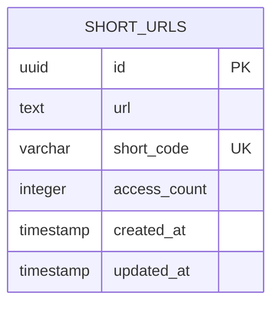

# ADR 05 — Schema do banco e migrations

## Status

Proposto

## Contexto

A feature de encurtamento de URLs depende de um modelo relacional simples, mas precisa nascer com disciplina suficiente para suportar integridade, evolução segura de schema, consultas previsíveis e estatísticas de acesso.

O desafio pede, como funcionalidades centrais:

- criar short URL
- recuperar URL original a partir do short code
- atualizar short URL existente
- remover short URL existente
- consultar estatísticas de acesso

A stack escolhida para persistência é:

- **PostgreSQL** como banco relacional
- **Drizzle** como schema e camada principal de acesso
- **Docker Compose** para ambiente local

As diretrizes arquiteturais e operacionais já definidas também exigem que:

- o schema do banco seja claro e consistente
- tabelas, colunas, índices e constraints sigam padrão de naming
- integridade estrutural seja garantida no banco sempre que possível
- unicidade seja protegida por constraint real, não só por regra de aplicação
- queries sejam centralizadas em repositórios ou query services
- paginação seja eficiente
- `select *` seja evitado
- transações sejam curtas e só existam quando realmente necessárias
- migrations sejam pequenas, revisáveis e seguras
- migrations aplicadas nunca sejam editadas
- exista estratégia de rollback
- schema do Drizzle seja tratado como fonte de verdade
- tipos inferidos sejam reaproveitados sem duplicação desnecessária
- datas sejam armazenadas em UTC

O objetivo deste ADR é definir a modelagem inicial do banco, as regras de integridade e a estratégia de migrations para a feature `short-url`, sem misturar ainda implementações detalhadas de repositório e casos de uso.

## Decisão

A persistência da feature será modelada inicialmente com uma **tabela principal de short URLs**, acompanhada de constraints e índices explícitos para suportar CRUD e estatísticas de acesso.

O schema será definido em **Drizzle** e tratado como **fonte de verdade da modelagem**. A evolução do banco ocorrerá exclusivamente por **migrations versionadas, pequenas e revisáveis**.

---

## 1. Modelagem inicial do domínio persistido

A modelagem inicial será deliberadamente enxuta.

### Tabela principal: `short_urls`

Essa tabela será responsável por armazenar o vínculo entre a URL original e o código curto gerado.

### Campos iniciais previstos

- `id`
- `url`
- `short_code`
- `access_count`
- `created_at`
- `updated_at`
- `deleted_at` (opcional, dependendo da decisão de soft delete)

### Decisão inicial sobre remoção

Para este projeto, a decisão padrão será **não usar soft delete por padrão**.

O `DELETE /shorten/:shortCode` será modelado como **remoção física**, a menos que algum requisito futuro real justifique retenção lógica.

### Motivo

- o desafio não exige recuperação de itens removidos
- remover fisicamente reduz complexidade em filtros e índices
- evita custo de padronizar `deleted_at` em toda query sem necessidade real

Portanto, `deleted_at` **não faz parte do schema inicial**.

---

## 2. Estrutura da tabela `short_urls`

### Colunas propostas

#### `id`

- identificador primário interno
- tipo: UUID
- gerado pelo sistema
- não baseado no `short_code`

#### `url`

- URL original informada pelo cliente
- tipo textual apropriado (`text`)
- obrigatória
- armazenada após validação na borda

#### `short_code`

- código curto único usado para consulta pública
- tipo textual curto
- obrigatório
- deve ter constraint de unicidade

#### `access_count`

- contador agregado de acessos
- tipo inteiro
- obrigatório
- valor padrão `0`
- não pode ser negativo

#### `created_at`

- timestamp de criação em UTC
- obrigatório

#### `updated_at`

- timestamp de última atualização em UTC
- obrigatório

---

## 3. Constraints de integridade

A aplicação usará validação com Zod, mas integridade estrutural relevante também deve existir no banco.

### Constraints obrigatórias

#### Primary key

- `pk_short_urls`

#### Unique

- unicidade em `short_code`
- constraint sugerida: `uq_short_urls_short_code`

#### Check constraints

- `access_count >= 0`
- constraint sugerida: `ck_short_urls_access_count_non_negative`

### Motivo

- unicidade não pode depender apenas da aplicação
- consistência mínima deve ser reforçada no banco
- contador negativo não faz sentido estruturalmente

---

## 4. Índices iniciais

Índices devem ser criados para consultas reais, não por especulação excessiva.

### Índices iniciais esperados

#### Índice/constraint para `short_code`

Como o lookup principal do sistema é por código curto, `short_code` deve estar coberto por unicidade/indexação adequada.

Na prática, a unique constraint já atende esse ponto.

#### Índice por ordenação temporal, se necessário futuramente

Não será criado índice temporal extra no primeiro momento sem query real que o justifique.

### Decisão

No schema inicial, o índice essencial é o associado à unicidade de `short_code`.

### Observação

Índices adicionais só devem surgir quando houver consulta concreta, por exemplo:

- listagem administrativa paginada por `created_at`
- filtros por data
- relatórios operacionais

---

## 5. Estratégia para estatísticas de acesso

O desafio pede estatísticas de acesso, especificamente `accessCount`.

### Decisão

A contagem será armazenada de forma **agregada na própria tabela `short_urls`**, no campo `access_count`.

### Motivo

- é simples
- atende ao requisito do desafio
- evita criar tabela de eventos sem necessidade comprovada
- reduz custo de implementação inicial

### Consequência

Ao recuperar uma short URL por `short_code`, o sistema deve incrementar `access_count` de forma segura e explícita.

### Observação

Se no futuro houver necessidade de analytics mais ricas, poderá ser introduzida uma tabela de eventos, por exemplo `short_url_access_events`, mas isso está fora do escopo inicial.

---

## 6. Estratégia para concorrência no contador

Como `access_count` representa estatística agregada, a atualização precisa considerar concorrência.

### Decisão

O incremento do contador deve ser feito por **operação atômica no banco**, evitando padrão de leitura-modificação-escrita ingênuo.

### Regras

- evitar buscar o valor atual em memória e depois salvar manualmente
- preferir update atômico com incremento direto
- manter operação curta

### Motivo

Isso reduz perda de contagem em acessos concorrentes.

---

## 7. Estratégia de IDs e short code

### `id`

Será UUID interno, usado como identificador técnico estável.

### `short_code`

Será o identificador público de consulta e update/delete por rota.

### Motivo da separação

- evita expor o identificador interno como chave pública principal
- mantém flexibilidade arquitetural
- permite eventual troca na estratégia de geração do short code sem afetar a PK estrutural

---

## 8. Naming conventions do schema

O banco seguirá convenções fixas e previsíveis.

### Tabelas

- plural em `snake_case`
- exemplo: `short_urls`

### Colunas

- `snake_case`
- nomes explícitos e sem abreviações obscuras

### Constraints

- primary key: `pk_<table>`
- unique: `uq_<table>_<field>`
- foreign key: `fk_<table>_<field>_<target_table>`
- check: `ck_<table>_<rule>`
- index: `idx_<table>_<field_or_purpose>`

### Motivo

- facilita manutenção
- melhora leitura em migrations e troubleshooting
- reduz caos em ambientes reais

---

## 9. Tipos e precisão

### URLs

- armazenar em `text`
- não impor limite artificial curto sem necessidade

### Short code

- armazenar como texto curto
- tamanho máximo pode ser controlado por validação e definição de coluna compatível

### Timestamps

- armazenar em UTC
- usar precisão consistente definida uma vez no projeto

### Contador

- usar inteiro com default `0`
- protegido por check constraint

---

## 10. Estratégia de migrations

Toda alteração de schema deve ocorrer por migration versionada.

### Regras obrigatórias

- migrations devem ser pequenas
- migrations devem ser revisáveis
- migrations aplicadas nunca devem ser editadas
- toda mudança estrutural deve ser versionada com disciplina
- rollback deve ser considerado na hora de escrever a migration

### Fluxo esperado

1. alterar o schema Drizzle
2. gerar migration correspondente
3. revisar migration
4. aplicar em ambiente local/teste
5. versionar schema + migration juntos

### Proibição

- alterar banco manualmente e deixar schema divergente
- editar migration já aplicada em ambientes compartilhados

---

## 11. Estratégia de rollback

Rollback não deve ser ignorado, mesmo em projeto pequeno.

### Decisão

Toda migration deve ser pensada de modo que:

- sua intenção seja clara
- alterações destrutivas sejam evitadas sem necessidade
- rollback seja possível quando tecnicamente viável

### Observação

Nem toda migration terá rollback perfeito sem risco, mas o time deve sempre avaliar impacto antes de aplicar mudanças destrutivas.

---

## 12. Organização dos arquivos de banco

Estrutura sugerida:

```text
src/
  infra/
    database/
      schema/
        short-urls.table.ts
      migrations/
      drizzle.config.ts
      database.module.ts
      database.service.ts
```

### Observação

A estrutura pode ser refinada ao longo do projeto, mas deve manter:

- schema explícito
- migrations organizadas
- separação entre definição estrutural e uso operacional

---

## 13. Relação entre domínio e persistência

O domínio não deve ficar acoplado diretamente aos detalhes do Drizzle.

### Decisão

O schema Drizzle será a fonte de verdade da persistência, mas o modelo de domínio continuará separado do registro persistido.

### Regras

- repository faz o mapeamento entre registro persistido e entidade/modelo de domínio
- não expor registro do banco diretamente como resposta HTTP
- não misturar detalhes de query com regra de negócio

---

## 14. Uso de transações

### Decisão

Transações devem ser usadas somente quando a operação exigir atomicidade real entre múltiplas mudanças.

### Para o escopo inicial

Como a modelagem inicial é simples, muitas operações não precisarão de transação explícita além da atomicidade natural de uma única query.

### Regras

- manter transações curtas
- não abrir transação sem necessidade
- não colocar lógica pesada dentro de transação

---

## 15. Query discipline

As queries devem seguir disciplina desde cedo.

### Regras

- não usar `select *` sem necessidade
- selecionar apenas colunas necessárias
- centralizar queries em repositórios ou query services
- evitar SQL raw sem necessidade
- quando SQL raw for necessário, encapsular e documentar
- revisar queries críticas com `EXPLAIN` quando surgirem gargalos reais

---

## 16. Segurança aplicada ao banco

O banco deve reforçar não só integridade, mas também segurança operacional.

### Regras

- nunca montar SQL por concatenação com entrada do usuário
- credenciais ficam em env, não no código
- conexão deve respeitar timeout e pool configuráveis
- banco não deve ficar exposto publicamente sem necessidade
- mensagens internas do banco não devem vazar para clientes HTTP
- logs não devem exibir senha ou DSN sensível

---

## 17. Seed e dados iniciais

O domínio de URL shortener não depende de seed rica para funcionar.

### Decisão

Ainda assim, a arquitetura deve suportar seed idempotente para cenários de desenvolvimento e testes.

### Escopo atual

Este ADR não define o conteúdo do seed; apenas estabelece que o schema e as migrations devem permitir esse fluxo sem gambiarra.

---

## 18. Modelagem inicial em Mermaid



---

## 19. Exemplo conceitual de schema em Drizzle

```ts
export const shortUrls = pgTable('short_urls', {
  id: uuid('id').primaryKey().defaultRandom(),
  url: text('url').notNull(),
  shortCode: varchar('short_code', { length: 32 }).notNull(),
  accessCount: integer('access_count').notNull().default(0),
  createdAt: timestamp('created_at', { withTimezone: true }).notNull().defaultNow(),
  updatedAt: timestamp('updated_at', { withTimezone: true }).notNull().defaultNow(),
}, (table) => ({
  shortCodeUnique: unique('uq_short_urls_short_code').on(table.shortCode),
  accessCountNonNegative: check('ck_short_urls_access_count_non_negative', sql`${table.accessCount} >= 0`),
}));
```

### Observação

Esse trecho é conceitual. O schema final pode ajustar detalhes de API do Drizzle, mas deve preservar as decisões de modelagem, naming e integridade.

---

## 20. Consequências

### Positivas

- modelagem inicial simples e suficiente para o desafio
- unicidade e integridade garantidas no banco
- estatísticas atendidas sem supermodelagem
- evolução controlada por migrations pequenas
- alinhamento entre schema Drizzle e banco real
- menor risco de débito técnico estrutural logo no início

### Negativas

- `access_count` agregado não preserva histórico detalhado de acessos
- remoção física elimina possibilidade de recuperação lógica sem backup
- modelagem simples pode exigir expansão futura para analytics mais ricas

### Trade-off assumido

Preferimos um schema pequeno, íntegro e operacionalmente claro em vez de antecipar complexidades que o desafio não pede agora.

---

## 21. Alternativas consideradas

### 1. Usar tabela separada de eventos de acesso desde o início

Rejeitada para o escopo inicial.

Motivo:

- adiciona complexidade sem necessidade imediata
- o requisito atual pede apenas contagem de acessos

### 2. Usar o `short_code` como primary key

Rejeitada.

Motivo:

- acopla a identidade estrutural ao identificador público
- reduz flexibilidade futura
- piora separação entre chave técnica e chave de negócio pública

### 3. Usar soft delete como padrão

Rejeitada.

Motivo:

- aumenta complexidade sem requisito real
- exige padronização extra em queries e índices
- o desafio não pede recuperação de removidos

### 4. Não criar constraints e confiar apenas na aplicação

Rejeitada.

Motivo:

- integridade estrutural deve ser protegida também no banco
- aplicação sozinha não substitui constraint real

### 5. Fazer alterações manuais de banco fora de migration

Rejeitada.

Motivo:

- gera divergência entre schema e ambiente real
- reduz rastreabilidade
- complica rollback e troubleshooting

---

## Escopo deste ADR

Este ADR define:

- modelagem inicial da tabela `short_urls`
- constraints e naming conventions do banco
- estratégia de contagem de acessos
- política de migrations com Drizzle
- decisões sobre remoção física vs soft delete
- princípios de integridade e disciplina de query

Este ADR não define em detalhe:

- implementação concreta dos repositórios
- casos de uso específicos da feature
- seed final
- estratégia avançada de analytics
- tuning fino de índices para cenários ainda inexistentes
- políticas completas de backup e disaster recovery

---

## Critérios de aceite

A task de schema do banco e migrations será considerada concluída quando existir:

- schema Drizzle para `short_urls`
- primary key explícita
- unique constraint para `short_code`
- check constraint para `access_count >= 0`
- migration inicial gerada e revisável
- convenções de naming aplicadas em tabela, colunas e constraints
- documentação mínima no README ou docs internas sobre como gerar e aplicar migrations

## Exemplo de resultado esperado

Ao final desta task, o projeto deve permitir:

1. subir o banco localmente
2. aplicar migration inicial
3. persistir short URLs com integridade estrutural garantida
4. consultar por `short_code` com unicidade protegida
5. armazenar e evoluir `access_count` de forma segura e explícita

---

## Próximos ADRs relacionados

- ADR 06 — Módulo de domínio short-url
- ADR 07 — Casos de uso: criar e obter short URL
- ADR 08 — Casos de uso: atualizar, deletar e estatísticas
- ADR 09 — Observabilidade e hardening

