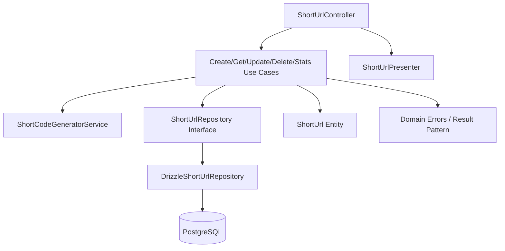

# ADR 06 — Módulo de domínio short-url

## Status

Proposto

## Contexto

A feature principal do projeto é o serviço de encurtamento de URLs. Ela concentra o núcleo funcional do desafio e precisa ser organizada de forma que permita evolução segura, baixo acoplamento, alta legibilidade e boa separação entre regras de negócio, borda HTTP e persistência.

Os requisitos já definidos ao longo dos ADRs anteriores determinam que:

- o projeto deve ser estruturado por **domínio ou feature**, e não por tipo de arquivo
- módulos devem ser pequenos, coesos e com responsabilidade única
- controller, use case, service e repository devem ser claramente separados
- controllers não devem conter regra de negócio
- acesso ao banco deve ficar isolado em repositórios
- validação estrutural de entrada deve acontecer na borda com Zod
- erros de negócio esperados devem preferir Result Pattern
- exceptions devem ficar reservadas a falhas realmente excepcionais
- a base HTTP já fornece contratos, pipes, filters e interceptors compartilhados
- o banco já foi modelado com a tabela `short_urls`

Além disso, os endpoints exigidos pelo desafio são todos centrados na mesma capacidade funcional:

- criar short URL
- obter URL original por short code
- atualizar URL existente
- deletar URL existente
- consultar estatísticas de acesso

Como essas operações pertencem ao mesmo subdomínio e compartilham identidade, invariantes e políticas de persistência, faz sentido tratá-las dentro de um módulo de feature dedicado, em vez de espalhá-las em áreas genéricas da aplicação.

O objetivo deste ADR é definir a arquitetura interna do módulo `short-url`, sua fronteira, seus componentes e suas regras de dependência.

## Decisão

A feature será implementada em um **módulo de domínio/feature chamado `short-url`**, organizado por responsabilidade interna e mantendo separação clara entre:

1. **borda de entrada** (HTTP)
2. **casos de uso da feature**
3. **modelo de domínio**
4. **contratos e mapeamentos**
5. **persistência por repositório**

O módulo será autocontido o suficiente para concentrar sua lógica principal, mas continuará consumindo infraestrutura compartilhada apenas quando fizer sentido real, como base HTTP, config, logger e database.

---

## 1. Princípio de organização

O módulo `short-url` seguirá organização por feature e não por tipo global de arquivo.

### Objetivo

- concentrar tudo que pertence à feature em um mesmo espaço lógico
- facilitar navegação e manutenção
- reduzir acoplamento entre partes não relacionadas
- evitar diretórios globais gigantes de `controllers`, `services`, `repositories` etc.

### Regra

Tudo que for específico da feature `short-url` deve viver dentro do módulo dela, exceto aquilo que for comprovadamente compartilhado entre múltiplas features.

---

## 2. Fronteira do módulo

O módulo `short-url` será responsável por tudo o que diz respeito ao ciclo de vida de uma URL encurtada.

### Inclui

- criação de short URL
- recuperação por short code
- atualização da URL original associada
- remoção da short URL
- consulta de estatísticas
- geração e validação de short code no contexto da feature
- regras de unicidade e tratamento de conflitos
- mapeamento entre domínio e persistência

### Não inclui

- bootstrap global da aplicação
- configuração de environment
- infra compartilhada HTTP
- configuração de banco/redis
- políticas genéricas de logging
- autenticação/autorização
- recursos de analytics avançada fora do escopo

---

## 3. Estrutura sugerida do módulo

Estrutura base sugerida:

```text
src/
  modules/
    short-url/
      short-url.module.ts
      http/
        controllers/
          shorten.controller.ts
        contracts/
          create-short-url.request.ts
          update-short-url.request.ts
          short-url.response.ts
          short-url-stats.response.ts
        presenters/
          short-url.presenter.ts
      application/
        use-cases/
          create-short-url.use-case.ts
          get-short-url.use-case.ts
          update-short-url.use-case.ts
          delete-short-url.use-case.ts
          get-short-url-stats.use-case.ts
        services/
          short-code-generator.service.ts
      domain/
        entities/
          short-url.entity.ts
        errors/
          short-url-not-found.error.ts
          short-code-conflict.error.ts
          invalid-short-url-state.error.ts
        repositories/
          short-url.repository.ts
        value-objects/
          short-code.vo.ts
          original-url.vo.ts
      infra/
        repositories/
          drizzle-short-url.repository.ts
        mappers/
          short-url.persistence-mapper.ts
```

### Observação

Nem toda pasta precisa nascer superpopulada. A estrutura existe para deixar responsabilidades claras e permitir crescimento ordenado.

---

## 4. Camada HTTP da feature

A camada HTTP da feature deve ser fina e explícita.

### Responsabilidades

- declarar endpoints da feature
- receber entrada já validada com Zod via base HTTP compartilhada
- chamar o caso de uso apropriado
- mapear resposta de domínio/aplicação para contrato HTTP

### Regras

- controller não contém regra de negócio
- controller não acessa banco diretamente
- controller não gera short code
- controller não conhece detalhes do Drizzle
- controller não converte erro técnico bruto em resposta por conta própria, exceto no fluxo padronizado da borda

### Decisão inicial

Pode existir um único controller da feature, por exemplo `shorten.controller.ts`, desde que ele permaneça pequeno e coeso.

---

## 5. Camada de aplicação

A camada de aplicação concentra os casos de uso da feature.

### Casos de uso esperados

- `CreateShortUrlUseCase`
- `GetShortUrlUseCase`
- `UpdateShortUrlUseCase`
- `DeleteShortUrlUseCase`
- `GetShortUrlStatsUseCase`

### Responsabilidades

- coordenar fluxo da feature
- aplicar regra de negócio
- interagir com repositórios
- usar serviços auxiliares do domínio/aplicação quando necessário
- retornar sucesso/falha esperada em formato previsível

### Regras

- cada use case deve ter responsabilidade única
- evitar “god use case” acumulando múltiplas intenções
- não acessar HTTP diretamente
- não conhecer detalhes de banco além dos contratos de repositório

---

## 6. Serviço de geração de short code

A geração do `short_code` é uma capacidade central da feature, mas não deve ficar no controller nem espalhada por vários pontos.

### Decisão

Será criado um serviço específico para geração de short code, por exemplo `short-code-generator.service.ts`.

### Responsabilidades

- gerar código curto aleatório
- respeitar política de tamanho e charset definida pela feature
- permitir evolução futura da estratégia sem quebrar casos de uso

### Regras

- geração deve ser encapsulada
- geração não garante unicidade sozinha; unicidade final é garantida pelo banco
- política de retry por conflito pode ficar no caso de uso que cria a short URL

### Motivo

Isso separa claramente:

- **gerar candidato a short code**
- **persistir com unicidade real**

---

## 7. Camada de domínio

A camada de domínio representa o núcleo conceitual da feature.

### Componentes esperados

- entidade `ShortUrl`
- value objects quando trouxerem clareza real
- erros de domínio claros
- interface de repositório de domínio

### Objetivo

- expressar regras da feature sem acoplamento direto à infraestrutura
- proteger invariantes importantes
- manter linguagem ubíqua da feature

---

## 8. Entidade `ShortUrl`

A entidade principal do módulo é `ShortUrl`.

### Responsabilidades conceituais

- representar a identidade da short URL
- carregar estado relevante da feature
- permitir operações do domínio que façam sentido

### Estado esperado

- `id`
- `url`
- `shortCode`
- `accessCount`
- `createdAt`
- `updatedAt`

### Possíveis comportamentos

- atualizar URL original
- registrar incremento de acesso quando modelado no domínio

### Regra

A entidade não deve conhecer HTTP, banco, Drizzle ou NestJS.

---

## 9. Value Objects

Value objects serão usados quando realmente agregarem clareza sem burocracia excessiva.

### Candidatos naturais

- `ShortCode`
- `OriginalUrl`

### Motivo

Eles podem encapsular invariantes e normalização sem contaminar controllers ou repositórios.

### Regra de parcimônia

Não criar VO apenas por formalismo. Só manter quando a clareza compensar o custo.

---

## 10. Repositório de domínio

O domínio/aplicação não deve depender diretamente do Drizzle.

### Decisão

Será definida uma interface de repositório da feature, por exemplo `ShortUrlRepository`, dentro do módulo.

### Responsabilidades do contrato

- criar registro
- buscar por `shortCode`
- atualizar URL e metadados necessários
- remover registro
- incrementar ou persistir estatística de acesso
- verificar conflitos/colisões quando necessário

### Regra

Use cases dependem da interface, não da implementação concreta.

---

## 11. Implementação de infraestrutura do repositório

A implementação concreta ficará na pasta `infra/repositories`.

### Exemplo

- `drizzle-short-url.repository.ts`

### Responsabilidades

- traduzir o contrato do repositório para queries Drizzle
- selecionar apenas colunas necessárias
- manter detalhes de persistência encapsulados
- lidar com constraints e erros técnicos de banco no nível adequado

### Regra

A implementação concreta não deve vazar para controller nem para contratos HTTP.

---

## 12. Mappers do módulo

O módulo deve manter mapeamentos explícitos entre suas camadas.

### Tipos de mapper esperados

#### Persistence mapper

- converte registro do banco em entidade/modelo de domínio
- converte dados de domínio para payload de persistência

#### Presenter

- converte saída da aplicação/domínio para contrato HTTP documentado

### Motivo

- evita expor entidade interna diretamente
- reduz acoplamento entre camadas
- torna transformações explícitas e testáveis

---

## 13. Erros de domínio do módulo

A feature deve declarar erros de domínio pequenos, claros e sem ambiguidade.

### Exemplos esperados

- `ShortUrlNotFoundError`
- `ShortCodeConflictError`
- `InvalidShortUrlStateError`

### Regras

- erros de domínio não devem carregar semântica HTTP embutida
- nomes devem refletir linguagem da feature
- falhas esperadas devem conviver bem com Result Pattern

---

## 14. Dependências permitidas

O módulo `short-url` pode depender de:

- base HTTP compartilhada
- config tipada
- logger compartilhado
- abstrações de database necessárias à implementação concreta

### Não deve depender de

- detalhes HTTP na camada de domínio
- outra feature de negócio sem necessidade real
- helpers globais obscuros que escondam regra da feature
- leitura direta de `process.env`

---

## 15. Responsabilidade do módulo Nest

O `short-url.module.ts` será o ponto de composição da feature.

### Responsabilidades

- registrar controller(s)
- registrar use cases
- registrar serviços auxiliares da feature
- vincular interface de repositório à implementação concreta
- expor apenas o necessário

### Regras

- evitar exports desnecessários
- não transformar o módulo em container genérico de coisas aleatórias
- manter providers majoritariamente stateless

---

## 16. Convenções de naming da feature

Para manter legibilidade, a feature seguirá convenções fixas.

### Arquivos

- `kebab-case`
- sufixos explícitos

Exemplos:

- `create-short-url.use-case.ts`
- `short-url.entity.ts`
- `short-url.repository.ts`
- `short-url.presenter.ts`
- `drizzle-short-url.repository.ts`

### Classes

- nomes explícitos com papel claro

Exemplos:

- `CreateShortUrlUseCase`
- `ShortUrlPresenter`
- `DrizzleShortUrlRepository`

---

## 17. Contratos HTTP da feature

A feature deve manter contratos de request/response pequenos e específicos por endpoint.

### Exemplos

- `create-short-url.request.ts`
- `update-short-url.request.ts`
- `short-url.response.ts`
- `short-url-stats.response.ts`

### Regras

- não reutilizar um contrato genérico para tudo
- não expor entidade interna diretamente
- contratos devem refletir o que a API realmente entrega
- Swagger deve documentar esses contratos com fidelidade

---

## 18. Estratégia de crescimento do módulo

Embora a feature inicial seja pequena, a organização deve suportar evolução futura sem colapsar em um módulo gigante.

### Crescimentos esperados que a estrutura já acomoda

- listagem administrativa
- expiração de short URLs
- custom short codes
- analytics mais ricas
- política de deduplicação por URL original
- fila para eventos futuros

### Decisão

A estrutura nasce modular o suficiente para crescer, mas sem superengenharia desnecessária agora.

---

## 19. Relação com Result Pattern

Os casos de uso da feature devem preferir Result Pattern para falhas esperadas.

### Exemplo conceitual

- not found
- conflito de short code
- operação inválida de atualização/deleção

### Motivo

- evita uso de exception como fluxo esperado
- deixa mais clara a semântica do caso de uso
- facilita mapeamento na borda HTTP

---

## 20. Limites de responsabilidade entre camadas

### Controller

- recebe chamada HTTP
- chama use case
- devolve presenter/contrato

### Use case

- coordena regra de negócio
- usa repositório e serviços auxiliares

### Entity / VO

- expressam invariantes e linguagem do domínio

### Repository interface

- define necessidades de persistência da feature

### Repository implementation

- executa acesso ao banco

### Presenter

- transforma saída para a API

Esse limite é obrigatório para evitar mistura de papéis.

---

## 21. Consequências

### Positivas

- a feature fica autocontenida e fácil de navegar
- separação clara entre borda, domínio e persistência
- reduz risco de regra de negócio em controller
- facilita testes unitários e de integração
- permite trocar detalhes de infraestrutura com menor impacto
- reforça organização por feature, como exigido pelo projeto

### Negativas

- adiciona alguns arquivos e abstrações a mais no início
- exige disciplina para não burlar a fronteira do módulo
- pode parecer mais formal que o mínimo para um CRUD trivial

### Trade-off assumido

Preferimos uma feature pequena, mas arquiteturalmente limpa, em vez de um CRUD rápido que se degrade logo nos próximos passos.

---

## 22. Alternativas consideradas

### 1. Organizar o projeto por tipo global de arquivo

Rejeitada.

Motivo:

- espalha a feature por vários diretórios
- dificulta manutenção
- contraria requisito explícito do projeto

### 2. Colocar lógica de geração de short code no controller

Rejeitada.

Motivo:

- mistura borda com regra de negócio
- dificulta teste e evolução

### 3. Usar diretamente o repositório Drizzle no use case sem interface

Rejeitada.

Motivo:

- aumenta acoplamento à infraestrutura
- dificulta substituição, teste e clareza arquitetural

### 4. Tratar a feature como simples CRUD sem camada de domínio

Parcialmente rejeitada.

Motivo:

- embora o problema seja pequeno, ainda há regra suficiente para justificar fronteira de domínio/aplicação
- geração de short code, contagem de acesso, conflitos e invariantes merecem modelagem mínima explícita

### 5. Criar múltiplos módulos menores para cada endpoint

Rejeitada.

Motivo:

- fragmenta demais o que pertence ao mesmo núcleo de negócio
- aumenta overhead sem ganho real

---

## Escopo deste ADR

Este ADR define:

- existência do módulo `short-url`
- fronteira da feature
- organização interna por camadas e responsabilidades
- papel de controller, use case, entidade, repository e presenter
- política de dependências do módulo
- convenções de naming e crescimento da feature

Este ADR não define em detalhe:

- implementação concreta de cada caso de uso
- política exata de geração do short code
- contratos completos de cada endpoint
- detalhes de query do Drizzle
- estratégia completa de testes da feature

---

## Critérios de aceite

A task do módulo de domínio `short-url` será considerada concluída quando existir:

- `short-url.module.ts`
- controller da feature registrado
- casos de uso separados por responsabilidade
- interface de repositório da feature
- implementação concreta de repositório ligada por DI
- entidade `ShortUrl` e erros de domínio iniciais
- presenter/contratos HTTP da feature
- organização por feature refletida na árvore do projeto

## Exemplo de resultado esperado

Ao final desta task, o projeto deve permitir:

1. localizar toda a feature `short-url` em um único módulo coeso
2. enxergar separadamente borda HTTP, aplicação, domínio e persistência
3. evoluir os endpoints da feature sem espalhar regra de negócio pelo projeto
4. testar casos de uso com baixo acoplamento à infraestrutura

---

## Diagrama simplificado do módulo



## Próximos ADRs relacionados

- ADR 07 — Casos de uso: criar e obter short URL
- ADR 08 — Casos de uso: atualizar, deletar e estatísticas
- ADR 09 — Observabilidade e hardening

