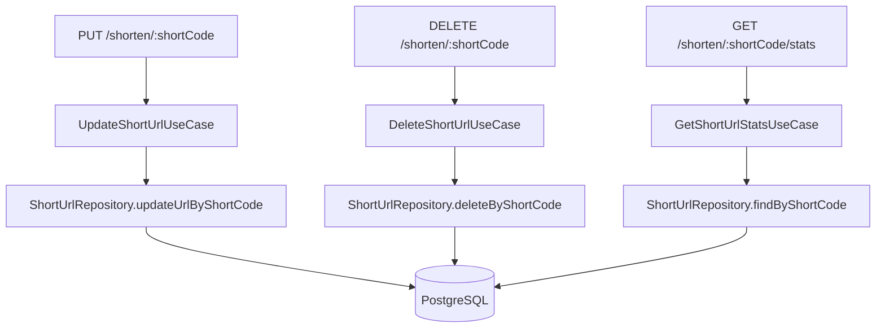
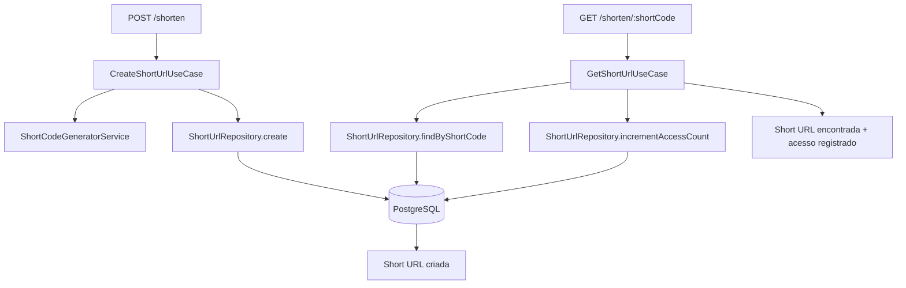

# ADR 07 — Casos de uso short-url

## Status

Proposto

## Contexto

Os fluxos essenciais do serviço de encurtamento de URLs são:

- criar uma short URL
- obter a URL original a partir do `shortCode`
- atualizar uma short URL existente
- deletar uma short URL existente
- consultar estatísticas de acesso

Os fluxos de criação e obtenção formam o núcleo mínimo funcional da API. Sem eles, o sistema não entrega sua proposta principal. Ao mesmo tempo, eles concentram várias decisões importantes que impactam validação, unicidade, contagem de acessos, contratos HTTP, repositório e comportamento transacional.

Os ADRs anteriores já definiram que:

- a feature será implementada em um módulo `short-url`
- a borda HTTP é padronizada por uma base compartilhada
- validação estrutural é feita com Zod
- a persistência usa PostgreSQL + Drizzle
- a tabela `short_urls` possui `id`, `url`, `short_code`, `access_count`, `created_at`, `updated_at`
- `short_code` possui unicidade garantida por constraint
- `access_count` é armazenado como contador agregado
- a aplicação deve preferir Result Pattern para falhas esperadas
- controllers não contêm regra de negócio
- repositórios encapsulam acesso ao banco

O objetivo deste ADR é definir o comportamento dos cinco casos de uso da feature, incluindo regras, fluxos, contratos internos, tratamento de erro e responsabilidades de cada componente.

## Decisão

Serão implementados cinco casos de uso independentes e coesos:

- `CreateShortUrlUseCase`
- `GetShortUrlUseCase`
- `UpdateShortUrlUseCase`
- `DeleteShortUrlUseCase`
- `GetShortUrlStatsUseCase`

Cada um terá responsabilidade única, dependerá apenas de contratos explícitos e seguirá o padrão arquitetural já definido para a feature.

---

## 1. Caso de uso: CreateShortUrl

### Objetivo

Receber uma URL válida, gerar um `shortCode` aleatório único e persistir uma nova short URL.

### Entrada conceitual

- `url`

### Saída conceitual em caso de sucesso

- `id`
- `url`
- `shortCode`
- `createdAt`
- `updatedAt`

### Falhas esperadas

- payload inválido na borda HTTP
- falha de unicidade por colisão de `shortCode`
- falha inesperada de persistência

---

## 2. Regras do CreateShortUrl

### Regra 1 — Validação estrutural acontece antes do caso de uso

A URL deve chegar ao caso de uso já validada pela borda HTTP com Zod.

Isso inclui:

- presença obrigatória
- formato de URL válido
- normalização/sanitização básica quando aplicável

### Regra 2 — O caso de uso não confia cegamente na borda

Mesmo com validação HTTP, o caso de uso continua assumindo contratos explícitos de entrada, sem depender de objetos brutos de request.

### Regra 3 — `shortCode` é gerado internamente

O cliente não informa `shortCode` neste fluxo.

### Regra 4 — Unicidade real é garantida pelo banco

A aplicação pode tentar evitar colisão, mas a garantia final é da constraint única no PostgreSQL.

### Regra 5 — `accessCount` nasce em zero

Toda short URL criada inicia com `accessCount = 0`.

### Regra 6 — `createdAt` e `updatedAt` devem refletir o momento de criação

Na criação, ambos devem representar o instante inicial persistido.

---

## 3. Fluxo do CreateShortUrl

Fluxo conceitual:

1. receber entrada já validada
2. gerar candidato a `shortCode`
3. tentar persistir a short URL
4. se houver colisão de unicidade, gerar novo código e tentar novamente até o limite configurado
5. em caso de sucesso, retornar entidade persistida
6. em caso de estouro de tentativas ou erro inesperado, retornar falha apropriada

---

## 4. Política de geração de short code

### Decisão

A geração do código curto será delegada a `ShortCodeGeneratorService`.

### Regras iniciais

- código aleatório
- charset simples e previsível
- tamanho fixo definido pela feature
- sem significado de negócio embutido

### Motivo

- reduz acoplamento
- facilita troca futura da estratégia
- mantém controller e use case mais claros

### Observação

A estratégia exata de geração não precisa ser supercomplexa nesta fase, desde que seja segura o bastante para o escopo do desafio e compatível com retry por colisão.

---

## 5. Política de retry por colisão no CreateShortUrl

Como `shortCode` é aleatório, colisão é improvável, mas possível.

### Decisão

O `CreateShortUrlUseCase` deve suportar **retry controlado** quando a persistência falhar por conflito de unicidade do `short_code`.

### Regras

- limitar número máximo de tentativas
- não fazer loop infinito
- diferenciar conflito de unicidade de outros erros técnicos
- ao exceder tentativas, retornar erro controlado da aplicação/domínio

### Motivo

- a unicidade final está no banco
- retry curto resolve colisão rara sem complexidade excessiva

### Exemplo conceitual

- tentativa 1: gera `abc123`, conflito
- tentativa 2: gera `x9k2lm`, sucesso

---

## 6. Dependências do CreateShortUrlUseCase

O caso de uso deve depender apenas de contratos explícitos.

### Dependências previstas

- `ShortUrlRepository`
- `ShortCodeGeneratorService`
- opcionalmente um provider de tempo, se o projeto quiser controlar isso explicitamente em testes

### Não deve depender de

- controller
- request/response HTTP
- Drizzle diretamente
- detalhes de exceções SQL concretas fora do contrato traduzido pelo repositório

---

## 7. Resultado do CreateShortUrl

### Decisão

O caso de uso deve retornar um resultado explícito e previsível.

### Sucesso

Retorna a short URL criada.

### Falha esperada

Retorna falha modelada, por exemplo:

- `ShortCodeConflictExhaustedError` ou equivalente de aplicação

### Falha excepcional

Fica reservada para erro técnico realmente inesperado, que será tratado pela borda HTTP.

---

## 8. Caso de uso: GetShortUrl

### Objetivo

Recuperar a short URL a partir do `shortCode` e refletir o acesso nas estatísticas.

### Entrada conceitual

- `shortCode`

### Saída conceitual em caso de sucesso

- `id`
- `url`
- `shortCode`
- `createdAt`
- `updatedAt`

### Falhas esperadas

- `shortCode` inválido na borda HTTP
- short URL não encontrada

---

## 9. Regra central do GetShortUrl

O fluxo `GET /shorten/:shortCode` deve **consultar a short URL** e **registrar o acesso** para fins estatísticos.

### Motivo

O desafio afirma que o frontend será responsável por redirecionar o usuário, mas a API deve fornecer a URL original. Como as estatísticas são baseadas em acessos à short URL, este fluxo é o ponto mais natural para incrementar a contagem.

### Decisão

Toda recuperação bem-sucedida por `shortCode` deve incrementar `accessCount`.

---

## 10. Fluxo do GetShortUrl

Fluxo conceitual:

1. receber `shortCode` já validado
2. buscar short URL no repositório
3. se não existir, retornar `not found`
4. se existir, registrar incremento de acesso
5. retornar os dados da short URL

---

## 11. Estratégia de incremento de acesso no GetShortUrl

Como `accessCount` é um contador agregado, o incremento precisa ser consistente.

### Decisão

O incremento deve ocorrer por operação explícita e segura no repositório, preferencialmente de forma atômica no banco.

### Regras

- evitar fluxo ingênuo de ler contador, somar em memória e salvar sem controle
- manter operação curta
- garantir que acessos concorrentes não percam contagem de forma trivial

### Alternativas possíveis no repositório

- buscar e incrementar em operação coordenada curta
- ou executar update atômico e retornar estado atualizado conforme estratégia adotada

### Decisão arquitetural

O detalhe exato fica no repositório, mas o caso de uso deve deixar clara a intenção sem vazar SQL.

---

## 12. Ordem semântica do GetShortUrl

Há duas interpretações possíveis:

1. retornar a short URL e depois tentar incrementar acesso
2. incrementar acesso como parte do sucesso do caso de uso

### Decisão

O caso de uso tratará o registro do acesso como parte do fluxo bem-sucedido de consulta.

### Motivo

- mantém estatística alinhada com consultas efetivamente servidas
- evita comportamento parcialmente silencioso demais

### Observação

Se a arquitetura futura quiser relaxar isso por performance extrema, essa mudança deverá ser explícita em outro ADR.

---

## 13. Dependências do GetShortUrlUseCase

### Dependência prevista

- `ShortUrlRepository`

### Possível modelagem de contrato

O repositório pode expor algo como:

- `findByShortCode(shortCode)`
- `incrementAccessCountByShortCode(shortCode)`

ou um método mais específico que encapsule melhor o fluxo.

### Regra

A interface deve refletir necessidades reais do caso de uso, sem ficar genérica demais.

---

## 14. Contratos de entrada e saída

### CreateShortUrl input

```ts
export type CreateShortUrlInput = {
  url: string;
};
```

### CreateShortUrl output

```ts
export type CreateShortUrlOutput = {
  id: string;
  url: string;
  shortCode: string;
  createdAt: Date;
  updatedAt: Date;
};
```

### GetShortUrl input

```ts
export type GetShortUrlInput = {
  shortCode: string;
};
```

### GetShortUrl output

```ts
export type GetShortUrlOutput = {
  id: string;
  url: string;
  shortCode: string;
  createdAt: Date;
  updatedAt: Date;
};
```

### Observação

Os tipos acima são conceituais. A implementação real pode usar entidade, DTO de aplicação ou presenter intermediário, desde que a separação continue clara.

---

## 15. Erros de domínio/aplicação esperados

### Para CreateShortUrl

- `ShortCodeGenerationExhaustedError` ou nome equivalente
- erro técnico de persistência inesperada, tratado fora do fluxo esperado

### Para GetShortUrl

- `ShortUrlNotFoundError`

### Regra

Erros devem ser pequenos, claros e sem semântica HTTP embutida.

---

## 16. Mapeamento HTTP esperado

### POST /shorten

- sucesso -> `201 Created`
- validação inválida -> `400 Bad Request`
- falha controlada de geração/persistência por colisão esgotada -> `409 Conflict` ou `500`, conforme a política final definida pela borda
- erro inesperado -> `500 Internal Server Error`

### GET /shorten/:shortCode

- sucesso -> `200 OK`
- validação inválida -> `400 Bad Request`
- não encontrado -> `404 Not Found`
- erro inesperado -> `500 Internal Server Error`

### Observação

A decisão final entre `409` e `500` para exaustão de colisão deve privilegiar clareza operacional. A recomendação inicial é tratar como falha controlada de conflito/indisponibilidade lógica, não como validação.

---

## 17. Idempotência e comportamento esperado

### CreateShortUrl

Não é idempotente por definição neste escopo.

Cada chamada válida cria uma nova short URL, mesmo que a URL original seja idêntica a outra já existente.

### Motivo

- o desafio não exige deduplicação por URL original
- isso mantém o fluxo mais simples

### GetShortUrl

É semanticamente leitura com efeito colateral estatístico controlado.

### Observação

Embora seja `GET`, o incremento de estatística faz parte do requisito funcional de acesso.

---

## 18. Deduplicação por URL original

### Alternativa considerada

Ao criar uma short URL, o sistema poderia buscar se aquela URL já existe e reutilizar o mesmo código.

### Decisão

Isso **não será feito no escopo inicial**.

### Motivo

- o desafio não pede esse comportamento
- adiciona ambiguidade de negócio
- complica sem necessidade o caso de uso inicial

Portanto, duas requisições iguais de criação podem gerar short URLs diferentes.

---

## 19. Responsabilidades por camada

### Controller

- recebe request validado
- chama `CreateShortUrlUseCase` ou `GetShortUrlUseCase`
- usa presenter para resposta

### Use Case

- coordena fluxo e regra da feature
- não conhece protocolo HTTP

### Repository

- acessa banco
- encapsula detalhes de query e persistência

### Presenter

- transforma saída para contrato HTTP final

### Base HTTP compartilhada

- valida entrada
- padroniza erro
- intercepta/loga/trata exceções

---

## 20. Testes esperados

### CreateShortUrl

Devem existir testes para:

- criação bem-sucedida
- retry por colisão de short code
- falha ao exceder tentativas de geração
- propagação adequada de erro inesperado do repositório

### GetShortUrl

Devem existir testes para:

- busca bem-sucedida com incremento de acesso
- retorno de `not found`
- comportamento diante de falha inesperada no incremento/persistência

### Observação

Testes de concorrência mais finos podem ficar parcialmente concentrados na camada de integração do repositório.

---

## 21. Consequências

### Positivas

- define claramente o núcleo funcional mínimo do sistema
- separa criação e leitura em casos de uso pequenos e testáveis
- trata colisão de short code de forma explícita
- mantém estatística de acesso alinhada ao fluxo de consulta
- evita deduplicação prematura não pedida pelo desafio

### Negativas

- `GET` passa a ter efeito colateral controlado sobre `accessCount`
- retry por colisão adiciona um pequeno fluxo extra ao create
- sem deduplicação, URLs iguais podem gerar múltiplos registros

### Trade-off assumido

Aceitamos simplicidade operacional e aderência ao desafio em vez de antecipar comportamentos mais sofisticados de produto.

---

## 22. Alternativas consideradas

### 1. Não incrementar `accessCount` no GET /shorten/:shortCode

Rejeitada.

Motivo:

- enfraquece o sentido da estatística pedida
- desloca responsabilidade para outro fluxo inexistente no escopo atual

### 2. Deixar colisão de `shortCode` falhar sem retry

Rejeitada.

Motivo:

- embora rara, colisão é possível
- retry curto melhora robustez sem grande custo

### 3. Deduplicar por URL original na criação

Rejeitada neste momento.

Motivo:

- não é requisito
- complica o caso de uso sem ganho essencial para o desafio

### 4. Fazer o controller gerar o `shortCode`

Rejeitada.

Motivo:

- mistura borda com regra de negócio
- prejudica clareza arquitetural

---

## Escopo deste ADR

Este ADR define:

- comportamento do `CreateShortUrlUseCase`
- comportamento do `GetShortUrlUseCase`
- política de geração e retry por colisão
- incremento de `accessCount` na recuperação por short code
- responsabilidades por camada nesses dois fluxos
- erros esperados e mapeamento HTTP conceitual

Este ADR não define em detalhe:

- implementação exata do algoritmo de geração do código
- detalhes concretos das queries Drizzle
- contratos HTTP finais em Swagger linha a linha

---

## Parte 2: UpdateShortUrl, DeleteShortUrl, GetShortUrlStats

Os requisitos formais pedem `PUT /shorten/:shortCode`, `DELETE /shorten/:shortCode` e `GET /shorten/:shortCode/stats`.

### UpdateShortUrl

- **Objetivo:** atualizar a URL original associada a um `shortCode` existente.
- **Regras:** apenas `url` editável; `shortCode`, `id`, `createdAt` imutáveis; `updatedAt` reflete persistência.
- **Mapeamento HTTP:** sucesso `200`, inválido `400`, not found `404`.

### DeleteShortUrl

- **Objetivo:** remoção física por `shortCode`.
- **Regras:** `204 No Content` em sucesso; `404` se inexistente.
- **Mapeamento HTTP:** sucesso `204`, inválido `400`, not found `404`.

### GetShortUrlStats

- **Objetivo:** retornar estatísticas (incluindo `accessCount`) sem incrementar.
- **Regras:** leitura pura; diferenciado de `GetShortUrl` que registra acesso.
- **Mapeamento HTTP:** sucesso `200`, inválido `400`, not found `404`.

### Contrato de repositório (conceitual)

```ts
interface ShortUrlRepository {
  findByShortCode(shortCode: string): Promise<ShortUrl | null>;
  updateUrlByShortCode(input: { shortCode: string; url: string }): Promise<ShortUrl | null>;
  deleteByShortCode(shortCode: string): Promise<boolean>;
}
```

### Diagrama da Parte 2



---

## Critérios de aceite

A task destes casos de uso será considerada concluída quando existir:

- `CreateShortUrlUseCase` implementado
- `GetShortUrlUseCase` implementado
- `UpdateShortUrlUseCase` implementado
- `DeleteShortUrlUseCase` implementado
- `GetShortUrlStatsUseCase` implementado
- integração com `ShortCodeGeneratorService`
- retry controlado por colisão de `shortCode`
- busca por `shortCode` com incremento seguro de `accessCount`
- testes unitários principais desses fluxos
- mapeamento claro para presenter/contrato HTTP

## Exemplo de resultado esperado

Ao final desta task, o projeto deve permitir:

1. receber uma URL válida e criar uma short URL única
2. consultar uma short URL por `shortCode`
3. incrementar estatística de acesso ao consultar
4. atualizar a URL original de uma short URL existente
5. deletar uma short URL por `shortCode`
6. consultar estatísticas por `shortCode`
7. responder corretamente para sucesso, not found e colisões esgotadas

---

## Diagrama simplificado dos fluxos



## Próximos ADRs relacionados

- ADR 08 — Observabilidade e hardening
- ADR 10 — Testes automatizados da feature

