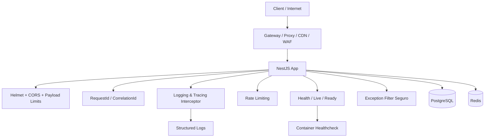

# ADR 08 — Observabilidade e hardening

## Status

Proposto

## Contexto

O serviço de encurtamento de URLs tem escopo funcional pequeno, mas mesmo sistemas aparentemente simples sofrem cedo com problemas de operação, abuso, diagnósticos pobres e superfícies de ataque desnecessárias quando observabilidade e hardening são deixados para depois.

Os requisitos já definidos para o projeto exigem uma base técnica com:

- logger centralizado e preferencialmente estruturado
- correlação por `requestId` e `correlationId`
- masking de dados sensíveis em logs e erros
- interceptors para logging, tracing e tempo de resposta
- health check, readiness e liveness
- timeout em requests e integrações
- `helmet`
- CORS restritivo
- `x-powered-by` desabilitado
- HTTPS em ambientes expostos
- HSTS em produção quando aplicável
- rate limit com `@nestjs/throttler`
- Redis para throttle distribuído quando necessário
- limitação de payload
- monitoramento de latência, taxa de erro, throughput e cache hit ratio
- registro de eventos suspeitos de abuso
- proteção de rotas internas e administrativas por rede ou gateway
- segredos fora do código e fora do repositório

Além disso, este projeto tem características que merecem atenção específica:

- o endpoint público `GET /shorten/:shortCode` é naturalmente exposto a alto volume
- serviços de encurtamento de URL tendem a atrair scraping, brute force de códigos e padrões automatizados de abuso
- diagnósticos ruins dificultam identificar problemas de geração de código, conflitos, latência de banco e falhas operacionais
- como não haverá autenticação neste desafio, a superfície pública precisa ser protegida com mais rigor na borda e na instrumentação

O objetivo deste ADR é definir as decisões de observabilidade e hardening mínimas e recomendadas para o projeto, separando aquilo que entra desde já no MVP do que fica previsto para evolução natural sem comprometer a arquitetura.

## Decisão

O projeto adotará uma camada transversal de **observabilidade e hardening desde o início**, com foco em:

1. **logging estruturado e correlacionado**
2. **tracing e medição de tempo de resposta por request**
3. **health endpoints para operação em Docker e ambientes expostos**
4. **rate limiting e proteção básica contra abuso**
5. **hardening HTTP e de deployment**
6. **política segura de erros, segredos e exposição operacional**

A meta não é criar uma stack enterprise supercomplexa, mas garantir que o serviço já nasça com um nível de resiliência, diagnóstico e segurança proporcional ao fato de ser uma API pública simples.

---

## 1. Escopo do ADR

Este ADR cobre:

- logging
- tracing
- métricas essenciais
- health checks
- hardening HTTP
- limitação de abuso
- proteção operacional básica
- segredos, configuração e exposição segura

Este ADR não cobre em detalhe:

- estratégia completa de autenticação/autorização
- WAF/CDN específicos de provedor
- SIEM corporativo
- alertas de produção integrados a ferramenta específica
- observabilidade distribuída avançada entre múltiplos serviços externos

---

## 2. Logging estruturado como padrão

### Decisão

A aplicação terá um **logger centralizado e estruturado** desde o início.

### Objetivos

- facilitar busca e correlação de eventos
- reduzir ambiguidade em produção
- evitar `console.log` espalhado
- permitir evolução para agregadores de log sem refatoração grande

### Regras

- logs devem ser emitidos por logger compartilhado
- estrutura mínima deve incluir nível, timestamp, contexto e identificadores de correlação quando disponíveis
- logs verbosos devem ser reduzidos em produção
- stack trace nunca deve ser devolvida ao cliente

### Campos mínimos desejados

- `timestamp`
- `level`
- `message`
- `context`
- `requestId`
- `correlationId`
- `path`
- `method`
- `durationMs` quando aplicável

---

## 3. Política de masking de dados sensíveis

### Decisão

Dados sensíveis ou potencialmente sensíveis devem ser mascarados automaticamente em logs e mensagens de erro.

### Regras

- não logar secrets
- não logar credenciais
- não logar conteúdo bruto de headers sensíveis
- não logar payload completo sem necessidade
- evitar registrar URLs originais inteiras em logs de erro quando isso não ajudar no diagnóstico

### Observação contextual

Embora este sistema não manipule dados extremamente sensíveis como autenticação, ainda pode lidar com URLs privadas, tokens em query string, parâmetros sensíveis e payloads maliciosos refletidos. Então vale endurecer esse ponto desde cedo.

---

## 4. RequestId e CorrelationId

### Decisão

Toda request deve receber um `requestId`, e a aplicação deve aceitar/propagar `correlationId` quando fornecido externamente.

### Regras

- se o cliente não enviar identificador de correlação, a aplicação gera um `requestId`
- se o cliente enviar `x-correlation-id` válido, ele deve ser aproveitado e propagado nos logs
- respostas podem refletir o identificador para facilitar troubleshooting

### Motivo

- correlaciona logs de início, fim e erro
- ajuda em debug de timeout e falhas intermitentes
- prepara o terreno para futuras filas/jobs/integrações

---

## 5. Interceptor de tracing e tempo de resposta

### Decisão

Será criado um interceptor transversal para medir latência de request e enriquecer logs com contexto operacional.

### Responsabilidades

- registrar início e fim de requests relevantes
- medir `durationMs`
- anexar `requestId` / `correlationId`
- registrar status code final
- registrar falhas com contexto seguro

### Regras

- interceptor não contém regra de negócio
- interceptor não deve logar payloads sensíveis indiscriminadamente
- em produção, deve evitar excesso de ruído

---

## 6. Níveis de log padronizados

### Decisão

Os níveis de log serão padronizados em:

- `debug`
- `log` ou `info`
- `warn`
- `error`

### Convenção

- `debug`: detalhes diagnósticos de desenvolvimento e troubleshooting controlado
- `info/log`: início/fim de fluxos relevantes, subida de app, eventos operacionais importantes
- `warn`: padrões suspeitos, timeouts parciais, retries, uso anômalo
- `error`: falhas reais que merecem investigação

### Regra

Produção deve rodar com verbosidade reduzida por configuração.

---

## 7. Health check, readiness e liveness

### Decisão

A aplicação exporá endpoints distintos de saúde operacional.

### Endpoints conceituais

- `/health/live`
- `/health/ready`
- `/health`

### Semântica sugerida

#### Liveness

Informa se o processo está vivo.

#### Readiness

Informa se a aplicação está apta a receber tráfego, considerando dependências críticas.

#### Health geral

Pode agregar visão resumida útil para dev e diagnóstico rápido.

### Dependências mínimas a verificar na readiness

- conexão com PostgreSQL
- disponibilidade do Redis quando ele for dependência realmente ativa do ambiente

### Motivo

- melhora operação em Docker Compose, containers e futuros orquestradores
- evita enviar tráfego para instâncias que subiram, mas não estão prontas

---

## 8. Métricas mínimas do sistema

### Decisão

Desde o início, o sistema deve ser pensado para expor ou ao menos registrar métricas essenciais.

### Métricas mínimas desejadas

- latência por endpoint
- taxa de erro por endpoint
- throughput por rota
- volume de requests por status code
- taxa de conflitos de geração de `shortCode`
- taxa de `404` por `shortCode`
- falhas de banco
- health/readiness failures
- cache hit/miss quando Redis for usado para casos aplicáveis

### Observação

Mesmo que o MVP não tenha um stack completo de métricas plugada em dashboard sofisticado, a instrumentação deve nascer de forma que isso seja simples de adicionar.

---

## 9. Hardening HTTP com Helmet

### Decisão

A aplicação usará `helmet` como padrão na borda HTTP.

### Objetivos

- reduzir exposição de cabeçalhos inseguros
- endurecer defaults de segurança em endpoints expostos
- evitar configuração manual fragmentada de headers básicos

### Regras

- `helmet` deve ser configurado no bootstrap
- ajustes finos podem ser feitos conforme ambiente e necessidade real

---

## 10. CORS restritivo

### Decisão

CORS será configurado de forma restritiva e explícita.

### Regras

- nunca usar CORS aberto em produção por conveniência
- permitir apenas origens necessárias por ambiente
- métodos e headers aceitos devem ser os estritamente necessários

### Observação

Como o desafio não pede frontend integrado dentro do mesmo deploy, a política deve continuar explícita e controlada.

---

## 11. x-powered-by desabilitado

### Decisão

A aplicação deve desabilitar `x-powered-by`.

### Motivo

- reduz exposição desnecessária de tecnologia na borda
- é um hardening pequeno, barato e recomendado

---

## 12. HTTPS e HSTS

### Decisão

Todo ambiente exposto externamente deve operar sob HTTPS.

### Regras

- tráfego exposto deve passar por TLS
- em produção, HSTS deve ser ativado quando aplicável e compatível com a topologia de deploy

### Observação

Em dev local com Docker Compose, isso pode não ser necessário diretamente na aplicação, mas a arquitetura deve considerar que produção opera atrás de gateway/proxy seguro.

---

## 13. Limite de payload

### Decisão

O servidor deve impor limite de tamanho de payload.

### Motivo

- prevenir abuso simples
- evitar consumo desnecessário de memória
- proteger endpoints que aceitam body

### Observação contextual

Como o domínio manipula payloads pequenos, o limite pode ser agressivamente baixo sem prejudicar usabilidade.

---

## 14. Timeouts

### Decisão

Devem existir timeouts explícitos para:

- request HTTP
- banco de dados
- Redis quando aplicável

### Motivo

- evita requests penduradas indefinidamente
- melhora previsibilidade operacional
- reduz efeito cascata em cenários degradados

### Regra

Timeout deve ser configurável por ambiente e validado via schema de env.

---

## 15. Rate limiting com NestJS Throttler

### Decisão

A API terá rate limiting desde o início usando `@nestjs/throttler`.

### Objetivos

- reduzir abuso trivial
- dificultar brute force de `shortCode`
- proteger endpoints públicos mais sensíveis

### Endpoints mais sensíveis

- `POST /shorten`
- `GET /shorten/:shortCode`
- `GET /shorten/:shortCode/stats`

### Observação

Os limites podem variar por rota. O endpoint público de consulta merece política diferente do endpoint de criação.

---

## 16. Rate limit distribuído com Redis

### Decisão

Em ambiente horizontal ou quando houver mais de uma instância, o throttle não pode depender de memória local.

### Regras

- usar Redis como backend distribuído para rate limit quando o ambiente justificar
- em dev local, memória local pode ser aceitável apenas para simplicidade operacional temporária
- produção não deve confiar em rate limiting exclusivamente em memória se houver múltiplas réplicas

### Motivo

- consistência de proteção entre instâncias
- previsibilidade em cenários escalados

---

## 17. Proteção contra brute force e scraping óbvio

### Decisão

O sistema deve registrar e mitigar padrões simples de abuso.

### Sinais relevantes

- alto volume de `404` por IP ou fingerprint
- tentativas sequenciais de códigos curtos
- explosão de requests no endpoint de consulta
- user-agents suspeitos ou ausentes em volume anômalo

### Respostas possíveis

- rate limiting mais estrito
- bloqueio progressivo temporário
- registro de evento suspeito em log estruturado

### Observação

Isso não substitui WAF/CDN, mas melhora a resiliência da aplicação.

---

## 18. WAF e CDN na borda

### Decisão arquitetural

O projeto reconhece que DDoS e abuso real não devem ser tratados apenas na aplicação.

### Posição

Para ambiente exposto de verdade, o desenho recomenda uso de WAF/CDN/reverse proxy na borda.

### Observação

Isso pode ficar fora do escopo do código do desafio, mas deve constar na documentação arquitetural para não passar a falsa impressão de que throttler resolve tudo.

---

## 19. Política de erros e exposição externa

### Decisão

Respostas de erro para o cliente devem ser curtas, consistentes e seguras.

### Regras

- nunca expor stack trace ao cliente
- nunca expor erro bruto de banco
- nunca vazar detalhes internos de schema, SQL ou provider
- mapear erros esperados para respostas padronizadas
- registrar detalhes técnicos completos apenas no lado servidor, com masking apropriado

### Motivo

- reduz vazamento de informação operacional
- mantém a API previsível
- facilita observabilidade sem comprometer segurança

---

## 20. Segredos e configuração sensível

### Decisão

Segredos e configuração sensível ficam fora do código e fora do repositório.

### Regras

- não subir `.env` real para git
- manter `.env.example` sem valores sensíveis
- validar env com Zod no boot
- falhar startup quando variável obrigatória estiver ausente ou inválida
- centralizar acesso via config tipada

### Exemplos de segredos/configs críticas

- credenciais do banco
- senha do Redis
- endpoints privados
- chaves operacionais futuras

---

## 21. Proteção de rotas internas/operacionais

### Decisão

Rotas operacionais e administrativas devem ser protegidas por rede, gateway ou exposição controlada.

### Exemplos

- health detalhado
- métricas internas
- dashboards operacionais futuros

### Regra

Mesmo sem autenticação formal no escopo do desafio, a arquitetura não deve presumir que endpoints operacionais são públicos irrestritos em produção.

---

## 22. Graceful shutdown e integridade operacional

### Decisão

A aplicação deve implementar graceful shutdown corretamente.

### Regras

- tratar `SIGTERM` e `SIGINT`
- encerrar conexões de banco e Redis adequadamente
- parar de aceitar novas requests quando aplicável
- evitar encerramento abrupto com operações pendentes

### Motivo

- melhora estabilidade em Docker
- reduz risco de erro em restart/deploy

---

## 23. Integração com Docker e ambientes

### Decisão

Observabilidade e hardening devem considerar o ambiente containerizado desde o início.

### Regras

- containers devem ter `healthcheck`
- logs devem sair em formato que funcione bem com stdout/stderr e agregadores
- readiness do app deve refletir dependências críticas reais
- produção deve priorizar imagem mínima, usuário não root e exposição mínima de portas

---

## 24. Eventos e logs importantes por fluxo

### CreateShortUrl

Logar de forma segura:

- início do fluxo
- criação bem-sucedida
- colisões de `shortCode` quando ocorrerem
- exaustão de tentativas de geração

### GetShortUrl

Logar de forma segura:

- consulta bem-sucedida
- `not found`
- padrões suspeitos de abuso
- falha ao registrar acesso

### Update/Delete/Stats

Logar de forma segura:

- sucesso
- `not found`
- falhas inesperadas

### Regra

Nunca transformar logging de sucesso em ruído excessivo; produção deve ser calibrada com parcimônia.

---

## 25. Observabilidade do banco e Redis

### Decisão

Falhas em banco e Redis devem ser registradas com contexto suficiente para diagnóstico, sem vazar credenciais ou payloads sensíveis.

### Banco

Monitorar e registrar:

- timeout
- indisponibilidade
- erro de constraint relevante
- lentidão anormal em queries críticas

### Redis

Monitorar e registrar:

- timeout
- indisponibilidade
- falhas de conexão
- degradação do throttle/cache quando aplicável

### Regra

Indisponibilidade de Redis não deve derrubar o core da aplicação quando o papel dele não for core transacional. O comportamento deve degradar com segurança quando possível.

---

## 26. Estratégia de priorização: MVP vs evolução

### Entram no MVP

- logger estruturado centralizado
- requestId/correlationId
- interceptor de tracing e latência
- health/live/ready
- helmet
- CORS restritivo
- `x-powered-by` desabilitado
- limite de payload
- timeout configurável
- throttling básico
- graceful shutdown
- política segura de erros

### Entram como evolução natural, já previstas na arquitetura

- integração mais rica com métricas/dashboards
- throttle distribuído via Redis em produção horizontal
- bloqueio progressivo mais sofisticado
- alertas automáticos
- WAF/CDN na borda
- tracing distribuído avançado

---

## 27. Consequências

### Positivas

- melhora diagnósticos desde o começo
- reduz risco de exposição desnecessária
- dificulta abuso trivial em API pública
- prepara o projeto para operação real sem retrabalho grande
- aumenta previsibilidade em ambiente Docker e produção

### Negativas

- adiciona alguma complexidade transversal ao projeto
- exige disciplina para não poluir logs
- demanda calibração de limites para não prejudicar uso legítimo

### Trade-off assumido

Preferimos um pequeno custo inicial de engenharia a descobrir tarde demais que a API está cega, vulnerável a abuso simples e difícil de operar.

---

## 28. Alternativas consideradas

### 1. Deixar observabilidade para depois do MVP

Rejeitada.

Motivo:

- aumenta custo de retrofit
- empobrece diagnóstico durante o desenvolvimento e testes
- contraria os requisitos já definidos

### 2. Usar apenas logs soltos com console

Rejeitada.

Motivo:

- difícil correlação
- baixa qualidade operacional
- inviabiliza evolução limpa para produção

### 3. Não usar rate limiting no projeto por ser “simples”

Rejeitada.

Motivo:

- URL shortener é alvo óbvio de abuso
- ausência de autenticação aumenta exposição

### 4. Tratar segurança só no código da aplicação sem borda externa

Rejeitada.

Motivo:

- proteção de aplicação não substitui WAF/CDN/gateway
- DDoS real não se resolve apenas dentro do NestJS

---

## Critérios de aceite

A task de observabilidade e hardening será considerada concluída quando existir:

- logger estruturado centralizado
- correlação por `requestId` e suporte a `correlationId`
- interceptor de logging/tracing com `durationMs`
- tratamento padronizado e seguro de erros
- `helmet` habilitado
- CORS restritivo por ambiente
- `x-powered-by` desabilitado
- limite de payload configurado
- throttling básico aplicado
- endpoints de health/live/ready
- graceful shutdown fechando conexões críticas
- documentação dos pontos que dependem de borda externa (WAF/CDN/HTTPS)

## Exemplo de resultado esperado

Ao final desta task, o projeto deve permitir:

1. rastrear uma request ponta a ponta com identificador de correlação
2. diagnosticar latência e falhas com logs úteis e seguros
3. expor health checks utilizáveis em Docker
4. reduzir abuso trivial com throttling e hardening HTTP
5. operar a API sem vazar detalhes internos ao cliente

---

## Estrategia de compliance e MVP (OpenTelemetry)

Para evoluir rastreabilidade e auditoria em ambiente cloud managed:

1. **Fase documental:** registrar no README requisitos de observabilidade e escopo de eventos auditaveis.
2. **Fase tecnica MVP:** padronizar instrumentacao com OpenTelemetry; coletar traces, metrics e logs estruturados; correlacao por trace-id (W3C Trace Context) e request-id.
3. **Backend:** iniciar com stack gerenciada (SaaS) para reduzir custo; manter neutralidade via OpenTelemetry.
4. **Instrumentacao:** OpenTelemetry SDK Node.js via `-r` antes do bootstrap NestJS; auto-instrumentacao HTTP/Express; export OTLP quando `OTEL_EXPORTER_OTLP_ENDPOINT` configurado.
5. **Variaveis opcionais:** `OTEL_SERVICE_NAME`, `OTEL_EXPORTER_OTLP_ENDPOINT`, `OTEL_TRACES_EXPORTER` (none para desabilitar).

---

## Diagrama simplificado de observabilidade e hardening

## Próximos ADRs relacionados

- ADR 10 — Testes automatizados da feature
- ADR 11 — README, setup local e convenções de execução

