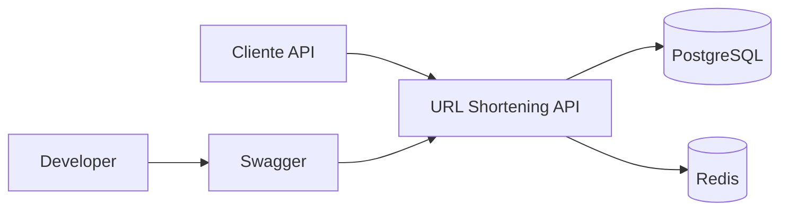
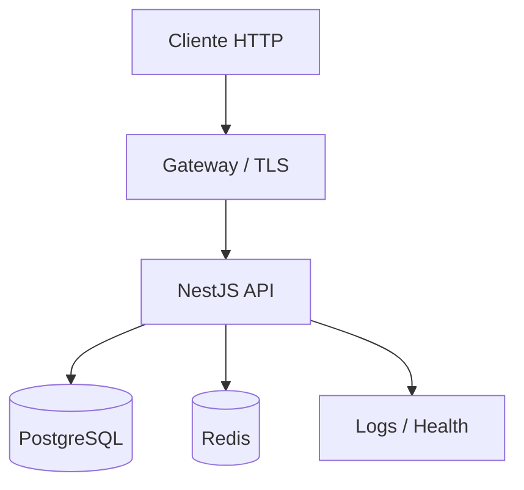
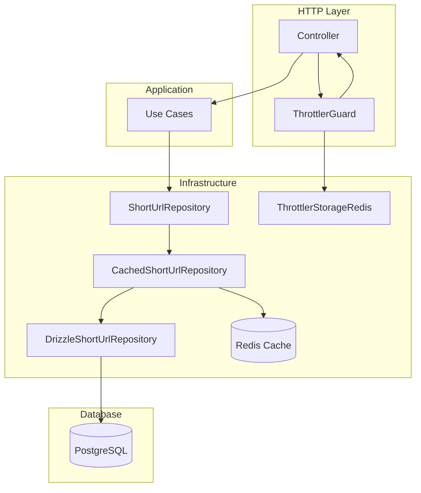
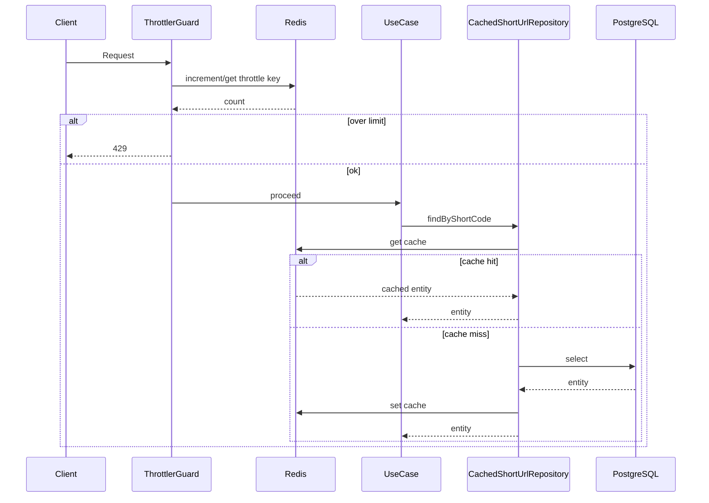

# ADR 09 — Redis: cache e seguranca

## Status

Adotado

## Contexto

O Redis esta configurado (Docker + `redis.config.ts`) mas nao e utilizado. O planejamento ([docs/planejamento_feature_url_shortener_c_4.md](docs/planejamento_feature_url_shortener_c_4.md)) define Redis para rate limit distribuido e cache pontual. O tler atual usa storage em memoria.

Este ADR estabelece como o Redis sera utilizado na aplicacao, priorizando cache e seguranca.

## Restricoes obrigatorias

- **Nao quebrar a aplicacao**: todas as alteracoes devem manter a aplicacao funcional
- **Testes intactos**: unitarios, integracao e e2e devem continuar passando apos a implementacao
- **Invalidacao de cache**: cache deve ser invalidado em operacoes de **PUT** (update) e **DELETE** (delete)

## Decisao

O Redis sera utilizado para:

1. **Throttler distribuido**: storage Redis no `@nestjs/throttler` para rate limit distribuido entre instancias
2. **Rate limit por rota**: limites customizados via decorator `@Throttle()` (POST /shorten mais rigido, GET moderado)
3. **Cache-aside**: `CachedShortUrlRepository` encapsulando `DrizzleShortUrlRepository` para consultas por `shortCode`

---

## 1. Throttler vs Rate Limit

Throttler e Rate Limit sao a mesma coisa no ecossistema NestJS. O `@nestjs/throttler` implementa rate limiting. A distincao sera:

- **Throttler global**: limite distribuido via Redis (todas as rotas)
- **Rate limit por rota**: limites customizados via decorator `@Throttle()`:
  - `POST /shorten`: mais rigido (ex: 20 req/min)
  - `GET /shorten/:shortCode`: moderado (ex: 100 req/min)

Ambos usam o mesmo storage Redis.

---

## 2. Estrategia de Cache

**Decisao**: Cache-aside no repository (Opcao A).

- Criar `CachedShortUrlRepository` que implementa `ShortUrlRepository` e encapsula `DrizzleShortUrlRepository`
- Fluxo: `findByShortCode` -> consulta Redis -> miss -> DB -> grava Redis
- Invalidacao obrigatoria em PUT (`updateUrlByShortCode`) e DELETE (`deleteByShortCode`)
- TTL configuravel (ex: 60-300s)
- `ioredis` reutilizado (ja dependencia do throttler-storage-redis)

Alternativas rejeitadas:

- **drizzle-redis-cache**: pacote comunidade, baixa adocao; Drizzle oficial so oferece cache com Upstash
- **@nestjs/cache-manager**: perde controle fino de invalidation em cache-aside

---

## 3. Arquitetura C4 e Diagramas

### 3.1 Context Diagram

Redis: rate limit distribuido, cache de leitura por shortCode, health check.

### 3.2 Container Diagram

### 3.3 Component Diagram - Redis no fluxo

### 3.4 Fluxo de dados - Cache e Throttle

---

## 4. Estrutura de Implementacao

### 4.1 Dependencias

| Pacote                              | Justificativa                            |
| ----------------------------------- | ---------------------------------------- |
| `@nest-lab/throttler-storage-redis` | Storage Redis para Throttler distribuido |
| `ioredis`                           | Cliente Redis (peer do throttler-storage-redis) |

### 4.2 Arquivos

| Arquivo                                                                   | Acao                                                    |
| ------------------------------------------------------------------------- | ------------------------------------------------------- |
| `src/infra/redis/redis.module.ts`                                         | Novo: modulo Redis com provider ioredis                 |
| `src/infra/redis/redis.service.ts`                                        | Novo: servico que encapsula cliente Redis               |
| `src/app/app.module.ts`                                                   | Alterar: ThrottlerModule.forRootAsync com storage Redis |
| `src/modules/short-url/infra/repositories/cached-short-url.repository.ts` | Novo: repository com cache-aside                        |
| `src/modules/short-url/short-url.module.ts`                               | Alterar: bind CachedShortUrlRepository                  |
| `src/shared/health/health.controller.ts`                                  | Alterar: incluir Redis no readiness                     |
| `src/shared/health/health.module.ts`                                      | Alterar: import RedisModule                             |

### 4.3 Configuracoes

- `CACHE_TTL_SECONDS` (ex: 60)
- Limites por rota: `POST /shorten` `@Throttle({ limit: 20, ttl: 60000 })`, `GET /shorten/:shortCode` default ou customizado

---

## 5. Cache: Escopo e Invalidacao

**Consultas cacheadas**:

- `findByShortCode` (cache key: `shorturl:${shortCode}`)

**Invalidacao obrigatoria** (PUT e DELETE):

- **PUT** (`updateUrlByShortCode`): invalida cache com `del shorturl:${shortCode}` apos atualizar a URL
- **DELETE** (`deleteByShortCode`): invalida cache com `del shorturl:${shortCode}` apos remover o registro

**Sem invalidacao**:

- `create`: shortCode novo, nao ha entrada em cache
- `incrementAccessCount`: nao invalida (accessCount eventualmente consistente ate TTL)

---

## 6. Resiliencia

- Se Redis cair: Throttler pode falhar ou degradar; cache retorna miss e vai ao DB
- Health check: `/health/ready` inclui Redis; se Redis down, retornar `degraded`
- Core da feature continua funcional via PostgreSQL sem Redis

---

## 7. Ordem de implementacao

1. RedisModule + RedisService (provider ioredis)
2. Throttler com Redis storage + limites por rota
3. Health check Redis
4. CachedShortUrlRepository (com invalidacao em PUT e DELETE)
5. Atualizacao do planejamento e README

**Gate de qualidade**: apos cada passo, executar `npm run test`, `npm run test:integration` e `npm run test:e2e`. Testes unitarios devem mockar Redis quando necessario; integracao e e2e usam Redis do Docker Compose.
