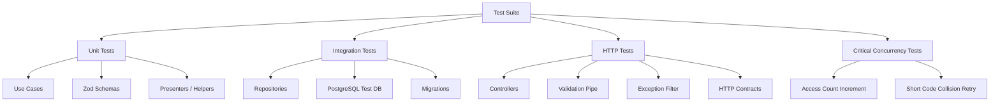

# ADR 10 — Testes automatizados da feature

## Status

Proposto

## Contexto

A feature de encurtamento de URLs já teve seu desenho arquitetural e seus principais fluxos definidos em ADRs anteriores:

- bootstrap do projeto
- infra local com Docker Compose
- configuração e validação de environment
- base compartilhada HTTP
- schema do banco e migrations
- módulo de domínio `short-url`
- casos de uso de criação e obtenção
- casos de uso de atualização, deleção e estatísticas
- observabilidade e hardening

O próximo passo natural é definir como a feature será validada por testes automatizados de forma consistente com os requisitos do projeto.

A lista de requisitos já estabelece várias diretrizes relevantes:

- escrever testes unitários para regra de negócio
- escrever testes de integração para banco, Redis e módulos críticos
- testar schemas Zod
- testar pipes, filters e interceptors críticos
- testar cenários de falha, não só sucesso
- ter fixtures simples e previsíveis
- evitar testes frágeis acoplados a detalhes internos
- testar concorrência e idempotência em fluxos críticos
- garantir ambiente de teste isolado
- não compartilhar Redis e banco de produção com testes
- falhar CI em lint, typecheck, test e build

Além disso, este projeto tem características que influenciam diretamente a estratégia de testes:

- a feature tem poucos endpoints, mas comportamento suficientemente rico para justificar testes bem separados por camada
- existe validação estrutural com Zod
- existe persistência relacional com PostgreSQL e Drizzle
- o endpoint de consulta incrementa estatísticas de acesso
- há retry controlado para colisão de `shortCode`
- a API exige respostas padronizadas e seguras
- parte do comportamento transversal depende de interceptors, filters e configuração HTTP

O objetivo deste ADR é definir a estratégia de testes automatizados da feature `short-url`, delimitando níveis de teste, responsabilidades, cobertura mínima esperada e critérios para manter a suíte rápida, confiável e útil.

## Decisão

A feature adotará uma estratégia de testes em camadas, com foco em **clareza, previsibilidade e custo proporcional ao projeto**, organizada em quatro níveis principais:

1. **testes unitários** para regra de negócio e componentes puros
2. **testes de integração** para repositórios, banco e componentes críticos de infraestrutura
3. **testes HTTP/integration-like** para contratos da API e comportamento transversal relevante
4. **testes direcionados de concorrência e cenários críticos** para fluxos com risco funcional maior

A meta não é maximizar quantidade de testes, e sim criar uma suíte que proteja os comportamentos mais importantes do sistema sem se tornar frágil ou lenta demais.

---

## 1. Escopo do ADR

Este ADR cobre:

- estratégia geral de testes
- tipos de teste por camada
- responsabilidades de cada nível
- política de fixtures e isolamento
- abordagem para banco e Redis em ambiente de teste
- foco especial em validação, repositório, casos de uso e contratos HTTP
- critérios mínimos de cobertura funcional

Este ADR não cobre em detalhe:

- ferramenta exata de coverage
- pipeline de CI completo
- testes E2E de frontend
- performance/load testing pesado
- chaos engineering

---

## 2. Princípios gerais da suíte de testes

### Decisão

A suíte deve seguir princípios de confiabilidade e intenção clara.

### Regras

- cada teste deve validar um comportamento observável relevante
- nomes de testes devem descrever cenário e resultado esperado
- testes não devem depender da ordem de execução
- testes não devem compartilhar estado implícito entre si
- testes devem preferir fixtures pequenas e previsíveis
- testes devem evitar acoplamento desnecessário a detalhes internos de implementação

### Objetivo

- reduzir fragilidade
- facilitar manutenção
- tornar falhas diagnósticas e úteis

---

## 3. Pirâmide prática de testes para este projeto

### Decisão

O projeto adotará uma pirâmide prática com predominância de testes unitários e de integração, mantendo testes HTTP em número menor, porém cobrindo contratos críticos.

### Distribuição qualitativa desejada

- base maior: unitários
- camada intermediária: integração com banco e infraestrutura crítica
- camada superior: testes HTTP de fluxos principais
- camada cirúrgica: concorrência e cenários especiais

### Motivo

- a feature é pequena o suficiente para permitir boa cobertura sem explosão de complexidade
- testes puramente E2E seriam lentos e insuficientes para localizar problemas com precisão

---

## 4. Testes unitários

### Objetivo

Validar regra de negócio e componentes puros sem dependência real de banco, rede ou framework pesado.

### Devem cobrir prioritariamente

- casos de uso
- serviços puros como `ShortCodeGeneratorService`, se a implementação permitir teste determinístico
- mapeadores e presenters simples
- erros de domínio
- helpers de normalização/sanitização pequenos
- utilitários de paginação/resposta, se existirem

### Regras

- dependências externas devem ser mockadas ou fakes bem controlados
- testes devem focar na intenção do fluxo, não em detalhes do framework
- cada caso de uso deve ter cenários de sucesso e falha esperada

---

## 5. Testes unitários dos casos de uso

### `CreateShortUrlUseCase`

Deve cobrir pelo menos:

- criação bem-sucedida
- retry por colisão de `shortCode`
- falha quando o limite de tentativas é excedido
- propagação/encapsulamento de falha inesperada relevante
- garantia de que `accessCount` nasce em zero

### `GetShortUrlUseCase`

Deve cobrir pelo menos:

- busca bem-sucedida
- incremento de acesso em consulta bem-sucedida
- retorno de `not found`
- comportamento diante de falha no incremento/persistência

### `UpdateShortUrlUseCase`

Deve cobrir pelo menos:

- atualização bem-sucedida
- alteração apenas da URL
- preservação de `shortCode`, `id`, `createdAt` e `accessCount`
- retorno de `not found`

### `DeleteShortUrlUseCase`

Deve cobrir pelo menos:

- deleção bem-sucedida
- retorno de `not found`

### `GetShortUrlStatsUseCase`

Deve cobrir pelo menos:

- retorno de estatísticas com `accessCount`
- ausência de incremento no endpoint de stats
- retorno de `not found`

---

## 6. Testes de schemas Zod

### Decisão

Schemas Zod relevantes da borda HTTP devem ter testes próprios.

### Motivo

- validação é uma parte central do contrato da API
- erros em schema quebram contratos cedo
- esse tipo de teste é barato e evita regressões silenciosas

### Devem cobrir

- payload válido aceito
- URL inválida rejeitada
- campos obrigatórios ausentes
- campos desconhecidos removidos ou rejeitados, conforme política do schema
- tamanhos mínimos/máximos quando aplicável
- normalização/sanitização esperada, quando houver transformação explícita

### Regra

Testar schema como unidade de contrato, sem depender do controller.

---

## 7. Testes de presenters e contratos de saída

### Decisão

Presenters e mapeadores de saída devem ser testados quando tiverem transformação relevante.

### Motivo

- evitar exposição acidental de entidade interna
- garantir formato consistente de resposta

### Devem cobrir

- serialização correta de datas
- nomes corretos de campos públicos
- ausência de campos internos indevidos

---

## 8. Testes de integração de repositório

### Decisão

Repositórios da feature devem ter testes de integração com banco real de teste.

### Motivo

- é onde moram queries, constraints, joins simples e comportamento real de persistência
- mocks não substituem verificação real de banco

### Escopo mínimo

Testar com PostgreSQL isolado de teste:

- criação de short URL
- busca por `shortCode`
- update da URL por `shortCode`
- delete por `shortCode`
- incremento de `accessCount`
- retorno consistente quando recurso não existe
- comportamento de constraint de unicidade de `short_code`

### Regra

Esses testes devem validar o comportamento observável do contrato do repositório, não a implementação linha a linha.

---

## 9. Testes de integração para migrations e schema

### Decisão

O ambiente de teste deve validar que migrations sobem corretamente e que o schema esperado existe.

### Motivo

- reduz risco de drift entre código e banco
- aumenta confiança na execução limpa do projeto em ambiente novo

### Devem cobrir minimamente

- banco sobe limpo
- migrations aplicam sem erro
- tabela `short_urls` existe com constraints críticas
- índice/unique principal esperado está presente

### Observação

Não precisa virar uma suíte gigantesca de introspecção do banco, mas deve existir confiança objetiva de que o ambiente de teste reflete o desenho do schema.

---

## 10. Testes HTTP da API

### Decisão

A API terá testes HTTP/integration-like cobrindo fluxos principais e contratos críticos.

### Objetivo

Validar de ponta a ponta dentro do backend:

- routing
- validação
- filtros de erro
- presenters
- status codes
- integração entre controller, use case e infraestrutura necessária

### Fluxos mínimos a cobrir

- `POST /shorten` sucesso
- `POST /shorten` payload inválido -> `400`
- `GET /shorten/:shortCode` sucesso
- `GET /shorten/:shortCode` -> `404`
- `PUT /shorten/:shortCode` sucesso
- `PUT /shorten/:shortCode` -> `404`
- `DELETE /shorten/:shortCode` sucesso -> `204`
- `DELETE /shorten/:shortCode` -> `404`
- `GET /shorten/:shortCode/stats` sucesso
- `GET /shorten/:shortCode/stats` -> `404`

### Regras

- validar corpo de resposta, não só status
- validar formato padronizado de erro
- evitar assertar detalhes não contratuais, como mensagens excessivamente específicas se isso fragilizar a suíte

---

## 11. Testes de filters, interceptors e componentes transversais críticos

### Decisão

Componentes transversais críticos devem ter testes dedicados quando seu comportamento impactar o contrato ou a operação do sistema.

### Devem cobrir prioritariamente

- exception filter que traduz erros em resposta padronizada
- interceptor de tracing/logging quando houver comportamento observável relevante
- pipe de validação Zod, se for componente customizado

### Motivo

- esses componentes concentram regras transversais de contrato e operabilidade
- regressões neles afetam toda a API

---

## 12. Testes de observabilidade com parcimônia

### Decisão

Observabilidade não deve gerar testes frágeis baseados em strings de log inteiras.

### Regra

Quando testar logging/tracing:

- validar presença de campos relevantes
- validar que eventos críticos são emitidos em cenários importantes
- evitar acoplamento a texto literal excessivo

### Motivo

- logs mudam de redação com facilidade
- o valor do teste está na semântica, não na frase exata

---

## 13. Testes de concorrência e cenários críticos

### Decisão

Fluxos com risco de comportamento concorrente devem ter testes direcionados, mesmo que poucos.

### Casos mais relevantes

- incremento de `accessCount` em acessos concorrentes
- colisão de `shortCode` durante criação

### Objetivo

- validar que o contador não perde incrementos de forma trivial
- validar que a estratégia de retry por colisão funciona sob cenário realista controlado

### Observação

Esses testes podem ficar na camada de integração, onde o comportamento do banco é parte do valor testado.

---

## 14. Testes de idempotência e semântica de operação

### Decisão

Não é necessário criar uma suíte ampla de idempotência, mas alguns comportamentos semânticos devem ser cobertos.

### Exemplos relevantes

- duas criações da mesma URL geram registros distintos, se essa foi a decisão do produto
- delete de recurso inexistente retorna `404`
- endpoint de stats não altera `accessCount`

---

## 15. Uso de fixtures

### Decisão

Fixtures devem ser simples, pequenas e explícitas.

### Regras

- criar apenas o necessário para cada cenário
- evitar datasets massivos sem ganho real
- priorizar builders/factories legíveis para entidades de teste
- usar valores previsíveis e fáceis de identificar

### Motivo

- melhora legibilidade
- reduz custo de manutenção
- evita teste obscuro

---

## 16. Builders e factories de teste

### Decisão

A suíte pode utilizar test builders/factories para reduzir duplicação, desde que mantenham clareza.

### Regras

- builders não devem esconder comportamento importante
- defaults devem ser seguros e explícitos
- overrides devem ser fáceis de aplicar

### Exemplos úteis

- builder de input de `CreateShortUrl`
- factory de registro `short_url`
- helper para subir app HTTP de teste

---

## 17. Isolamento do ambiente de teste

### Decisão

O ambiente de teste deve ser completamente isolado de qualquer recurso de desenvolvimento ou produção.

### Regras

- banco de teste separado
- Redis de teste separado, quando necessário
- `.env.test` ou configuração equivalente validada
- nunca apontar testes para serviços compartilhados de produção/dev

### Motivo

- segurança operacional
- previsibilidade
- repetibilidade da suíte

---

## 18. Estratégia para banco em testes

### Decisão

Testes de integração e HTTP que dependem de persistência devem usar PostgreSQL real em ambiente isolado, preferencialmente via Docker Compose de teste ou serviço efêmero equivalente.

### Motivo

- o projeto usa Postgres como fonte de verdade
- diferenças entre banco real e mocks podem esconder problemas de constraint, tipos e queries

### Regras

- aplicar migrations antes da suíte ou por ciclo controlado
- limpar estado entre testes ou usar estratégia transacional/rollback quando fizer sentido
- manter setup reprodutível

---

## 19. Estratégia para Redis em testes

### Decisão

Redis só entra nos testes quando o comportamento testado realmente depender dele.

### Motivo

- evita custo desnecessário na suíte básica
- mantém foco no que de fato é core da feature

### Regras

- não introduzir Redis real em todo teste por padrão
- usar Redis isolado em testes dos componentes que realmente dependem de throttle/cache distribuído
- quando não fizer parte do comportamento da feature exercitada, substituir por configuração controlada mais simples

---

## 20. Separação de suítes

### Decisão

Os testes devem ser organizados por tipo e propósito.

### Estrutura conceitual sugerida

- unit
- integration
- http
- shared test helpers

### Motivo

- facilita execução seletiva
- melhora leitura do projeto
- ajuda CI a isolar falhas

---

## 21. O que não testar diretamente

### Decisão

Nem tudo merece teste dedicado.

### Evitar

- testar internals triviais de framework
- testar getters/setters sem comportamento
- duplicar o mesmo cenário em todas as camadas sem ganho
- fixar testes em detalhes cosméticos de mensagens não contratuais

### Motivo

- reduz custo de manutenção
- deixa a suíte mais útil e rápida

---

## 22. Política de cobertura funcional mínima

### Decisão

A cobertura será tratada em termos de comportamentos críticos, não apenas porcentagem numérica cega.

### Comportamentos que obrigatoriamente devem estar cobertos

- criação válida de short URL
- rejeição de payload inválido
- unicidade/colisão de `shortCode`
- consulta por `shortCode`
- incremento de `accessCount` na consulta
- atualização de URL existente
- deleção por `shortCode`
- consulta de estatísticas sem mutação de contador
- tradução de `not found` em `404`
- formato padronizado de erro

### Observação

Percentual de coverage pode existir como meta de governança, mas não substitui cobertura intencional dos comportamentos acima.

---

## 23. Testes na CI

### Decisão

A pipeline deve falhar quando qualquer etapa crítica falhar.

### Etapas mínimas

- lint
- typecheck
- testes
- build

### Regra

A suíte de testes deve ser suficientemente reprodutível para rodar em CI sem depender de passos manuais ou estado prévio escondido.

---

## 24. Critérios de qualidade dos testes

Um teste é considerado adequado quando:

- falha pelo motivo certo
- é legível sem esforço excessivo
- não depende de timing frágil desnecessário
- não depende de ordem implícita
- descreve claramente cenário, ação e expectativa
- ajuda a localizar regressão com precisão

---

## 25. Consequências

### Positivas

- aumenta confiança na feature desde a base
- reduz regressões em validação, persistência e contratos HTTP
- melhora clareza arquitetural por camada
- facilita evolução segura da feature
- cria base confiável para CI e revisão técnica

### Negativas

- adiciona custo inicial de setup e manutenção
- exige disciplina para manter isolamento e não criar testes lentos/frágeis
- testes de integração com banco real têm custo maior do que mocks puros

### Trade-off assumido

Preferimos investir em uma suíte menor, mas realista e confiável, em vez de muitos testes superficiais que pouco protegem o comportamento central do sistema.

---

## 26. Alternativas consideradas

### 1. Testar quase tudo apenas com unit tests e mocks

Rejeitada.

Motivo:

- não valida comportamento real de banco, constraints e integração HTTP
- gera falsa sensação de segurança

### 2. Concentrar tudo em poucos testes E2E pesados

Rejeitada.

Motivo:

- dificulta localizar regressões
- torna a suíte mais lenta e cara
- cobre mal regras internas específicas

### 3. Não testar schemas Zod separadamente

Rejeitada.

Motivo:

- validação é parte central do contrato
- testes de schema são baratos e valiosos

### 4. Não testar concorrência por ser “projeto simples”

Rejeitada.

Motivo:

- contador de acesso e retry por colisão são pontos onde concorrência importa
- poucos testes direcionados já trazem valor real

---

## Critérios de aceite

A estratégia de testes será considerada implementada quando existir:

- testes unitários dos cinco casos de uso principais
- testes dos schemas Zod relevantes da feature
- testes de integração do repositório com PostgreSQL isolado
- testes HTTP cobrindo os endpoints principais e seus erros centrais
- testes do exception filter e pipe/interceptor customizados críticos
- ambiente de teste isolado e documentado
- execução da suíte integrada ao fluxo de CI

## Exemplo de resultado esperado

Ao final desta task, o projeto deve permitir:

1. validar rapidamente regras de negócio sem banco real via testes unitários
2. validar persistência real com PostgreSQL em testes de integração
3. validar contratos HTTP e respostas padronizadas da API
4. detectar regressões em validação, contagem de acesso, update, delete e stats
5. rodar a suíte de forma reproduzível localmente e na CI

---

## Diagrama simplificado da estratégia de testes

## Próximos ADRs relacionados

- ADR 11 — README, setup local e convenções de execução
- ADR 12 — Swagger/OpenAPI e contratos públicos da API

