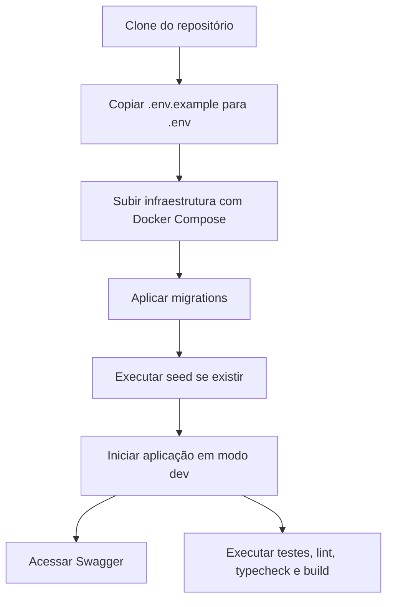

# ADR 11 — README, setup local e convenções de execução

## Status

Proposto

## Contexto

O desafio exige explicitamente um `README.md` na raiz do projeto explicando como executar a aplicação. Além disso, os ADRs anteriores já definiram boa parte da base arquitetural e operacional do sistema:

- bootstrap do projeto
- infra local com Docker Compose
- configuração e validação de environment
- base compartilhada HTTP
- schema do banco e migrations
- módulo de domínio `short-url`
- casos de uso de CRUD e estatísticas
- observabilidade e hardening
- estratégia de testes automatizados

Sem uma documentação inicial clara, mesmo um projeto tecnicamente bem construído perde valor em avaliação, onboarding, manutenção e uso cotidiano. O README precisa funcionar como porta de entrada do repositório, explicando:

- o que o projeto faz
- quais tecnologias usa
- como configurar o ambiente
- como subir a aplicação
- como rodar migrations, seed e testes
- como acessar Swagger
- quais convenções de organização e execução são esperadas

Também é importante evitar documentação inchada, divergente do código ou excessivamente genérica. O objetivo não é criar um manual infinito, e sim um guia de execução e entendimento rápido, confiável e alinhado à implementação real.

## Decisão

O projeto terá um **README.md objetivo, executável e orientado a onboarding**, apoiado por **convenções claras de execução local** e por uma **padronização mínima de comandos**, arquivos e responsabilidades de setup.

A documentação inicial deverá permitir que uma pessoa nova consiga:

1. entender o propósito do projeto em poucos minutos
2. configurar o ambiente local sem adivinhação
3. subir a aplicação com Docker Compose
4. rodar migrations, seed e testes
5. acessar a documentação Swagger
6. entender a estrutura macro do projeto e seus principais padrões

---

## 1. Escopo do ADR

Este ADR cobre:

- papel do `README.md`
- estrutura mínima obrigatória do README
- convenções de setup local
- convenções de comandos de execução
- documentação de env, Docker, banco, testes e Swagger
- alinhamento entre README e realidade do projeto

Este ADR não cobre em detalhe:

- conteúdo completo de todos os ADRs
- documentação de negócio aprofundada
- documentação externa de produto
- runbooks operacionais avançados de produção

---

## 2. README como documento de entrada do repositório

### Decisão

O `README.md` será o documento principal de entrada do projeto.

### Objetivo

Responder rapidamente às perguntas mais importantes de quem abre o repositório:

- que projeto é este?
- qual stack ele usa?
- como eu subo localmente?
- quais comandos existem?
- onde vejo a documentação da API?
- como executo os testes?

### Regra

O README deve refletir a implementação real e ser mantido atualizado a cada mudança relevante de setup, execução ou arquitetura operacional.

---

## 3. Características esperadas do README

### Decisão

O README deve ser:

- curto o suficiente para leitura rápida
- completo o suficiente para onboarding real
- específico do projeto
- alinhado ao código
- orientado a execução

### Deve evitar

- texto excessivamente genérico
- promessas que o projeto ainda não implementa
- instruções implícitas ou incompletas
- duplicação grande com outros documentos sem necessidade

---

## 4. Estrutura mínima obrigatória do README

### Decisão

O README deve conter no mínimo as seguintes seções.

### 4.1. Título e resumo

Deve explicar em poucas linhas:

- nome do projeto
- propósito da API
- escopo funcional principal

### 4.2. Stack utilizada

Deve listar de forma objetiva:

- Node.js
- TypeScript
- NestJS
- PostgreSQL
- Drizzle
- Zod
- Swagger
- Docker Compose
- Redis, se estiver ativo no projeto

### 4.3. Funcionalidades

Deve citar os principais endpoints ou capacidades:

- criar short URL
- obter URL original
- atualizar short URL
- deletar short URL
- consultar estatísticas

### 4.4. Estrutura macro do projeto

Deve apresentar visão breve da organização por feature/domínio, sem transformar o README em documentação interna excessiva.

### 4.5. Pré-requisitos

Deve informar claramente o que é necessário para rodar localmente.

Exemplos esperados:

- Docker e Docker Compose
- Node.js, caso parte do fluxo rode fora dos containers
- gerenciador de pacotes adotado

### 4.6. Configuração de environment

Deve explicar:

- uso de `.env.example`
- como criar `.env`
- quais arquivos de env existem por ambiente
- que valores precisam ser preenchidos localmente

### 4.7. Como subir o projeto localmente

Deve conter passo a passo objetivo para:

- instalar dependências quando necessário
- copiar env
- subir containers
- rodar migrations
- rodar seed, se existir
- iniciar app em modo dev

### 4.8. Comandos úteis

Deve listar comandos recorrentes, como:

- subir ambiente
- derrubar ambiente
- rodar app em dev
- build
- lint
- typecheck
- test
- migration generate
- migration run
- seed

### 4.9. Banco de dados e migrations

Deve explicar o mínimo necessário sobre:

- banco usado
- como migrations são aplicadas
- política de não editar migration aplicada
- comando para rodar migrations localmente

### 4.10. Testes

Deve explicar:

- tipos principais de teste disponíveis
- comando de execução
- observação sobre ambiente isolado de teste

### 4.11. Swagger / documentação da API

Deve informar:

- onde a documentação fica disponível
- URL local esperada
- necessidade de app estar rodando

### 4.12. Convenções do projeto

Deve resumir convenções mais importantes, por exemplo:

- organização por feature/domínio
- validação com Zod
- regras no use case, não no controller
- acesso a banco via repositório
- strict mode no TypeScript

### 4.13. Fluxo de qualidade

Deve informar o mínimo esperado antes de abrir PR ou concluir tarefa:

- lint
- typecheck
- test
- build

---

## 5. Convenção de setup local

### Decisão

O setup local deve ser simples, previsível e reproduzível.

### Regras

- o fluxo principal de desenvolvimento deve ser documentado com Docker Compose
- o setup não pode depender de passos ocultos
- banco e Redis locais devem ser provisionados de forma reprodutível
- a pessoa desenvolvedora deve conseguir subir o ambiente com poucos comandos

### Objetivo

Reduzir atrito de onboarding e minimizar “funciona só na minha máquina”.

---

## 6. Docker Compose como caminho principal de execução local

### Decisão

O README deve assumir Docker Compose como caminho padrão de infraestrutura local.

### Motivo

- é requisito do desafio
- já foi definido como base da infra local
- reduz discrepâncias entre ambientes

### Regra

O README deve deixar claro quais serviços sobem via Compose, por exemplo:

- app
- postgres
- redis, quando aplicável

---

## 7. Convenção para variáveis de ambiente

### Decisão

A documentação de env deve ser explícita e segura.

### Regras

- usar `.env.example` como referência
- nunca documentar segredos reais no README
- indicar quais variáveis são obrigatórias
- indicar quando o boot falha por env inválida
- manter nomes coerentes com o módulo de configuração tipada

### Observação

O README não deve duplicar a validação do schema de env inteira, mas precisa orientar corretamente quem vai configurar o ambiente.

---

## 8. Convenção para migrations e seed

### Decisão

O README deve explicar claramente o ciclo de banco em ambiente local.

### Deve deixar explícito

- como gerar migrations
- como aplicar migrations
- se existe seed e como executá-la
- que seed deve ser idempotente
- que migrations aplicadas não devem ser editadas

### Motivo

- reduz erro operacional
- reforça disciplina de versionamento de schema

---

## 9. Convenção para execução da aplicação

### Decisão

Os comandos de execução devem ser padronizados e curtos, com semântica previsível.

### Regras

- nomes de scripts devem refletir claramente a ação
- evitar scripts redundantes com nomes confusos
- priorizar convenções fáceis de memorizar

### Comandos esperados

O projeto deve oferecer convenções próximas de:

- `dev`
- `build`
- `start`
- `start:prod`
- `lint`
- `typecheck`
- `test`
- `test:unit`
- `test:integration`
- `test:http`
- `db:migrate`
- `db:generate`
- `db:seed`

### Observação

Os nomes exatos podem variar, mas devem permanecer coerentes e bem documentados.

---

## 10. Convenção para qualidade local antes de PR

### Decisão

O README deve declarar o fluxo mínimo de verificação local antes de considerar uma entrega pronta.

### Fluxo esperado

Executar localmente:

- lint
- typecheck
- test
- build

### Motivo

- reduz ruído em CI
- melhora previsibilidade da qualidade entregue
- reforça padrão do projeto desde cedo

---

## 11. Convenção para Swagger/OpenAPI

### Decisão

O README deve apontar claramente como acessar a documentação Swagger da API.

### Deve informar

- URL local
- necessidade de app rodando
- propósito da documentação

### Regra

Swagger deve refletir a implementação real; o README não deve prometer rotas ou contratos ainda não existentes.

---

## 12. Estrutura macro do projeto no README

### Decisão

O README deve apresentar uma visão simples da organização do repositório, sem detalhamento excessivo.

### Exemplo do que deve comunicar

- organização por feature/domínio
- pasta compartilhada para contratos, utilitários e base HTTP
- módulos pequenos e coesos
- separação de controller, use case, repository e presenter

### Motivo

Ajuda leitura do projeto sem transformar o README em um manual arquitetural completo.

---

## 13. Relação entre README e ADRs

### Decisão

O README não substitui os ADRs e os ADRs não substituem o README.

### Papel do README

- onboarding rápido
- setup
- execução
- visão geral prática

### Papel dos ADRs

- registrar decisões arquiteturais
- explicar trade-offs e racional técnico

### Regra

Quando fizer sentido, o README pode apontar para a pasta de ADRs, mas sem obrigar leitura dos ADRs para conseguir subir o projeto.

---

## 14. Política de atualização da documentação

### Decisão

Mudanças que afetem setup, comandos, env, execução, testes ou acesso ao Swagger devem vir acompanhadas de atualização do README no mesmo fluxo de trabalho.

### Motivo

- evita drift documental
- mantém o repositório utilizável
- melhora avaliação e manutenção

### Regra prática

Documentação operacional não é etapa opcional de “depois”; ela faz parte da entrega.

---

## 15. Convenções de exemplos no README

### Decisão

Os exemplos de comando e execução devem ser realistas e copiáveis.

### Regras

- evitar pseudo-comandos vagos
- usar nomes coerentes com scripts reais do projeto
- não incluir URLs, portas e caminhos contraditórios com a implementação
- manter exemplos pequenos e úteis

---

## 16. Convenção de linguagem e tom

### Decisão

O README deve usar linguagem técnica clara, direta e objetiva.

### Regras

- evitar jargão desnecessário
- evitar textos longos demais para instruções simples
- priorizar clareza operacional
- manter consistência de idioma em todo o documento

### Observação

O idioma pode ser português ou inglês, desde que a escolha seja consistente em todo o repositório. Para desafio técnico, inglês costuma ser vantajoso, mas a decisão final pode seguir o contexto do processo seletivo.

---

## 17. O que não deve ficar só no README

### Decisão

Alguns detalhes não devem ser centralizados apenas no README.

### Exemplos

- decisões arquiteturais profundas -> ADRs
- contratos detalhados da API -> Swagger/OpenAPI
- exemplos de environment -> `.env.example`
- automação de setup -> scripts reais do projeto

### Motivo

Evita transformar o README em documento monolítico e difícil de manter.

---

## 18. Critérios de qualidade do README

Um README adequado para este projeto deve:

- permitir onboarding inicial sem ajuda externa
- ser coerente com os scripts reais do projeto
- explicar setup local do zero
- informar como rodar testes e migrations
- apontar Swagger corretamente
- resumir convenções arquiteturais importantes
- evitar ambiguidade operacional

---

## 19. Consequências

### Positivas

- melhora onboarding e avaliação técnica do projeto
- reduz dúvidas operacionais
- reforça consistência entre arquitetura e execução
- facilita manutenção e colaboração
- torna o repositório utilizável por outra pessoa rapidamente

### Negativas

- exige disciplina para manter documentação sincronizada
- adiciona pequeno custo contínuo a cada mudança operacional

### Trade-off assumido

Preferimos investir cedo em documentação de entrada confiável a entregar um projeto tecnicamente bom, porém difícil de subir, entender e avaliar.

---

## 20. Alternativas consideradas

### 1. Deixar README mínimo demais e jogar detalhes em comentários no código

Rejeitada.

Motivo:

- dificulta onboarding
- não atende bem ao desafio
- espalha informação operacional por lugares inadequados

### 2. Colocar toda a arquitetura detalhada no README

Rejeitada.

Motivo:

- torna o documento longo e cansativo
- mistura onboarding com decisão arquitetural profunda
- ADRs cumprem melhor esse papel

### 3. Documentar apenas comandos e omitir convenções

Rejeitada.

Motivo:

- ajuda a subir, mas não ajuda a manter coerência do projeto
- perde chance de comunicar padrões importantes da codebase

---

## Critérios de aceite

A task será considerada concluída quando existir um `README.md` na raiz contendo, no mínimo:

- resumo do projeto
- stack utilizada
- funcionalidades principais
- pré-requisitos
- configuração de environment
- instruções de setup local
- comandos principais
- instruções de migrations e seed
- instruções de testes
- acesso ao Swagger
- resumo de convenções arquiteturais
- fluxo mínimo de qualidade antes de PR

## Exemplo de resultado esperado

Ao final desta task, qualquer pessoa com os pré-requisitos corretos deve conseguir:

1. entender rapidamente o objetivo da API
2. configurar o `.env` com base no `.env.example`
3. subir a infraestrutura local com Docker Compose
4. rodar migrations e, se existir, seed
5. iniciar a aplicação em modo de desenvolvimento
6. acessar a documentação Swagger
7. executar testes e checks básicos do projeto

---

## Diagrama simplificado do onboarding local

## Próximos ADRs relacionados

- ADR 12 — Swagger/OpenAPI e contratos públicos da API
- ADR 13 — Convenções de CI, lint, format e commit

