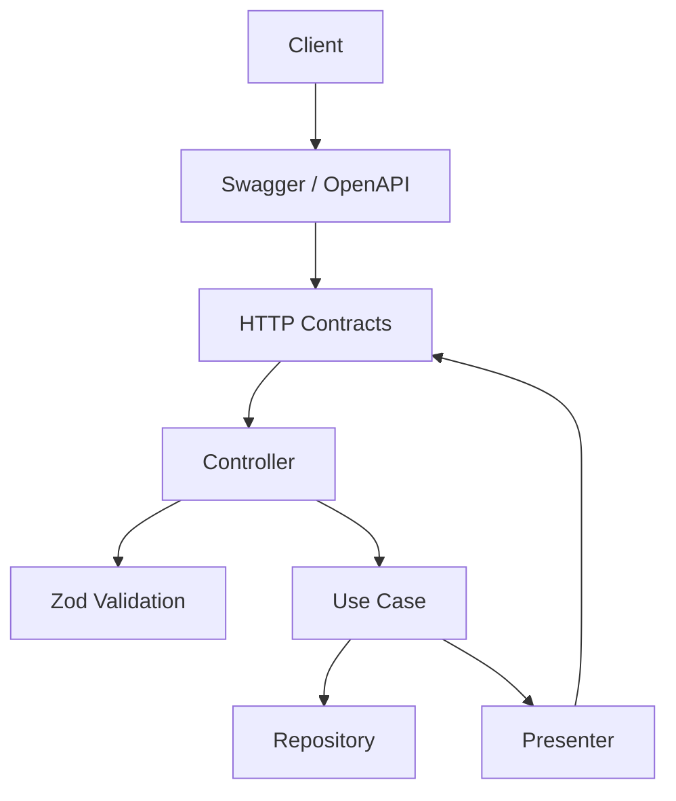

# ADR 12 — Swagger/OpenAPI e contratos públicos da API

## Status

Proposto

## Contexto

O desafio exige explicitamente o uso de Swagger para documentação da API. Além disso, os requisitos do projeto reforçam pontos que tornam os contratos públicos especialmente importantes:

- documentar contratos com Swagger/OpenAPI
- garantir que a documentação reflita a implementação real
- remover endpoints mortos e docs desatualizadas
- usar DTOs ou contratos pequenos e específicos por endpoint
- não reutilizar um contrato genérico para tudo
- não exponha entidade interna diretamente na resposta
- criar presenters ou mappers de saída
- padronizar filtros, ordenação e paginação quando aplicável
- padronizar formato de erro em toda API
- converter erros de validação para resposta HTTP consistente

Nos ADRs anteriores, já foram definidas decisões que afetam diretamente a modelagem dos contratos da API:

- validação de entrada com Zod
- separação entre schema de entrada, saída e domínio
- controllers finos e casos de uso por fluxo
- presenters para saída
- erro HTTP padronizado na borda
- observabilidade e hardening
- README com orientação para acesso ao Swagger

Como esta API é pequena, existe o risco de subestimar a importância da documentação contratual. Mas justamente em projetos enxutos, Swagger/OpenAPI bem modelado ajuda muito em quatro frentes:

- clareza para avaliação técnica
- onboarding rápido
- alinhamento entre implementação e documentação
- redução de ambiguidade na evolução dos endpoints

O objetivo deste ADR é definir como a API será documentada publicamente, como os contratos serão organizados e quais princípios evitarão drift entre Swagger/OpenAPI e implementação real.

## Decisão

O projeto adotará **Swagger/OpenAPI como fonte oficial dos contratos públicos HTTP da API**, mantendo a documentação:

1. **alinhada à implementação real**
2. **organizada por endpoint e por contrato específico**
3. **coerente com validação Zod e presenters de saída**
4. **padronizada para sucesso, erro e exemplos**

A API não deverá expor entidades internas ou detalhes de persistência diretamente. Os contratos públicos serão modelados explicitamente na borda, refletindo o que o cliente realmente pode enviar e receber.

---

## 1. Escopo do ADR

Este ADR cobre:

- papel do Swagger/OpenAPI no projeto
- organização dos contratos públicos da API
- documentação de requests, responses e erros
- alinhamento entre Zod, controllers, presenters e OpenAPI
- convenções de nomenclatura e granularidade dos contratos
- critérios de qualidade da documentação pública

Este ADR não cobre em detalhe:

- autenticação/autorização, já que não faz parte do escopo do desafio
- versionamento público da API além da primeira versão
- SDK generation
- documentação de APIs internas futuras

---

## 2. Swagger/OpenAPI como contrato público oficial

### Decisão

Swagger/OpenAPI será a representação oficial dos contratos HTTP públicos do serviço.

### Objetivo

Permitir que qualquer pessoa consumidora da API consiga entender com clareza:

- quais endpoints existem
- quais payloads aceitam
- quais respostas retornam
- quais erros podem ocorrer
- quais campos fazem parte do contrato público

### Regra

A documentação não pode ser tratada como artefato decorativo. Ela precisa refletir fielmente o comportamento implementado.

---

## 3. A documentação deve refletir a implementação real

### Decisão

Toda alteração de endpoint, request, response ou erro relevante deve vir acompanhada da atualização correspondente no Swagger/OpenAPI.

### Regras

- não documentar campos inexistentes
- não omitir campos realmente retornados
- não manter rotas mortas no Swagger
- não descrever comportamento diferente do implementado

### Motivo

Drift documental reduz confiança no projeto mais rápido do que ausência de documentação parcial.

---

## 4. Contratos pequenos e específicos por endpoint

### Decisão

A API usará contratos pequenos, explícitos e específicos por endpoint.

### Regras

- não usar um único DTO genérico para todos os fluxos
- contratos de criação, atualização, leitura e erro devem ser separados quando tiverem responsabilidades diferentes
- contratos de stats devem refletir seu payload próprio

### Motivo

- melhora clareza
- reduz acoplamento acidental
- facilita evolução sem quebrar outros fluxos

---

## 5. Separação entre entrada, saída e domínio

### Decisão

A documentação pública não será construída a partir da entidade de domínio ou do registro persistido como se fossem a mesma coisa.

### Regras

- input contract representa apenas o que o cliente envia
- output contract representa apenas o que a API expõe
- domínio e persistência podem conter detalhes que não pertencem ao contrato público

### Motivo

- evita vazamento de estrutura interna
- protege a evolução interna do sistema
- mantém API mais estável e intencional

---

## 6. Relação entre Zod e OpenAPI

### Decisão

A validação com Zod é a fonte de verdade da estrutura de entrada na borda, e o Swagger/OpenAPI deve permanecer coerente com essa validação.

### Regras

- request bodies documentados devem refletir os schemas Zod efetivamente aceitos
- parâmetros de rota documentados devem refletir validações reais
- restrições importantes de formato devem aparecer na documentação
- exemplos não devem contradizer o schema

### Observação

Mesmo quando houver integração técnica específica entre Zod e OpenAPI, o princípio central permanece: a documentação deve seguir a validação real, não uma descrição paralela inventada manualmente.

---

## 7. Presenters e contratos de saída

### Decisão

As respostas documentadas no Swagger/OpenAPI devem refletir os presenters/mappers de saída da aplicação.

### Regras

- não documentar entidade persistida bruta como response pública
- documentar somente campos expostos ao cliente
- manter consistência de nomes, formatos e tipos

### Motivo

- reforça separação entre interno e externo
- evita exposição acidental de estrutura técnica

---

## 8. Padrão de contratos da feature short-url

### Decisão

A feature terá contratos públicos específicos para cada fluxo principal.

### Contratos mínimos esperados

#### Requests

- `CreateShortUrlRequest`
- `UpdateShortUrlRequest`

#### Responses de sucesso

- `ShortUrlResponse`
- `ShortUrlStatsResponse`

#### Responses de erro

- `ValidationErrorResponse`
- `NotFoundErrorResponse`
- `InternalServerErrorResponse`
- eventualmente um `ConflictErrorResponse`, se algum cenário público vier a expor isso de forma intencional

### Motivo

Esses contratos cobrem o escopo do desafio sem inflar artificialmente a API com modelos genéricos demais.

---

## 9. Modelagem dos requests

### Decisão

Os requests devem ser mínimos, objetivos e coerentes com a semântica HTTP.

### `POST /shorten`

Request body esperado:

- `url`

### `PUT /shorten/:shortCode`

Request body esperado:

- `url`

### Regras

- não aceitar campos extras quando a política do schema for estrita
- documentar formato esperado da URL
- documentar obrigatoriedade dos campos

### Observação

Como o domínio é simples, isso favorece contratos limpos e fáceis de consumir.

---

## 10. Modelagem das responses de sucesso

### Decisão

As responses de sucesso devem documentar de forma explícita os payloads retornados por cada endpoint.

### `ShortUrlResponse`

Campos esperados:

- `id`
- `url`
- `shortCode`
- `createdAt`
- `updatedAt`

### `ShortUrlStatsResponse`

Campos esperados:

- `id`
- `url`
- `shortCode`
- `createdAt`
- `updatedAt`
- `accessCount`

### Regras

- datas devem aparecer como timestamps em UTC no formato adequado do contrato público
- tipos devem ser descritos corretamente
- exemplos devem ser realistas

---

## 11. Modelagem das responses de erro

### Decisão

Os erros da API devem ter formato padronizado e documentado no Swagger/OpenAPI.

### Objetivo

Permitir que clientes entendam erros sem precisar inferir estruturas diferentes para cada endpoint.

### Respostas mínimas a documentar

- `400 Bad Request` para falha de validação
- `404 Not Found` para `shortCode` inexistente
- `500 Internal Server Error` para falhas inesperadas

### Regras

- formato de erro deve ser consistente em toda a API
- erros não devem expor stack trace
- erros não devem expor detalhes internos de banco ou framework
- mensagens devem ser curtas, claras e seguras

---

## 12. Estrutura recomendada do erro público

### Decisão

A documentação deve refletir um envelope de erro consistente.

### Estrutura conceitual esperada

- identificador ou tipo de erro
- mensagem
- statusCode
- detalhes de validação quando aplicável
- requestId ou correlationId quando fizer parte da resposta pública definida

### Observação

O formato exato pode seguir a base HTTP já definida em ADR anterior, mas a decisão aqui é que ele precisa ser consistente e visível no Swagger.

---

## 13. Documentação de parâmetros de rota

### Decisão

Parâmetros de rota devem ser explicitamente documentados.

### Casos principais

- `shortCode` em `GET /shorten/:shortCode`
- `shortCode` em `PUT /shorten/:shortCode`
- `shortCode` em `DELETE /shorten/:shortCode`
- `shortCode` em `GET /shorten/:shortCode/stats`

### Regras

- documentar tipo
- documentar significado
- documentar exemplo válido
- manter alinhamento com a validação real do parâmetro

---

## 14. Exemplos são obrigatórios nos endpoints principais

### Decisão

Os endpoints principais devem incluir exemplos de request e response no Swagger/OpenAPI.

### Objetivo

- facilitar entendimento rápido
- melhorar experiência de avaliação e consumo da API
- reduzir ambiguidades de payload

### Regras

- exemplos devem ser realistas
- exemplos devem respeitar o schema real
- evitar placeholders vagos demais quando um exemplo concreto ajudar mais

---

## 15. Documentação por endpoint da feature

### Decisão

Cada endpoint principal deve ser documentado com request, response e erros esperados.

### Endpoints obrigatórios

#### `POST /shorten`

Documentar:

- body de criação
- `201 Created`
- `400 Bad Request`
- `500 Internal Server Error`

#### `GET /shorten/:shortCode`

Documentar:

- parâmetro `shortCode`
- `200 OK`
- `404 Not Found`
- `500 Internal Server Error`

#### `PUT /shorten/:shortCode`

Documentar:

- parâmetro `shortCode`
- body de atualização
- `200 OK`
- `400 Bad Request`
- `404 Not Found`
- `500 Internal Server Error`

#### `DELETE /shorten/:shortCode`

Documentar:

- parâmetro `shortCode`
- `204 No Content`
- `404 Not Found`
- `500 Internal Server Error`

#### `GET /shorten/:shortCode/stats`

Documentar:

- parâmetro `shortCode`
- `200 OK`
- `404 Not Found`
- `500 Internal Server Error`

---

## 16. DELETE com 204 e sem body

### Decisão

O endpoint `DELETE /shorten/:shortCode` deve ser documentado com `204 No Content` sem body de resposta.

### Motivo

- mantém semântica HTTP correta
- evita inconsistência entre contrato e implementação

### Regra

Swagger não deve sugerir payload de sucesso para uma resposta `204`.

---

## 17. Paginação não se aplica no escopo atual

### Decisão

Como a feature não possui endpoint listável no escopo atual, a documentação pública não incluirá contratos de paginação nesta versão.

### Observação

A convenção de paginação da base HTTP continua válida para futuras features, mas não deve ser adicionada artificialmente a endpoints que não precisam dela.

---

## 18. Versionamento da documentação

### Decisão

A documentação da API deve nascer já preparada para versionamento coerente, mesmo que a primeira entrega seja enxuta.

### Regra

A versão inicial da API deve estar explicitamente identificada de forma consistente na documentação, sem overengineering.

### Motivo

- melhora clareza para consumo futuro
- evita ambiguidade quando novos contratos surgirem

---

## 19. Organização da documentação por tag ou domínio

### Decisão

Os endpoints da feature devem ser agrupados no Swagger por domínio funcional.

### Regra

A tag principal recomendada para esta feature é algo como:

- `short-url`
- ou `Short URL`

### Motivo

- melhora navegabilidade
- mantém a documentação organizada conforme a estrutura por feature do projeto

---

## 20. Swagger no bootstrap da aplicação

### Decisão

A configuração do Swagger deve ficar centralizada no bootstrap ou módulo apropriado de documentação, sem poluir controllers com responsabilidade além da necessária para anotações de contrato.

### Regras

- manter bootstrap simples
- centralizar configuração base do documento OpenAPI
- evitar configuração espalhada e inconsistente

---

## 21. Documentação de saúde operacional

### Decisão

Endpoints operacionais, como health/readiness/liveness, podem ser documentados de forma controlada conforme decisão de exposição do projeto.

### Regra

Se estiverem presentes no Swagger, devem ser claramente identificados como operacionais. Se não estiverem expostos publicamente, a ausência deve ser intencional, não acidental.

---

## 22. Segurança e documentação pública

### Decisão

A documentação não deve expor detalhes internos sensíveis, exemplos inseguros ou artefatos operacionais indevidos.

### Regras

- não expor segredos em exemplos
- não documentar detalhes internos de infra como parte do contrato público
- não sugerir headers ou fluxos inexistentes

### Observação

Como não há autenticação no escopo, o Swagger deve refletir isso com honestidade, sem adicionar esquemas de segurança fictícios.

---

## 23. Qualidade dos exemplos da API

### Decisão

Os exemplos devem ser suficientemente realistas para orientar consumo, mas sem ruído desnecessário.

### Regras

- usar URLs plausíveis
- usar `shortCode` plausível
- usar timestamps consistentes
- evitar exemplos contraditórios entre endpoints

---

## 24. Testes e validação da documentação

### Decisão

A documentação Swagger/OpenAPI deve ser tratada como parte verificável do projeto.

### Objetivos

- reduzir drift entre implementação e contrato
- aumentar confiança na documentação pública

### Regras

- sempre que possível, validar a presença dos endpoints esperados
- revisar documentação junto com mudanças de contrato
- incluir a verificação da documentação no fluxo de revisão técnica

### Observação

Não é necessário transformar a documentação em uma suíte gigantesca de testes, mas ela não deve ficar fora do radar de qualidade.

---

## 25. Relação entre README e Swagger

### Decisão

O README deve apontar para o Swagger como referência prática de uso da API, enquanto o Swagger detalha contratos endpoint a endpoint.

### Papel de cada um

- README: onboarding e execução
- Swagger/OpenAPI: contrato público e exploração da API

---

## 26. Consequências

### Positivas

- melhora avaliação técnica e onboarding
- reduz ambiguidade de consumo da API
- reforça separação entre domínio interno e contrato público
- facilita evolução controlada dos endpoints
- aproxima documentação e implementação real

### Negativas

- exige manutenção disciplinada a cada mudança de contrato
- adiciona trabalho inicial de modelagem explícita dos responses e erros

### Trade-off assumido

Preferimos investir em documentação contratual clara e fiel ao código a depender de interpretação do leitor sobre controllers, schemas e retornos implícitos.

---

## 27. Alternativas consideradas

### 1. Documentar apenas o básico no README e deixar o resto implícito no código

Rejeitada.

Motivo:

- não atende bem ao requisito de Swagger
- reduz clareza para quem avalia ou consome a API

### 2. Expor entidade de banco diretamente no Swagger para “ganhar tempo”

Rejeitada.

Motivo:

- mistura persistência com contrato público
- aumenta acoplamento e risco de vazamento de detalhes internos

### 3. Usar contratos genéricos demais para todos os endpoints

Rejeitada.

Motivo:

- piora clareza
- reduz precisão documental
- dificulta evolução futura

### 4. Manter Swagger manual e separado da implementação sem disciplina de atualização

Rejeitada.

Motivo:

- alto risco de drift
- documentação perde credibilidade rapidamente

---

## Critérios de aceite

A task será considerada concluída quando existir documentação Swagger/OpenAPI cobrindo, no mínimo:

- `POST /shorten`
- `GET /shorten/:shortCode`
- `PUT /shorten/:shortCode`
- `DELETE /shorten/:shortCode`
- `GET /shorten/:shortCode/stats`

Além disso, deve existir:

- requests documentados com contratos específicos
- responses de sucesso documentadas por endpoint
- responses de erro padronizadas e documentadas
- parâmetros de rota documentados
- exemplos coerentes e realistas
- agrupamento por domínio/tag
- alinhamento entre documentação e implementação real

## Exemplo de resultado esperado

Ao final desta task, qualquer pessoa deve conseguir:

1. abrir o Swagger localmente
2. entender os endpoints disponíveis da feature `short-url`
3. visualizar payloads de entrada e saída com exemplos
4. entender erros esperados sem ler o código interno
5. consumir a API com confiança de que a documentação reflete o comportamento real

---

## Diagrama simplificado da relação entre implementação e contrato público

## Próximos ADRs relacionados

- ADR 13 — Convenções de CI, lint, format e commit
- ADR 14 — Seed inicial e estratégia de dados de desenvolvimento

