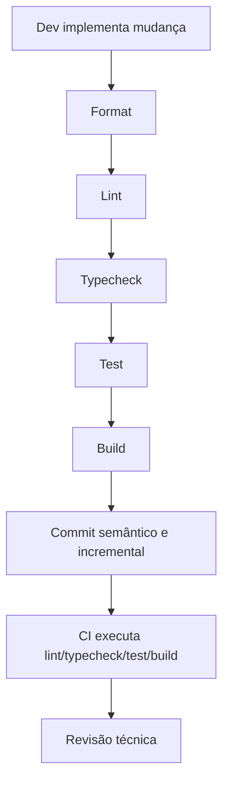

# ADR 13 — Convenções de CI, lint, format e commit

## Status

Adotado

## Contexto

Até este ponto, o projeto já definiu uma base arquitetural sólida para a feature `short-url`, incluindo:

- bootstrap do projeto
- infraestrutura local com Docker Compose
- validação e tipagem de environment
- base compartilhada HTTP
- schema do banco e migrations
- módulo de domínio e casos de uso
- observabilidade e hardening
- estratégia de testes automatizados
- README e setup local
- Swagger/OpenAPI e contratos públicos da API

A lista de requisitos também estabelece diretrizes explícitas que impactam diretamente o fluxo de qualidade e colaboração do repositório:

- padronize lint, format e commit conventions
- falhe CI em lint, typecheck, test e build
- faça code review com foco em segurança, performance e clareza
- toda feature nova deve respeitar validação, observabilidade, segurança e padronização desde o primeiro commit
- você deve fazer pequenos commits incrementais para que a evolução e o raciocínio da implementação possam ser avaliados

Como este projeto é parte de um desafio técnico, o histórico de commits e o nível de disciplina do pipeline têm peso prático na avaliação. Não basta que o código funcione; ele precisa transmitir organização, previsibilidade e maturidade de engenharia.

Sem convenções mínimas de CI, lint, format e commits, o projeto tende a sofrer com:

- inconsistência de estilo
- ruído em revisão
- regressões simples chegando tarde demais
- histórico confuso de evolução
- dificuldade de reproduzir a qualidade localmente e na CI

Este ADR define as convenções de qualidade automatizada e de colaboração que devem acompanhar a implementação do desafio desde o início.

## Decisão

O projeto adotará um fluxo de qualidade com quatro pilares:

1. **CI obrigatória para validações essenciais**
2. **lint e format padronizados e executáveis localmente**
3. **typecheck, testes e build como gates de qualidade**
4. **commits pequenos, incrementais e semanticamente claros**

O objetivo é garantir que a qualidade mínima do projeto seja verificável de forma automática e que o histórico de evolução seja legível para revisão técnica.

---

## 1. Escopo do ADR

Este ADR cobre:

- convenções de CI
- regras para lint e format
- papel de typecheck, testes e build no fluxo de qualidade
- convenções de mensagens de commit
- princípios de granularidade dos commits
- relação entre qualidade local e qualidade na CI

Este ADR não cobre em detalhe:

- configuração específica de plataforma de CI
- estratégia de release/versionamento do produto
- branching model corporativo complexo
- automações de deploy

---

## 2. CI como gate de qualidade obrigatório

### Decisão

Toda alteração relevante no projeto deve passar por CI com validações essenciais.

### Objetivo

Garantir que a branch entregue mantenha um nível mínimo de confiabilidade e consistência.

### Regra

A pipeline deve falhar quando qualquer etapa crítica falhar.

### Etapas mínimas obrigatórias

- lint
- typecheck
- test
- build

### Motivo

Essas quatro etapas capturam a maior parte dos problemas básicos antes do merge ou da avaliação final.

---

## 3. O que a CI deve validar

### Decisão

A CI deve validar não apenas “se roda”, mas se o projeto continua aderente às decisões arquiteturais e de qualidade assumidas.

### Escopo mínimo

- estilo e qualidade estática do código
- compatibilidade de tipagem strict
- regressões comportamentais via testes
- integridade da build

### Observação

Em projetos pequenos, é tentador reduzir o pipeline a apenas testes ou apenas build. Essa simplificação foi rejeitada porque deixa passar regressões importantes de tipagem, organização e consistência.

---

## 4. Lint como guardião de consistência estrutural

### Decisão

O projeto deve ter lint configurado e tratado como parte obrigatória do fluxo de desenvolvimento.

### Objetivo

- reduzir inconsistências triviais
- evitar code smells simples
- reforçar padrões da base TypeScript/NestJS
- melhorar legibilidade e manutenção

### Regras

- lint deve rodar localmente e na CI
- violações de lint devem falhar a pipeline
- regras devem priorizar clareza, segurança e previsibilidade

### Observação

Lint não substitui revisão técnica nem testes, mas elimina ruído e captura problemas recorrentes cedo.

---

## 5. Format como padronização automática de estilo

### Decisão

O projeto deve ter formatação automatizada e previsível.

### Objetivo

- evitar discussão improdutiva sobre estilo visual
- reduzir ruído de diff
- manter consistência do repositório

### Regras

- format deve poder ser executado com um comando simples
- o estilo formatado deve ser determinístico
- revisão de código não deve se concentrar em detalhes cosméticos que a ferramenta resolve sozinha

### Motivo

O foco humano da revisão deve estar em arquitetura, segurança, semântica, performance e clareza — não em espaços, aspas ou quebras triviais.

---

## 6. Separação de responsabilidades entre lint e format

### Decisão

Lint e format devem ser tratados como responsabilidades complementares, não como a mesma coisa.

### Regra

- format cuida do estilo mecânico
- lint cuida de consistência estática, boas práticas e sinais de problema

### Motivo

Misturar os papéis tende a gerar configuração confusa e resultados menos previsíveis.

---

## 7. Typecheck como gate obrigatório

### Decisão

O projeto deve executar verificação de tipos explícita como parte do fluxo local e da CI.

### Motivo

A base do projeto depende de TypeScript em modo strict, Zod e Drizzle com reaproveitamento de tipos inferidos. Ignorar typecheck enfraquece diretamente uma das premissas centrais da arquitetura.

### Regras

- typecheck deve falhar a pipeline quando houver erro
- código não deve depender de `any` desnecessário
- contratos públicos devem manter tipagem clara e consistente

---

## 8. Testes como gate funcional obrigatório

### Decisão

A suíte de testes automatizados definida no ADR anterior deve participar do gate de qualidade da CI.

### Objetivo

- impedir regressões básicas de comportamento
- validar regras de negócio e contratos críticos
- reforçar confiança na evolução incremental do projeto

### Regras

- testes devem rodar de forma reproduzível
- falhas de teste devem bloquear a pipeline
- cenários críticos definidos pela estratégia de testes não podem ser tratados como opcionais

---

## 9. Build como verificação final de integridade

### Decisão

A build da aplicação deve ser executada na CI e falhar o pipeline em caso de erro.

### Motivo

Um projeto pode passar em lint, typecheck e parte dos testes e ainda assim falhar ao empacotar, compilar ou iniciar artefatos necessários.

### Regras

- build deve ser determinística
- scripts de build devem refletir a forma real de empacotamento do projeto
- a CI deve validar que o projeto continua empacotável

---

## 10. Ordem recomendada das validações

### Decisão

A ordem lógica das validações deve favorecer feedback rápido.

### Sequência recomendada

1. lint
2. typecheck
3. test
4. build

### Motivo

- lint e typecheck costumam falhar mais rápido
- testes têm custo intermediário
- build pode ficar por último como confirmação final de integridade

---

## 11. Convenção de execução local antes de subir código

### Decisão

A mesma disciplina esperada na CI deve existir localmente antes de considerar uma tarefa pronta.

### Fluxo mínimo esperado localmente

- format, quando necessário
- lint
- typecheck
- test
- build

### Objetivo

Reduzir ida e volta desnecessária e tornar a qualidade previsível antes mesmo do código chegar à CI.

---

## 12. Commits pequenos e incrementais

### Decisão

O histórico do projeto deve ser composto por commits pequenos, focados e semanticamente claros.

### Motivo

O desafio pede explicitamente commits incrementais para permitir avaliação do progresso e do raciocínio da implementação.

### Regras

- cada commit deve representar uma mudança coerente
- evitar commits gigantes com múltiplas responsabilidades desconexas
- preferir progressão gradual da arquitetura e da feature
- mudanças mecânicas grandes devem ser separadas de mudanças lógicas quando isso melhorar leitura do histórico

---

## 13. O que é um bom commit neste projeto

### Decisão

Um bom commit deve ser pequeno o suficiente para revisão objetiva e grande o suficiente para representar uma unidade de valor compreensível.

### Exemplos de unidades saudáveis

- bootstrap inicial do projeto
- compose local com postgres e redis
- schema inicial do banco com migration
- criação do módulo `short-url`
- caso de uso de criação
- caso de uso de obtenção com incremento de acesso
- documentação Swagger da feature
- suíte inicial de testes unitários

### Evitar

- “ajustes diversos” sem foco
- mistura de refactor, bugfix, docs e infra sem separação clara
- um único commit contendo metade do projeto inteiro

---

## 14. Convenção de mensagens de commit

### Decisão

As mensagens de commit devem seguir convenção semântica clara e previsível.

### Convenção recomendada

Adotar padrão no estilo **Conventional Commits**.

### Tipos mais úteis para este projeto

- `feat`
- `fix`
- `refactor`
- `test`
- `docs`
- `chore`
- `build`
- `ci`

### Formato recomendado

`tipo(escopo): descrição curta`

### Exemplos

- `feat(short-url): add create short url use case`
- `feat(short-url): add get short url stats endpoint`
- `fix(short-url): handle short code collision retry`
- `test(short-url): cover update and delete use cases`
- `docs(readme): add local setup instructions`
- `ci(pipeline): run lint typecheck test and build`
- `build(docker): add multi-stage production image`

---

## 15. Idioma das mensagens de commit

### Decisão

As mensagens de commit devem manter idioma consistente em todo o repositório.

### Recomendação

Para desafio técnico e maior interoperabilidade, inglês é preferível para commits.

### Regra

Mais importante do que o idioma específico é a consistência ao longo do histórico.

---

## 16. Semantic-release e branches de gatilho

O projeto usa **semantic-release** para versionamento automatico. Dois pontos criticos:

1. **Commits semanticos:** tipos em ingles (`feat`, `fix`, `refactor`, etc.); assunto em portugues; escopo opcional. Mapeamento: `feat`/`BREAKING CHANGE` -> minor/major; `fix`/`perf`/`refactor` -> patch.

2. **Branches de gatilho:** `release.config.js` e `.github/workflows/ci.yml` devem estar alinhados. O job de release so executa quando o PR e mergeado em branches listadas em `branches` do `release.config.js`. Exemplo: `branches: ['dev']` e `if: github.base_ref == 'dev'` no ci.yml.

Regra: qualquer alteracao de branches de release exige edicao sincronizada em ambos os arquivos.

## 17. Boas praticas e remediacao de code smells

Adotar de forma sistematica:

- **Early return:** preferir retornos antecipados para reduzir aninhamento.
- **Extracao de numeros magicos:** constantes nomeadas (ex.: W3C Trace Context, limites de validacao).
- **Constantes centralizadas:** limites de dominio (shortCode min/max) em um unico ponto.
- **Extracao de regex:** padroes em constantes nomeadas em arquivos dedicados.
- **Remocao de codigo morto:** eliminar tipos/modulos nao utilizados com regras divergentes.

## 18. Relação entre commit e revisão técnica

### Decisão

Os commits devem facilitar a revisão, não apenas registrar salvamentos locais.

### Regras

- a ordem dos commits deve contar a evolução do projeto
- cada commit deve ter justificativa implícita clara pelo nome e pelo conteúdo
- histórico deve permitir entender decisões passo a passo

### Motivo

Um histórico bom melhora avaliação técnica e ajuda manutenção futura.

---

## 19. Hooks locais são úteis, mas não substituem a CI

### Decisão

Hooks locais podem ser usados para antecipar erros simples, mas a fonte oficial de validação continua sendo a CI.

### Motivo

- hooks melhoram feedback local
- porém podem ser ignorados, variar por máquina ou não refletir o ambiente da pipeline

### Regra

Mesmo com hooks, lint/typecheck/test/build precisam existir como checks executáveis oficialmente e rodar na CI.

---

## 20. Política de formatação e refactors mecânicos

### Decisão

Mudanças puramente mecânicas devem ser isoladas quando houver risco de poluir revisão.

### Exemplos

- formatação em massa
- renomeação ampla sem mudança de comportamento
- reorganização estrutural sem alteração funcional

### Motivo

Se essas mudanças forem misturadas com lógica nova, a revisão fica mais cara e menos confiável.

---

## 21. Qualidade de PR ou entrega final

### Decisão

Antes de considerar uma entrega pronta, o projeto deve atender simultaneamente aos critérios mínimos de automação e legibilidade do histórico.

### Esperado

- pipeline verde
- commits compreensíveis
- diffs legíveis
- documentação atualizada quando aplicável

### Motivo

Qualidade de software não é apenas ausência de erro em runtime; é também previsibilidade de evolução e facilidade de revisão.

---

## 22. Papel do code review

### Decisão

Mesmo com CI, lint e format, a revisão humana continua obrigatória como camada de qualidade conceitual.

### Foco recomendado da revisão

- segurança
- performance
- clareza
- aderência arquitetural
- simplicidade
- consistência com os ADRs

### Regra

A automação deve reduzir trabalho repetitivo da revisão, não substituí-la.

---

## 23. Scripts do projeto devem refletir o fluxo de qualidade

### Decisão

Os scripts expostos no projeto devem tornar o fluxo de qualidade simples de executar.

### Objetivo

- facilitar uso local
- padronizar comandos
- reduzir improviso na execução

### Scripts mínimos esperados

- `lint`
- `format`
- `typecheck`
- `test`
- `build`

### Scripts complementares desejáveis

- `test:unit`
- `test:integration`
- `test:http`
- `format:check`
- `lint:fix`, se fizer sentido

---

## 24. Falhar cedo é preferível

### Decisão

O fluxo de qualidade deve priorizar falha precoce para problemas simples.

### Motivo

- economiza tempo de execução
- reduz feedback tardio
- torna o ciclo de desenvolvimento mais eficiente

### Aplicação prática

- lint e typecheck antes de etapas mais custosas
- validações locais antes de subir código

---

## 25. O que não é objetivo deste ADR

### Decisão

Este ADR não impõe burocracia desnecessária.

### Não é objetivo

- criar pipeline excessivamente complexo para um projeto pequeno
- exigir múltiplos jobs sofisticados sem ganho real
- transformar commit convention em barreira artificial de produtividade

### Motivo

A disciplina precisa ser proporcional ao tamanho do projeto, sem perder qualidade.

---

## 26. Consequências

### Positivas

- qualidade mínima verificável automaticamente
- histórico mais legível e avaliável
- menor chance de regressões triviais
- menos ruído em revisão de código
- melhor alinhamento entre desenvolvimento local e pipeline

### Negativas

- adiciona alguma fricção inicial ao fluxo
- exige disciplina na organização dos commits
- pode aumentar ligeiramente o tempo de feedback antes do merge

### Trade-off assumido

Preferimos um processo leve, porém firme, que proteja a qualidade e torne a evolução do projeto inteligível desde o primeiro commit.

---

## 27. Alternativas consideradas

### 1. Rodar apenas testes na CI

Rejeitada.

Motivo:

- deixaria passar falhas de estilo, tipagem e build
- é insuficiente para o padrão desejado do projeto

### 2. Não padronizar commits por ser “só um desafio”

Rejeitada.

Motivo:

- o próprio desafio pede commits incrementais
- o histórico faz parte da avaliação técnica

### 3. Usar lint e format apenas localmente sem validação em pipeline

Rejeitada.

Motivo:

- gera inconsistência entre ambientes
- reduz confiança no repositório

### 4. Criar pipeline muito complexa logo de início

Rejeitada.

Motivo:

- excesso de complexidade sem ganho proporcional
- foge do tamanho e escopo do projeto

---

## Critérios de aceite

A decisão será considerada implementada quando o projeto possuir:

- pipeline de CI executando `lint`, `typecheck`, `test` e `build`
- scripts locais equivalentes documentados no projeto
- configuração de lint e format aplicável à base TypeScript/NestJS
- convenção de commit semântica definida e seguida
- histórico de implementação composto por commits pequenos e incrementais
- fluxo de revisão orientado por segurança, performance e clareza

## Exemplo de resultado esperado

Ao final desta task, o projeto deve permitir:

1. validar automaticamente a qualidade mínima em cada alteração relevante
2. executar localmente os mesmos checks essenciais da CI
3. manter histórico de commits que conte a evolução da feature
4. reduzir ruído de estilo e problemas simples antes da revisão humana
5. apresentar um repositório mais confiável e profissional para avaliação técnica

---

## Diagrama simplificado do fluxo de qualidade

## Próximos ADRs relacionados

- ADR 14 — Seed inicial e estratégia de dados de desenvolvimento
- ADR 15 — Planejamento consolidado da feature e roadmap incremental

