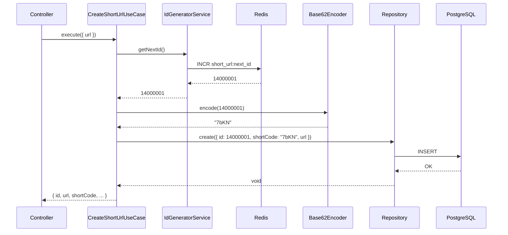

# ADR 14 — Base 62 e Redis INCR para Short Code

## Status

Adotado

## Contexto

O sistema atual utiliza **nanoid** para gerar short codes aleatorios (6-21 caracteres). Essa abordagem apresenta:

- **Paradoxo do aniversario:** com ~2,21 milhoes de URLs geradas ja ha probabilidade significativa de colisao
- **Consultas extras ao banco:** em caso de conflito (UNIQUE violation), o use case faz retry com novo codigo, gerando multiplas tentativas de INSERT
- **Impacto em throughput:** 1.160 writes/s com retries aumentam a carga real no banco

O objetivo e substituir por uma solucao **deterministica**, sem colisao e sem retry.

## Decisao

1. **Conversao Base 62:** alfabeto `0-9a-zA-Z` (62 caracteres). O short code e a representacao em Base 62 de um ID numerico.
2. **Redis INCR:** comando atomico para gerar IDs sequenciais unicos. Chave `short_url:next_id`.
3. **ID inicial:** 14.000.000 (62^4). Garante que os primeiros short codes tenham 4+ caracteres, evitando URLs muito curtas previsiveis.
4. **Capacidade 7 caracteres:** 62^7 = 3.521.614.606.208 (~3,5 trilhoes de combinacoes).

## Estimativas e probabilidades

| Metrica | Valor |
|---------|-------|
| Capacidade 7 chars Base 62 | 3,52 trilhoes |
| ID inicial | 14.000.000 |
| Colisao | 0% (deterministico) |
| Consultas extras por criacao | 0 (sem retry) |

## Limites do PostgreSQL (check-list 1-7)

Requisitos do check-list vs capacidade real do Postgres:

| Requisito | Valor | PostgreSQL | Observacao |
|-----------|-------|------------|------------|
| URLs/dia | 100M | OK | ~1.160 writes/s |
| Leitura 10:1 | 11.600 reads/s | OK | Com pool, replicas |
| Armazenamento 10 anos | 365B registros | Limitado | Pratico ate ~50B com particionamento |
| Capacidade | 36,5 TB | Limitado | Limite teorico ~32 TB por tabela |
| HA 24/7 | Sim | OK | Streaming replication |

**Estimativas realistas com PostgreSQL:**

- **Confortavel ate:** ~10-50 bilhoes de registros com particionamento por tempo (ex.: mensal)
- **365 bilhoes:** exige Cassandra ou banco colunar; Postgres nao e recomendado
- **36,5 TB:** proximo do limite de 32 TB por tabela; particionamento reduz tamanho por particao
- **1.160 writes/s:** viavel com connection pooling (PgBouncer) e tuning
- **11.600 reads/s:** viavel com read replicas e cache (Redis)

**Conclusao:** O desenho (Base 62 + Redis INCR) atende a logica de short code. Os limites de escala (365B registros, 36,5 TB) extrapolam o cenario confortavel do PostgreSQL; para esse volume, a recomendacao seria Cassandra ou similar.

## Alternativas consideradas

- **Hash (MD5/SHA):** colisao, base 16, URLs longas
- **Nanoid aleatorio:** paradoxo do aniversario, retry
- **Sequence PostgreSQL:** unico no Postgres; Redis permite distribuicao futura

## Consequencias

- Remocao de nanoid, ShortCodeConflictError, ShortCodeGenerationExhaustedError
- Novo servico IdGeneratorService (Redis INCR)
- ShortCodeGenerator vira Base62Encoder (funcao pura)
- Migration: id uuid -> bigint

## Fluxo

