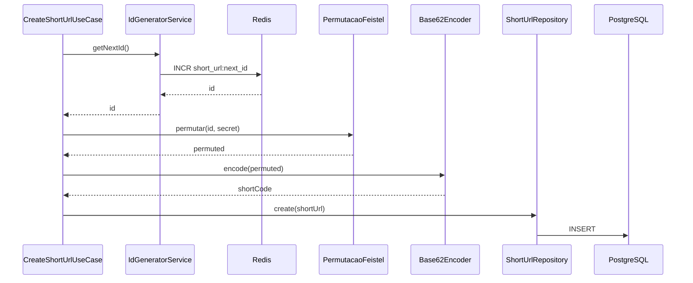

# ADR 19 — Permutação Feistel com segredo no short code (evolução do Base62 + INCR)

## Status

Aceito (decisão de arquitetura; implementação conforme avanço do código)

## Contexto

O [ADR 14](14-base62-redis-incr.md) fixou **Redis INCR** + **Base62 direto do id** para unicidade sem retry e sem consulta de colisão no banco. Isso mantém o código curto e previsível em custo de escrita, mas expõe **enumerabilidade por vizinhança**: quem entende Base62 pode correlacionar códigos consecutivos no contador.

O rate limit **12 requisições por minuto por IP** nas rotas do `ShortenController` reduz varredura em massa, mas não remove a previsibilidade estrutural do slug.

Autenticação em operações de escrita permanece fora do escopo imediato (evolução natural descrita no README).

## Decisão

Manter o **contador monotônico** no Redis (`IdGeneratorService`, `INCR`) e o **Base62** apenas como formatador final; inserir entre eles uma **permutação keyed** (rede Feistel ou equivalente criptograficamente razoável) sobre bloco fixo (ex.: **32 bits**), com **segredo apenas no servidor**.

### Segredo no `.env` e validação junto aos demais envs

- O valor sensível fica **somente** no arquivo `.env` local (nunca commitado), no mesmo padrão já usado pelo projeto.
- A variável é declarada em **`src/config/env-variables.ts`** (`EnvVariables`), com regras **class-validator** coerentes com as outras chaves (formato, tamanho mínimo de entropia, obrigatoriedade em produção, etc., conforme definido na implementação).
- A validação ocorre no **`parseEnv`** na subida da aplicação, **em conjunto** com as demais variáveis; ambiente inválido falha cedo, sem iniciar com segredo ausente ou malformado.
- O repositório deve incluir **`.env.example`** atualizado: nome da variável documentado, placeholder **sem segredo real**, alinhado à política já descrita no planejamento (`.env.example` sem credenciais verdadeiras).

Fluxo no create:

1. `id = await getNextId()` (Redis)
2. `permuted = feistel32(id, secret)` (ou FPE equivalente, bijeção no espaço do bloco)
3. `shortCode = base62Encode(permuted)`
4. `INSERT` com `UNIQUE(short_code)` como defesa em profundidade

Leitura, atualização, delete e estatísticas continuam resolvendo por `short_code` persistido; **não** é necessário reverter Feistel no GET.

### Regras complementares

- Charset do `shortCode` permanece o alfabeto Base62 já validado pelo `ShortCodeParamPipe`.
- **Bijeção** no espaço permutado: dois ids distintos não devem colidir em `shortCode` por construção (diferente de slug aleatório com retry).
- **Rotação de segredo**: alterar a chave afeta só **novos** links; códigos já gravados permanecem válidos.

### Comprimento

Com permutação em 32 bits, o Base62 do resultado tende a **até ~6 caracteres**, compatível com as constantes atuais (mínimo 4, máximo 8 no pipe) e com a constraint do banco.

## Alternativas consideradas

- **Base62(id) puro (status quo do ADR 15):** ótimo para comprimento mínimo inicial, fraco contra enumeração por vizinhança.
- **Slug aleatório CSPRNG + INSERT + retry em colisão:** forte em entropia, porém reintroduz colisões improváveis e preocupação com caminho feliz no banco; rejeitado em favor de manter o modelo **uma escrita por criação** sem `SELECT` prévio de existência do slug.
- **HMAC truncado ou cifra só para “embelezar” id:** complexidade e análise de colisão/truncagem sem ganho claro sobre Feistel/FPE em bloco fixo com bijeção.

## Consequências

### Positivas

- Preserva escalabilidade do **INCR** e um único INSERT por URL criada.
- Reduz adivinhação por **id ± 1** no espaço público do código.
- Segredo configurável e rotacionável sem invalidar dados antigos.

### Negativas / trade-offs

- Códigos iniciais deixam de ser tão curtos quanto `Base62(id)` para ids pequenos (efeito do bloco fixo de 32 bits).
- Nova variável de ambiente obrigatória em produção e testes com chave fixa para determinismo.
- Implementação criptográfica a manter e testar (vetores conhecidos em testes unitários).

## Impacto na implementação

| Área | Arquivo / artefato | Impacto |
|------|-------------------|---------|
| Use case | `src/modules/short-url/application/use-cases/create-short-url.use-case.ts` | Aplicar permutação antes do Base62; injetar serviço de permutação. |
| Novo serviço | `src/modules/short-url/application/services/` (ex.: `short-code-permutation.service.ts`) | Feistel/FPE 32 bits; segredo via config. |
| Inalterado (contrato) | `id-generator.service.ts` | `getNextId()` permanece. |
| Inalterado (regra) | `base62-encoder.service.ts` | Entrada passa a ser o inteiro pós-permutação. |
| Módulo | `short-url.module.ts` | Registrar provider da permutação. |
| Config | `src/config/env-variables.ts`, `src/config/env.parser.ts`, regras em `env-cross-rules.ts` se necessário | Nova variável; validação no mesmo fluxo das outras envs via `parseEnv` / `EnvVariables`. |
| Exemplo de ambiente | `.env.example` na raiz | Documentar a nova chave com placeholder não secreto. |
| Constantes | `short-code.constants.ts` | Confirmar `SHORT_CODE_MAX_LENGTH` 8 para pior caso Base62 de uint32. |
| Repositório / cache | `drizzle-short-url.repository.ts`, `cached-short-url.repository.ts` | Sem mudança de contrato. |
| Demais use cases | get, update, delete, stats | Sem mudança. |
| Testes unitários | `*.spec.ts` (permutação, `create-short-url.use-case`, demais serviços afetados) | Chave de teste fixa (env ou mock); expectativas determinísticas. |
| Testes de integração | `test/*.integration-spec.ts`, Jest `jest-integration.json` | Garantir que o processo de teste carrega a nova env (ou valor padrão seguro só para teste) para que criação de URLs e concorrência continuem passando. |
| E2E | `test/app.e2e-spec.ts`, `jest-e2e.json` | Mesma exigência de env de teste; fluxo create → get → … permanece verde. |
| CI / scripts | `package.json` (`test`, `test:integration`, `test:e2e`, `test:all`) | Critério de aceite: após a mudança, `npm test`, `npm run test:integration` e `npm run test:e2e` continuam passando. |
| Documentação | `README.md` | Alinhar descrição do modelo (não apenas INCR + Base62 direto); mencionar nova env se relevante para setup local. |

## Relação com outros artefatos

- Refina o desenho do [ADR 14](14-base62-redis-incr.md): mantém INCR e Base62, altera apenas a derivação do valor passado ao Base62.
- Alinhado às seções **15**, **15.2**, **15.3** e **18** do documento [planejamento_feature_url_shortener_c_4.md](../docs/planejamento_feature_url_shortener_c_4.md) (segredo em `.env`, `.env.example`, validação conjunta e critérios de testes).

## Fluxo (alvo)

