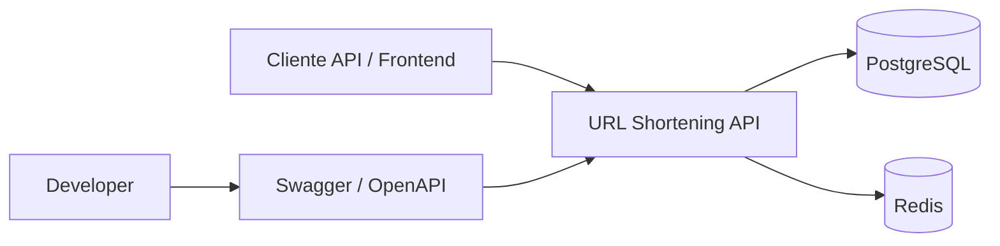
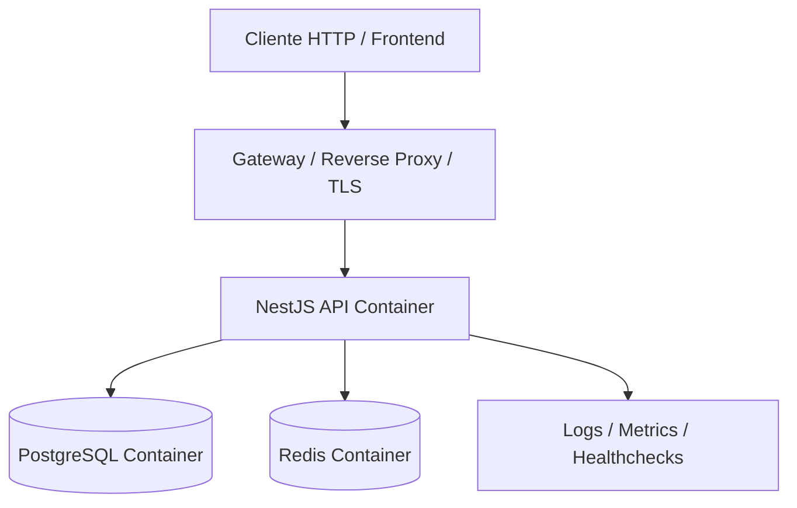
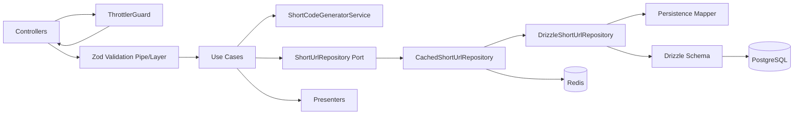
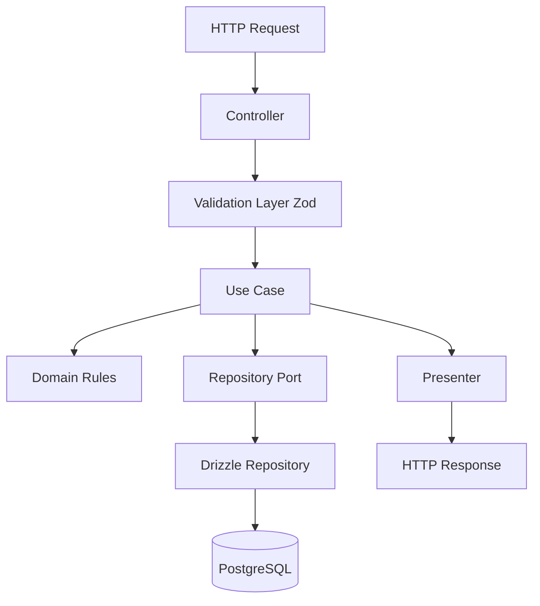
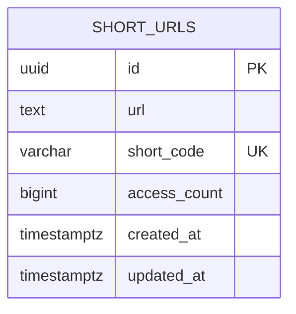
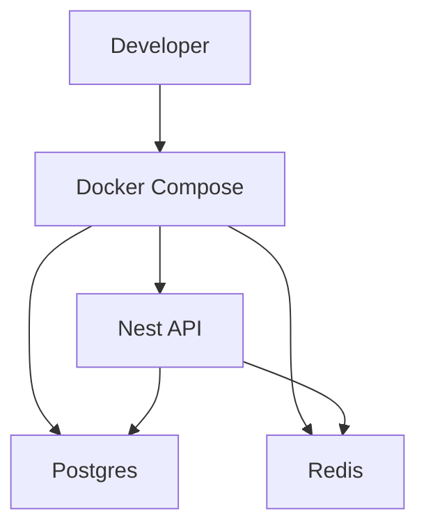
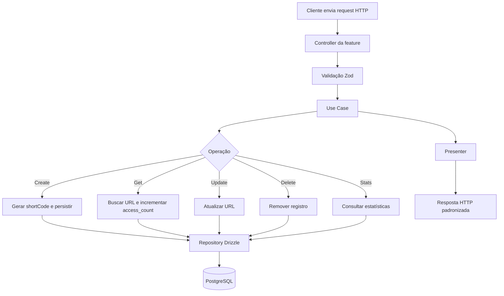

# Planejamento completo da feature — URL Shortening Service

## 1. Objetivo

Projetar de ponta a ponta a feature **URL Shortening Service** usando **NestJS + TypeScript strict + Zod + Drizzle + PostgreSQL + Redis + Docker Compose + Swagger**, com organização por **domínio/feature**, foco em segurança, observabilidade, consistência arquitetural e facilidade de evolução.

Este documento cobre:

- escopo funcional da feature
- requisitos funcionais e não funcionais
- decisões arquiteturais
- organização por domínio
- contratos da API
- modelagem de banco
- diagrama **C4 Model**
- diagrama **Mermaid UML/ER do banco**
- regras de segurança de banco de dados
- estratégias de cache, rate limit, logging, testes e Docker
- plano incremental de implementação
- estrutura sugerida do projeto

---

# 2. Escopo da feature

A feature permite:

1. criar uma URL encurtada
2. consultar a URL original por `shortCode`
3. atualizar a URL original vinculada ao `shortCode`
4. remover uma URL encurtada
5. consultar estatísticas de acesso
6. registrar acessos ao `shortCode` para compor métricas

Não faz parte do escopo:

- autenticação/autorização
- frontend HTML/CSS
- upload de arquivos
- regras multi-tenant
- custom aliases escolhidos pelo usuário
- expiração de links na primeira versão

---

# 3. Stack e direcionadores técnicos

## Stack obrigatória

- **Node.js + TypeScript**
- **NestJS**
- **PostgreSQL**
- **Drizzle ORM**
- **Zod** para validação
- **Swagger/OpenAPI**
- **Docker Compose**
- **Redis** para rate limit distribuído e cache pontual

## Direcionadores arquiteturais

- estrutura por feature/domínio, não por tipo de arquivo global
- separação clara entre controller, use case, service e repository
- repositório como única porta de acesso persistente
- validação de toda entrada externa com Zod
- domínio desacoplado de detalhes de framework e ORM
- observabilidade desde o primeiro commit
- segurança e padronização como requisitos transversais

---

# 4. Requisitos funcionais

## RF-01 — Criar short URL

**POST `/shorten`**

Entrada:

```json
{
  "url": "https://www.example.com/some/long/url"
}
```

Saída esperada `201`:

```json
{
  "data": {
    "id": "uuid",
    "url": "https://www.example.com/some/long/url",
    "shortCode": "abc123",
    "createdAt": "2021-09-01T12:00:00Z",
    "updatedAt": "2021-09-01T12:00:00Z"
  },
  "meta": {
    "requestId": "uuid"
  }
}
```

Regras:

- validar URL com Zod
- normalizar string de entrada
- gerar `shortCode` aleatório e único
- garantir unicidade no banco com constraint
- retornar erro padronizado em caso de payload inválido

## RF-02 — Recuperar URL original

**GET `/shorten/:shortCode`**

Saída `200`:

```json
{
  "data": {
    "id": "uuid",
    "url": "https://www.example.com/some/long/url",
    "shortCode": "abc123",
    "createdAt": "2021-09-01T12:00:00Z",
    "updatedAt": "2021-09-01T12:00:00Z"
  },
  "meta": {
    "requestId": "uuid"
  }
}
```

Regras:

- validar `shortCode`
- retornar `404` se não encontrado
- incrementar estatística de acesso de forma segura e simples
- não executar redirect no backend, já que o desafio informa que o frontend fará isso

## RF-03 — Atualizar URL existente

**PUT `/shorten/:shortCode`**

Entrada:

```json
{
  "url": "https://www.example.com/some/updated/url"
}
```

Regras:

- validar `shortCode` e body com Zod
- manter o mesmo `shortCode`
- atualizar `updatedAt`
- retornar `404` se inexistente

## RF-04 — Remover short URL

**DELETE `/shorten/:shortCode`**

Regras:

- remoção física na primeira versão
- retornar `204` quando sucesso
- retornar `404` se inexistente

## RF-05 — Consultar estatísticas

**GET `/shorten/:shortCode/stats`**

Saída `200`:

```json
{
  "data": {
    "id": "uuid",
    "url": "https://www.example.com/some/long/url",
    "shortCode": "abc123",
    "createdAt": "2021-09-01T12:00:00Z",
    "updatedAt": "2021-09-01T12:00:00Z",
    "accessCount": 10
  },
  "meta": {
    "requestId": "uuid"
  }
}
```

Regras:

- retornar `404` quando `shortCode` não existir
- estatística deve refletir acessos realizados no endpoint de recuperação

---

# 5. Requisitos não funcionais consolidados

## Arquitetura e código

- organização por feature/domínio
- módulos pequenos, coesos e de responsabilidade única
- bootstrap mínimo
- contratos, tipos e utilitários compartilhados centralizados apenas quando realmente compartilhados
- evitar exports desnecessários entre módulos
- providers stateless sempre que possível

## TypeScript

- `strict: true`
- `noImplicitAny: true`
- `strictNullChecks: true`
- `noUncheckedIndexedAccess: true`
- sem `any` desnecessário
- contratos públicos com tipos explícitos
- aproveitar inferência do Zod e Drizzle para reduzir duplicação

## Validação

- toda entrada externa validada com Zod
- schemas pequenos e específicos por endpoint
- separar schemas de entrada, saída e domínio
- usar normalização/sanitização de texto antes do processamento
- rejeitar payload fora do contrato esperado
- mapear `ZodError` para formato HTTP padronizado

## Segurança

- sem autenticação nesta feature, mas com proteção de superfície
- `helmet`
- `cors` restritivo por ambiente
- `x-powered-by` desabilitado
- HTTPS em ambientes expostos
- HSTS em produção quando aplicável
- limite de payload
- logs sem segredos/dados sensíveis
- secrets fora do repositório
- env validada na inicialização com Zod

## Resiliência e abuso

- rate limit com `@nestjs/throttler`
- Redis para throttle distribuído
- limites diferentes por rota quando fizer sentido
- timeout de request e integrações
- monitorar padrões abusivos por IP e rota

## Observabilidade

- logger estruturado centralizado
- requestId e correlationId
- interceptor para tracing e latência
- health/readiness/liveness
- métricas mínimas: latência, throughput, taxa de erro, cache hit/miss

## Persistência

- PostgreSQL com constraints reais
- Drizzle como fonte de verdade do schema
- migrations pequenas e versionadas
- queries encapsuladas em repositórios
- paginação obrigatória quando houver listas futuras
- sem `select *`
- índices baseados em consultas reais

## Infra

- Docker multi-stage
- usuário não root
- `.dockerignore`
- app, postgres e redis em containers separados
- healthcheck
- hot reload em dev
- imagem mínima e segura em produção
- graceful shutdown com fechamento de conexões

## Qualidade

- lint + format + typecheck + test + build na CI
- testes unitários, integração e de validação
- seed idempotente
- README claro na raiz
- commits pequenos e incrementais

---

# 6. Decisões principais de arquitetura

## 6.1 Organização por feature

Estrutura sugerida:

```text
src/
  app/
    app.module.ts
    bootstrap.ts

  config/
    app.config.ts
    db.config.ts
    redis.config.ts
    logger.config.ts
    env.schema.ts

  shared/
    contracts/
      api-response.contract.ts
      api-error.contract.ts
      pagination.contract.ts
    http/
      filters/
      interceptors/
      pipes/
    logger/
    result/
    utils/
    health/

  modules/
    short-url/
      short-url.module.ts
      presentation/
        controllers/
          create-short-url.controller.ts
          get-short-url.controller.ts
          update-short-url.controller.ts
          delete-short-url.controller.ts
          get-short-url-stats.controller.ts
        presenters/
          short-url.presenter.ts
          short-url-stats.presenter.ts
        schemas/
          create-short-url.request.schema.ts
          update-short-url.request.schema.ts
          short-code.param.schema.ts
      application/
        use-cases/
          create-short-url.use-case.ts
          get-short-url.use-case.ts
          update-short-url.use-case.ts
          delete-short-url.use-case.ts
          get-short-url-stats.use-case.ts
        services/
          short-code-generator.service.ts
          short-url-validator.service.ts
      domain/
        entities/
          short-url.entity.ts
        repositories/
          short-url.repository.ts
        errors/
          short-url-not-found.error.ts
          short-code-collision.error.ts
          invalid-url-domain.error.ts
      infrastructure/
        repositories/
          drizzle-short-url.repository.ts
        mappers/
          short-url.persistence.mapper.ts
        drizzle/
          short-url.table.ts
          short-url-access.table.ts
```

### Motivo

- reduz acoplamento horizontal
- deixa cada feature autocontida
- facilita manutenção e testes
- impede um diretório global gigante por “controllers/services/repositories”

## 6.2 Separação entre camadas

### Controller

Responsável apenas por:

- receber request
- acionar validação da borda
- chamar use case
- devolver presenter/contrato HTTP

### Use case

Responsável por:

- orquestrar regra de negócio
- aplicar fluxo funcional
- decidir sucesso/falha esperada usando Result Pattern

### Service de aplicação

Responsável por:

- capacidades reutilizáveis ligadas à feature, como geração de shortCode
- regras técnicas auxiliares que não pertencem ao controller nem ao repositório

### Repository

Responsável por:

- abstração do acesso ao banco
- queries, inserts, updates e deletes
- nunca receber responsabilidade de regra de negócio complexa

---

# 7. Modelo de domínio

## Agregado principal

### ShortUrl

Representa o link encurtado.

Campos de domínio:

- `id`
- `url`
- `shortCode`
- `createdAt`
- `updatedAt`
- `accessCount`

## Observação de modelagem

Para a primeira versão, existem duas opções válidas:

1. manter `accessCount` diretamente em `short_urls`
2. criar tabela separada para eventos de acesso e/ou tabela de estatística agregada

### Decisão adotada

Para este desafio, a melhor relação entre simplicidade e robustez é:

- tabela principal `short_urls`
- coluna `access_count` na própria tabela
- incremento atômico a cada recuperação bem-sucedida

### Motivo

- o requisito pede apenas contagem total
- reduz complexidade de leitura
- evita joins desnecessários
- simplifica implementação e testes

### Evolução futura possível

Caso seja necessário analytics real, pode-se introduzir:

- `short_url_access_events`
- agregações assíncronas
- métricas por data, IP, user-agent, origem etc.

---

# 8. Contratos e convenções da API

## Formato padrão de sucesso

```json
{
  "data": {},
  "meta": {
    "requestId": "uuid"
  }
}
```

## Formato padrão de erro

```json
{
  "error": {
    "code": "VALIDATION_ERROR",
    "message": "Request validation failed",
    "details": [
      {
        "field": "url",
        "message": "Invalid URL"
      }
    ]
  },
  "meta": {
    "requestId": "uuid"
  }
}
```

## Convenções

- mensagens curtas, claras e seguras
- sem stack trace para cliente
- sem erro bruto do banco exposto
- paginação padronizada para endpoints listáveis futuros
- presenters impedem exposição direta de entidade interna

---

# 9. C4 Model

## 9.1 Context Diagram



### Descrição

- o cliente consome a API REST
- a API persiste dados no PostgreSQL
- Redis apoia rate limiting distribuído e cache pontual
- Swagger documenta e facilita teste/manual review

## 9.2 Container Diagram



### Containers

#### Cliente HTTP / Frontend

- consome endpoints REST
- usa short code para buscar URL original
- faz redirect no frontend

#### Reverse Proxy / Gateway

- TLS
- CORS controlado
- compressão, limites e políticas de borda
- potencial integração com WAF/CDN

#### NestJS API

- controllers
- use cases
- validação Zod
- rate limiting
- logging
- swagger
- health checks

#### PostgreSQL

- fonte primária de verdade
- constraints, índices, integridade relacional

#### Redis

- throttle distribuído
- cache-aside pontual para consultas quentes, se necessário

## 9.3 Component Diagram — módulo short-url



### Fluxo interno

1. Throttler verifica rate limit (Redis)
2. controller recebe request
3. schema Zod valida e sanitiza entrada
4. use case executa regra
5. repository resolve persistência (cache Redis em hit, Drizzle em miss)
6. presenter monta resposta HTTP estável

## 9.4 Code Diagram simplificado



---

# 10. Diagrama Mermaid UML/ER do banco



## Explicação

Para o escopo atual, uma única tabela atende muito bem ao desafio.

### Tabela `short_urls`

- `id`: identificador interno UUID
- `url`: URL original validada e normalizada
- `short_code`: código curto único usado nas rotas públicas
- `access_count`: contador agregado de acessos
- `created_at`: criação em UTC
- `updated_at`: atualização em UTC

## DDL conceitual sugerida

```sql
CREATE TABLE short_urls (
  id UUID PRIMARY KEY,
  url TEXT NOT NULL,
  short_code VARCHAR(32) NOT NULL,
  access_count BIGINT NOT NULL DEFAULT 0,
  created_at TIMESTAMPTZ NOT NULL DEFAULT NOW(),
  updated_at TIMESTAMPTZ NOT NULL DEFAULT NOW(),
  CONSTRAINT uq_short_urls_short_code UNIQUE (short_code),
  CONSTRAINT chk_short_urls_access_count_non_negative CHECK (access_count >= 0),
  CONSTRAINT chk_short_urls_short_code_length CHECK (char_length(short_code) BETWEEN 4 AND 32)
);

CREATE INDEX idx_short_urls_created_at ON short_urls (created_at DESC);
CREATE INDEX idx_short_urls_short_code ON short_urls (short_code);
```

## Observação sobre índice

O índice isolado de `short_code` pode ser redundante se a constraint unique já criar índice equivalente. Na implementação real, manter apenas o índice gerado pela unique constraint é o mais limpo, salvo necessidade específica.

---

# 11. Regras de segurança do banco de dados

## 11.1 Regras estruturais obrigatórias

- usar **PostgreSQL** como fonte primária de verdade
- aplicar **constraint de unicidade** em `short_code`
- aplicar **check constraint** para impedir `access_count < 0`
- `created_at` e `updated_at` obrigatórios, em UTC
- `NOT NULL` em todos os campos essenciais
- tamanho de `short_code` restringido por constraint

## 11.2 Regras de acesso e aplicação

- aplicação nunca acessa banco fora da camada de repositório
- nunca montar SQL com concatenação de entrada do usuário
- preferir query builder do Drizzle
- quando usar SQL raw, encapsular e documentar
- selecionar somente colunas necessárias
- não usar `select *`
- revisar queries críticas com `EXPLAIN` quando surgirem gargalos

## 11.3 Segurança de credenciais e conexão

- credenciais fora do código e do git
- `.env` nunca versionado
- `.env.example` sem segredo real
- conexão via usuário com privilégios mínimos
- banco não exposto publicamente
- acesso restrito à rede interna Docker/VPC
- TLS entre serviços quando houver ambiente distribuído exposto
- rotacionar segredos fora do ciclo de deploy da imagem

## 11.4 Regras de integridade e concorrência

- unicidade garantida no banco e não apenas na aplicação
- colisão de `shortCode` deve ser tratada com retry controlado no use case
- incremento de `access_count` deve ser atômico
- transações apenas quando realmente necessárias
- transações curtas
- operações críticas devem ser idempotentes quando aplicável

## 11.5 Regras de observabilidade e auditoria técnica

- não logar query com secrets ou dados sensíveis
- mascarar credenciais de conexão nos logs
- monitorar tempo de query, pool e erros de conexão
- acompanhar saturação do pool e locks quando o sistema crescer

## 11.6 Backups e operação

- backups automáticos por política do ambiente
- teste de restauração periodicamente
- migrations pequenas e revisáveis
- nunca editar migration aplicada
- sempre prever rollback ou migration corretiva

---

# 12. Estratégia de modelagem e persistência com Drizzle

## Princípios

- schema Drizzle como fonte de verdade
- tipos inferidos a partir do schema
- repositório retorna modelo persistente mapeado para entidade/DTO interno
- domínio não depende diretamente do Drizzle

## Exemplo conceitual de tabela Drizzle

```ts
export const shortUrlsTable = pgTable('short_urls', {
  id: uuid('id').primaryKey().notNull(),
  url: text('url').notNull(),
  shortCode: varchar('short_code', { length: 32 }).notNull().unique(),
  accessCount: bigint('access_count', { mode: 'number' }).notNull().default(0),
  createdAt: timestamp('created_at', { withTimezone: true }).notNull().defaultNow(),
  updatedAt: timestamp('updated_at', { withTimezone: true }).notNull().defaultNow(),
}, (table) => ({
  shortCodeLengthCheck: check('chk_short_urls_short_code_length', sql`char_length(${table.shortCode}) between 4 and 32`),
  accessCountNonNegativeCheck: check('chk_short_urls_access_count_non_negative', sql`${table.accessCount} >= 0`),
}));
```

---

# 13. Validação com Zod

## Estratégia

- um schema por endpoint/contrato de entrada
- schemas pequenos
- `strict()` quando campos extras forem proibidos
- `strip()` ou comportamento equivalente quando fizer sentido remover desconhecidos
- normalização antes da regra de negócio

## Exemplos de validação

### Create short URL request

```ts
const createShortUrlSchema = z.object({
  url: z
    .string()
    .trim()
    .min(1)
    .max(2048)
    .url(),
}).strict();
```

### Short code param

```ts
const shortCodeParamSchema = z.object({
  shortCode: z
    .string()
    .trim()
    .min(4)
    .max(32)
    .regex(/^[a-zA-Z0-9_-]+$/),
}).strict();
```

## Regras importantes

- nunca fazer parse manual sem schema
- padronizar mapeamento de `ZodError`
- não misturar validação estrutural com regra de negócio
- validação deve ocorrer antes do use case

---

# 14. Fluxos principais da feature

## 14.1 Fluxo — criar short URL

```text
Request -> Controller -> Zod validation -> CreateShortUrlUseCase
-> gerar shortCode -> tentar persistir -> colisão? retry curto
-> presenter -> response 201
```

## 14.2 Fluxo — recuperar URL e incrementar contador

```text
Request -> Controller -> validar shortCode -> GetShortUrlUseCase
-> buscar por shortCode -> não existe? 404
-> incrementar access_count atomicamente
-> presenter -> response 200
```

## 14.3 Fluxo — atualizar URL

```text
Request -> Controller -> validar param/body -> UpdateShortUrlUseCase
-> buscar registro -> não existe? 404
-> atualizar url e updatedAt -> presenter -> 200
```

## 14.4 Fluxo — deletar URL

```text
Request -> Controller -> validar param -> DeleteShortUrlUseCase
-> delete por shortCode -> não existe? 404
-> 204 sem body
```

## 14.5 Fluxo — consultar estatísticas

```text
Request -> Controller -> validar shortCode -> GetShortUrlStatsUseCase
-> buscar por shortCode -> não existe? 404
-> presenter stats -> 200
```

---

# 15. Estratégia de geração de shortCode

## Requisitos

- aleatório
- único
- curto
- seguro o suficiente para o escopo

## Decisão

Usar gerador pseudoaleatório seguro baseado em `crypto` do Node.js, com charset controlado e tamanho inicial entre 6 e 8 caracteres.

## Regras

- charset: `A-Z`, `a-z`, `0-9`
- validar via regex
- persistência protegida por unique constraint
- em caso de colisão, retry limitado
- após número pequeno de tentativas, retornar erro técnico controlado

## Motivo

- não confiar apenas em checagem prévia em memória
- o banco é a garantia final de unicidade

---

# 16. Redis: onde usar e onde não usar

**Implementado conforme ADR-00-14.**

## Usar Redis para

- rate limit distribuído (Throttler com `ThrottlerStorageRedisService`)
- cache de leitura por `shortCode` (CachedShortUrlRepository, cache-aside)
- health check (readiness inclui Redis)

## Não usar Redis para

- fonte primária de verdade da URL
- substituir constraints do banco
- esconder deficiência de modelagem

## Implementação atual

- **Throttler**: storage Redis, limites por rota (POST /shorten: 20/min, GET /shorten/:shortCode: 100/min)
- **Cache**: `findByShortCode` com TTL configurável (`CACHE_TTL_SECONDS`), invalidação em PUT e DELETE
- **Health**: `/health/ready` retorna `degraded` se Redis down
- se Redis cair, cache retorna miss e vai ao DB; throttler pode degradar

---

# 17. Segurança da aplicação relacionada à feature

## Hardening HTTP

- `helmet`
- `cors` restritivo
- limite de payload
- timeout configurado
- `x-powered-by` desabilitado
- resposta padronizada para erro

## Logs

- logger estruturado
- sem `console.log` espalhado
- requestId/correlationId
- mascarar dados sensíveis
- logar início/fim de fluxos importantes

## Abuso

- throttle mais rígido para `POST /shorten`
- throttle moderado para `GET /shorten/:shortCode`
- monitorar IPs e user-agents abusivos
- considerar bloqueio progressivo se houver scraping óbvio

---

# 18. Estratégia de testes

## Unitários

- geração de shortCode
- regras de create/update/delete/get/stats
- result pattern e erros de domínio

## Integração

- repositório Drizzle + Postgres
- incremento atômico de `access_count`
- tratamento de colisão de `shortCode`
- health checks mínimos

## Validação

- schemas Zod de body e params
- mapping de erro de validação

## E2E

- create -> get -> update -> stats -> delete
- 400 para payload inválido
- 404 para inexistente

## Concorrência

- múltiplos acessos simultâneos incrementando contador
- tentativas simultâneas de persistir shortCode em cenário controlado

---

# 19. Docker e ambientes

## Containers

- `api`
- `postgres`
- `redis`

## Dev

- volume para hot reload
- compose simples e reprodutível
- comandos claros de setup
- seed idempotente

## Produção

- multi-stage build
- imagem mínima
- usuário não root
- healthcheck
- somente portas necessárias
- secrets injetadas em runtime

## Exemplo conceitual de composição



---

# 20. Estrutura sugerida de módulos e arquivos

```text
src/
  app/
    app.module.ts
    bootstrap.ts

  config/
    env.schema.ts
    app.config.ts
    db.config.ts
    redis.config.ts
    logger.config.ts

  shared/
    contracts/
      api-error.contract.ts
      api-response.contract.ts
      health.contract.ts
    result/
      result.ts
    logger/
      logger.service.ts
    http/
      filters/
        app-exception.filter.ts
      interceptors/
        request-context.interceptor.ts
        timeout.interceptor.ts
        logging.interceptor.ts
      pipes/
        zod-validation.pipe.ts
    utils/
      sanitize-string.ts
      normalize-url.ts
    health/
      health.controller.ts

  modules/
    short-url/
      short-url.module.ts
      domain/
        entities/
          short-url.entity.ts
        repositories/
          short-url.repository.ts
        errors/
          short-url-not-found.error.ts
          short-code-generation-failed.error.ts
      application/
        use-cases/
          create-short-url.use-case.ts
          get-short-url.use-case.ts
          update-short-url.use-case.ts
          delete-short-url.use-case.ts
          get-short-url-stats.use-case.ts
        services/
          short-code-generator.service.ts
      presentation/
        controllers/
          create-short-url.controller.ts
          get-short-url.controller.ts
          update-short-url.controller.ts
          delete-short-url.controller.ts
          get-short-url-stats.controller.ts
        presenters/
          short-url.presenter.ts
          short-url-stats.presenter.ts
        schemas/
          create-short-url.request.schema.ts
          update-short-url.request.schema.ts
          short-code.param.schema.ts
      infrastructure/
        drizzle/
          short-url.table.ts
        repositories/
          drizzle-short-url.repository.ts
        mappers/
          short-url.persistence.mapper.ts

test/
  integration/
  e2e/
```

---

# 21. Regras de naming e padronização

## Pastas

- kebab-case
- estrutura previsível

## Arquivos

- `<ação>-<recurso>.<papel>.ts`
- exemplos:
  - `create-short-url.use-case.ts`
  - `short-url.presenter.ts`
  - `short-code.param.schema.ts`

## Classes

- `CreateShortUrlUseCase`
- `DrizzleShortUrlRepository`
- `GetShortUrlController`

## Providers/tokens

- tokens explícitos, ex.: `SHORT_URL_REPOSITORY`
- evitar string solta espalhada; preferir constantes centralizadas

---

# 22. Result Pattern e erros

## Estratégia

- falhas esperadas de negócio retornam `Result`
- exceções reservadas para falhas inesperadas
- borda HTTP traduz erro para contrato padrão

## Exemplos de erro esperado

- `ShortUrlNotFoundError`
- `ShortCodeGenerationFailedError`
- `ValidationFailedError`

## Mapeamento sugerido

- validação -> `400`
- não encontrado -> `404`
- conflito técnico de persistência não recuperável -> `500`

---

# 23. Swagger / OpenAPI

## Regras

- documentar todos os endpoints
- alinhar docs com implementação real
- exemplos de request/response padronizados
- documentar códigos `200/201/204/400/404/500`

## Endpoints documentados

- `POST /shorten`
- `GET /shorten/:shortCode`
- `PUT /shorten/:shortCode`
- `DELETE /shorten/:shortCode`
- `GET /shorten/:shortCode/stats`
- `GET /health`

---

# 24. Plano incremental de implementação

## Commit 01 — bootstrap mínimo

- Nest base
- config Zod
- strict TS
- docker compose com postgres/redis
- README inicial

## Commit 02 — schema e migrations

- tabela `short_urls`
- migration inicial
- seed idempotente se necessário

## Commit 03 — shared core HTTP

- contracts padrão
- exception filter
- zod validation pipe
- logging/request context interceptors

## Commit 04 — domínio short-url

- entidade
- contrato de repositório
- erros de domínio
- generator service

## Commit 05 — create short URL

- schema
- controller
- use case
- repository drizzle
- swagger
- testes unitários e integração

## Commit 06 — get short URL + incremento de acesso

- endpoint de consulta
- incremento atômico de `access_count`
- testes concorrentes básicos

## Commit 07 — update e delete

- endpoints restantes do CRUD
- testes correspondentes

## Commit 08 — stats

- endpoint de estatísticas
- presenter específico
- documentação final

## Commit 09 — observabilidade e hardening

- health checks
- throttler + redis
- helmet/cors/timeout
- logs estruturados

## Commit 10 — refinamento final

- revisão de nomes
- lint/typecheck/test/build
- README definitivo

---

# 25. README — o que precisa existir

O projeto deve ter `README.md` na raiz com:

- visão geral
- stack
- requisitos para rodar
- como subir com Docker Compose
- como rodar migrations
- como rodar testes
- como acessar Swagger
- variáveis de ambiente necessárias
- decisões arquiteturais resumidas
- convenções de commit

---

# 26. Resumo das decisões finais

## Escolhas centrais

- **NestJS** como framework
- **Zod** no lugar de class-validator/class-transformer
- **Drizzle + PostgreSQL** para persistência
- **Redis** para throttle distribuído e cache pontual
- **feature-first architecture**
- **uma tabela principal `short_urls`** na primeira versão
- **`access_count` agregado na própria tabela**
- **Result Pattern** para falhas esperadas
- **Swagger** como documentação viva
- **Docker Compose** com app + postgres + redis

## Resultado arquitetural esperado

Uma feature simples no escopo, mas construída com base sólida de produção:

- clara separação de responsabilidades
- validação forte na borda
- domínio desacoplado
- persistência consistente
- observabilidade mínima desde o início
- segurança transversal
- pronta para evolução futura sem reescrever o núcleo

---

# 27. Próximo passo recomendado

A partir deste planejamento, o próximo artefato ideal é quebrar isso em:

1. backlog técnico por épicos e tasks
2. ADRs principais da feature
3. estrutura inicial de pastas/arquivos do projeto
4. README base
5. primeiro conjunto de migrations e contratos

---

# 28. Mermaid adicional — fluxo completo da feature



