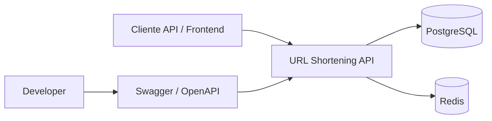
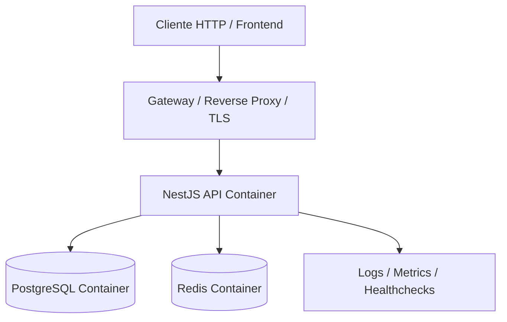
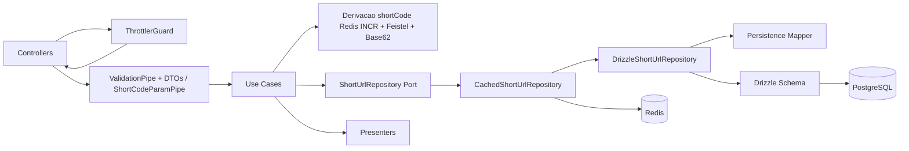
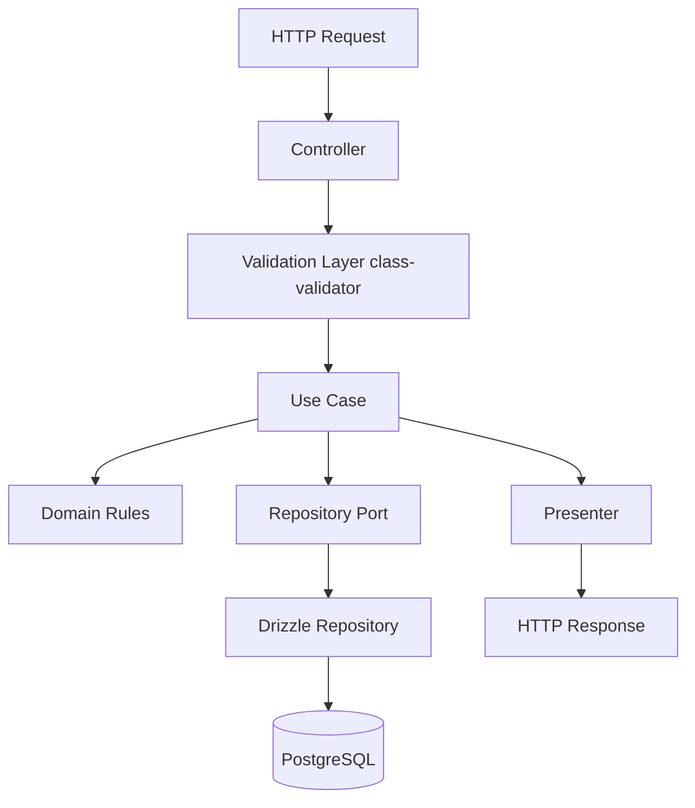
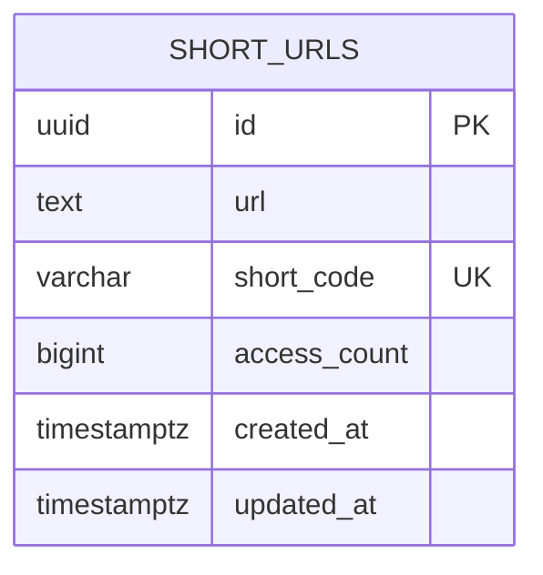
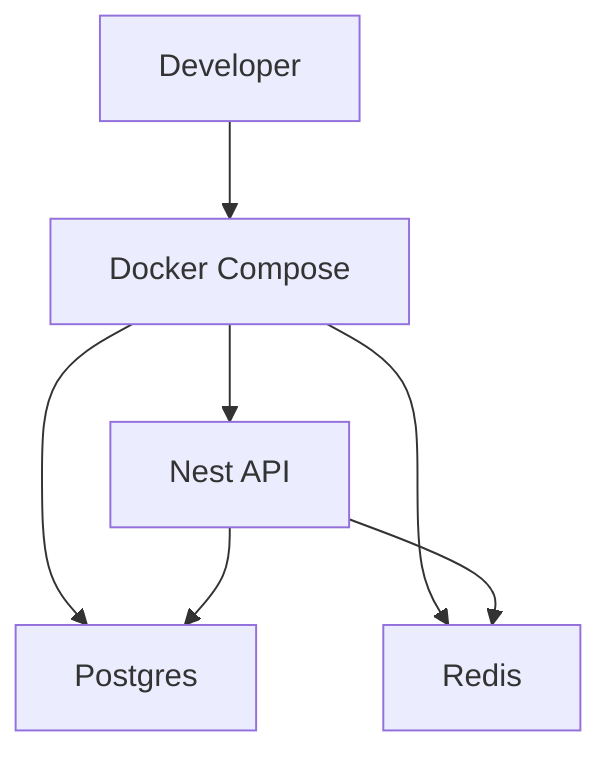
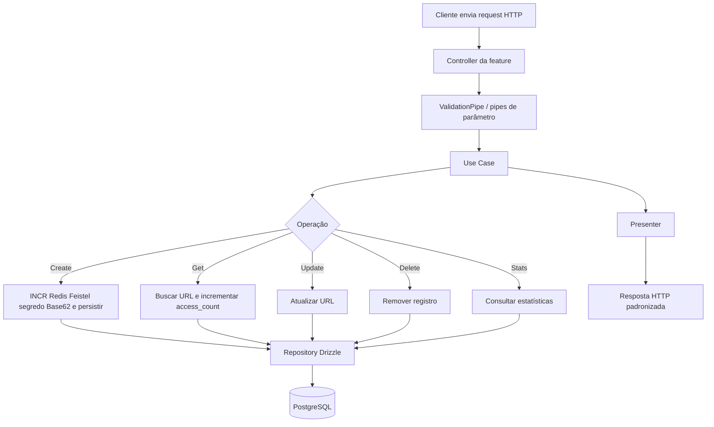

# Planejamento completo da feature — URL Shortening Service

## 1. Objetivo

Projetar de ponta a ponta a feature **URL Shortening Service** usando **NestJS + TypeScript strict + class-validator/class-transformer + Drizzle + PostgreSQL + Redis + Docker Compose + Swagger**, com organização por **domínio/feature**, foco em segurança, observabilidade, consistência arquitetural e facilidade de evolução.

Este documento cobre:

- escopo funcional da feature
- requisitos funcionais e não funcionais
- decisões arquiteturais
- organização por domínio
- contratos da API
- modelagem de banco
- diagrama **C4 Model**
- diagrama **Mermaid UML/ER do banco**
- regras de segurança de banco de dados
- estratégias de cache, rate limit, logging, testes e Docker
- **geração de `shortCode`**: contador Redis (`INCR`) + permutação Feistel com segredo em `.env` (validado com as demais envs) + Base62; detalhes nas seções **15**, **15.2** e **15.3**
- plano incremental de implementação
- estrutura sugerida do projeto

---

# 2. Escopo da feature

A feature permite:

1. criar uma URL encurtada
2. consultar a URL original por `shortCode`
3. atualizar a URL original vinculada ao `shortCode`
4. remover uma URL encurtada
5. consultar estatísticas de acesso
6. registrar acessos ao `shortCode` para compor métricas

Não faz parte do escopo:

- autenticação/autorização
- frontend HTML/CSS
- upload de arquivos
- regras multi-tenant
- custom aliases escolhidos pelo usuário
- expiração de links na primeira versão

---

# 3. Stack e direcionadores técnicos

## Stack obrigatória

- **Node.js + TypeScript**
- **NestJS**
- **PostgreSQL**
- **Drizzle ORM**
- **class-validator** e **class-transformer** na borda HTTP (ValidationPipe global); **class-validator** também na validação de env na subida
- **Swagger/OpenAPI**
- **Docker Compose**
- **Redis** para rate limit distribuído e cache pontual

## Direcionadores arquiteturais

- estrutura por feature/domínio, não por tipo de arquivo global
- separação clara entre controller, use case, service e repository
- repositório como única porta de acesso persistente
- validação de entrada HTTP com DTOs (ValidationPipe + class-validator); parâmetro `shortCode` com pipe dedicado; env validada com classe `EnvVariables` e `parseEnv` (**incluindo o segredo da permutação do `shortCode`**, declarado no `.env` e documentado no `.env.example`, sem valor sensível versionado)
- domínio desacoplado de detalhes de framework e ORM
- observabilidade desde o primeiro commit
- segurança e padronização como requisitos transversais

---

# 4. Requisitos funcionais

## RF-01 — Criar short URL

**POST `/shorten`**

Entrada:

```json
{
  "url": "https://www.example.com/some/long/url"
}
```

Saída esperada `201`:

```json
{
  "data": {
    "id": "uuid",
    "url": "https://www.example.com/some/long/url",
    "shortCode": "abc123",
    "createdAt": "2021-09-01T12:00:00Z",
    "updatedAt": "2021-09-01T12:00:00Z"
  },
  "meta": {
    "requestId": "uuid"
  }
}
```

Nota sobre o exemplo: `shortCode` e `id` ilustram o contrato HTTP. Na implementação, `id` corresponde ao valor do contador Redis em forma de string e `shortCode` deriva de **permutação keyed + Base62** (não de Base62 direto do contador). Valores como `"abc123"` são apenas placeholders de documentação.

Regras:

- validar URL nos DTOs (`@IsUrl` em POST/PUT)
- normalizar string de entrada
- idempotente: se a URL ja existir, retornar shortCode existente (201)
- gerar `shortCode` unico quando URL nao existir: contador monotonico no Redis (`INCR`), permutacao tipo Feistel com segredo em env, codificacao Base62 (sem consulta previa de existencia no banco para o slug)
- `shortCode` entre 4 e 8 caracteres, URL-friendly (com permutacao em espaco de 32 bits o comprimento tende a ate 6 caracteres em Base62; limites do pipe e do banco permanecem validos)
- garantir unicidade no banco com constraint
- retornar erro padronizado em caso de payload invalido

## RF-02 — Recuperar URL original

**GET `/shorten/:shortCode`**

Saída `200`:

```json
{
  "data": {
    "id": "uuid",
    "url": "https://www.example.com/some/long/url",
    "shortCode": "abc123",
    "createdAt": "2021-09-01T12:00:00Z",
    "updatedAt": "2021-09-01T12:00:00Z"
  },
  "meta": {
    "requestId": "uuid"
  }
}
```

Regras:

- validar `shortCode`
- retornar `404` se não encontrado
- incrementar estatística de acesso de forma segura e simples
- não executar redirect no backend, já que o desafio informa que o frontend fará isso

## RF-03 — Atualizar URL existente

**PUT `/shorten/:shortCode`**

Entrada:

```json
{
  "url": "https://www.example.com/some/updated/url"
}
```

Regras:

- validar `shortCode` (pipe dedicado) e body (ValidationPipe global)
- manter o mesmo `shortCode`
- atualizar `updatedAt`
- retornar `404` se inexistente

## RF-04 — Remover short URL

**DELETE `/shorten/:shortCode`**

Regras:

- remoção física na primeira versão
- retornar `204` quando sucesso
- retornar `404` se inexistente

## RF-05 — Consultar estatísticas

**GET `/shorten/:shortCode/stats`**

Saída `200`:

```json
{
  "data": {
    "id": "uuid",
    "url": "https://www.example.com/some/long/url",
    "shortCode": "abc123",
    "createdAt": "2021-09-01T12:00:00Z",
    "updatedAt": "2021-09-01T12:00:00Z",
    "accessCount": 10
  },
  "meta": {
    "requestId": "uuid"
  }
}
```

Regras:

- retornar `404` quando `shortCode` não existir
- estatística deve refletir acessos realizados no endpoint de recuperação

---

# 5. Requisitos não funcionais consolidados

## Arquitetura e código

- organização por feature/domínio
- módulos pequenos, coesos e de responsabilidade única
- bootstrap mínimo
- contratos, tipos e utilitários compartilhados centralizados apenas quando realmente compartilhados
- evitar exports desnecessários entre módulos
- providers stateless sempre que possível

## TypeScript

- `strict: true`
- `noImplicitAny: true`
- `strictNullChecks: true`
- `noUncheckedIndexedAccess: true`
- sem `any` desnecessário
- contratos públicos com tipos explícitos
- aproveitar inferência de tipos do Drizzle onde aplicável; DTOs Swagger e validação compartilham a mesma classe

## Validação

- bodies validados pelo ValidationPipe global (`transform`, `whitelist`) e DTOs com decorators class-validator
- `shortCode` validado por pipe dedicado (string primitiva), paridade com regras 4-8 e charset
- separar contratos de entrada HTTP, saída e domínio
- sem sanitização extra de URL além da validação (paridade de idempotência)
- rejeitar payload fora do contrato esperado
- `exceptionFactory` do ValidationPipe produz `VALIDATION_ERROR`, mensagem fixa e `details` com `field` e `message`; o SecurityInputGuard permanece ortogonal (rejeição de padrões perigosos antes dos pipes)

## Segurança

- sem autenticação nesta feature, mas com proteção de superfície
- `helmet`
- `cors` restritivo por ambiente
- `x-powered-by` desabilitado
- filtro global de segurança para `body`, `params`, `query` e `headers`
- política intransigente: payload suspeito de XSS é rejeitado com `HTTP 400`
- HTTPS em ambientes expostos
- HSTS em produção quando aplicável
- limite de payload
- logs sem segredos/dados sensíveis
- secrets fora do repositório
- env validada na inicialização com `EnvVariables` (class-transformer + class-validator) e regras cruzadas em `env-cross-rules.ts`

## Resiliência e abuso

- rate limit com `@nestjs/throttler`
- Redis para throttle distribuído
- implementacao atual: **12 req/min por IP** nas rotas do `ShortenController` (mesmo objeto `THROTTLE_CONFIG`); evoluir para limites distintos por rota se necessario
- timeout de request e integrações
- monitorar padrões abusivos por IP e rota

## Observabilidade

- logger estruturado centralizado
- requestId e correlationId
- interceptor para tracing e latência
- health/readiness/liveness
- métricas mínimas: latência, throughput, taxa de erro, cache hit/miss

## Persistência

- PostgreSQL com constraints reais
- Drizzle como fonte de verdade do schema
- migrations pequenas e versionadas
- queries encapsuladas em repositórios
- paginação obrigatória quando houver listas futuras
- sem `select *`
- índices baseados em consultas reais

## Infra

- Docker multi-stage
- usuário não root
- `.dockerignore`
- app, postgres e redis em containers separados
- healthcheck
- hot reload em dev
- imagem mínima e segura em produção
- graceful shutdown com fechamento de conexões

## Qualidade

- lint + format + typecheck + test + build na CI
- testes unitários, integração e de validação
- seed idempotente
- README claro na raiz
- commits pequenos e incrementais

---

# 6. Decisões principais de arquitetura

## 6.1 Organização por feature

Estrutura sugerida:

```text
src/
  app/
    app.module.ts
    bootstrap.ts

  config/
    app.config.ts
    db.config.ts
    redis.config.ts
    logger.config.ts
    env-variables.ts
    env-cross-rules.ts
    env.parser.ts

  shared/
    contracts/
      api-response.contract.ts
      api-error.contract.ts
      pagination.contract.ts
    http/
      filters/
      interceptors/
      pipes/
    logger/
    result/
    utils/
    health/

  modules/
    short-url/
      short-url.module.ts
      domain/
        entities/short-url.entity.ts
        repositories/short-url.repository.ts
        constants/short-code.constants.ts
        errors/
          short-url-not-found.error.ts
          url-already-shortened.error.ts
          invalid-short-url-state.error.ts
      application/
        use-cases/
          create-short-url.use-case.ts
          get-short-url.use-case.ts
          update-short-url.use-case.ts
          delete-short-url.use-case.ts
          get-short-url-stats.use-case.ts
        services/
          id-generator.service.ts
          base62-encoder.service.ts
          short-code-permutation.service.ts
      http/
        controllers/shorten.controller.ts
        contracts/
        presenters/short-url.presenter.ts
      infra/
        repositories/
          drizzle-short-url.repository.ts
          cached-short-url.repository.ts
        mappers/short-url.persistence-mapper.ts

  infra/
    database/
      schema/
        short-urls.table.ts
```

Estrutura alinhada ao repositório e ao modelo de geração do `shortCode` descrito neste documento; detalhamento adicional na seção 20.

### Motivo

- reduz acoplamento horizontal
- deixa cada feature autocontida
- facilita manutenção e testes
- impede um diretório global gigante por “controllers/services/repositories”

## 6.2 Separação entre camadas

### Controller

Responsável apenas por:

- receber request
- acionar validação da borda
- chamar use case
- devolver presenter/contrato HTTP

### Use case

Responsável por:

- orquestrar regra de negócio
- aplicar fluxo funcional
- decidir sucesso/falha esperada usando Result Pattern

### Service de aplicação

Responsável por:

- capacidades reutilizáveis ligadas à feature, como geração de `shortCode`: contador Redis (`IdGeneratorService`), permutação com segredo (`ShortCodePermutationService`), codificação Base62 (`Base62EncoderService`)
- regras técnicas auxiliares que não pertencem ao controller nem ao repositório

### Repository

Responsável por:

- abstração do acesso ao banco
- queries, inserts, updates e deletes
- nunca receber responsabilidade de regra de negócio complexa

---

# 7. Modelo de domínio

## Agregado principal

### ShortUrl

Representa o link encurtado.

Campos de domínio:

- `id`
- `url`
- `shortCode`
- `createdAt`
- `updatedAt`
- `accessCount`

## Observação de modelagem

Para a primeira versão, existem duas opções válidas:

1. manter `accessCount` diretamente em `short_urls`
2. criar tabela separada para eventos de acesso e/ou tabela de estatística agregada

### Decisão adotada

Para este desafio, a melhor relação entre simplicidade e robustez é:

- tabela principal `short_urls`
- coluna `access_count` na própria tabela
- incremento atômico a cada recuperação bem-sucedida

### Motivo

- o requisito pede apenas contagem total
- reduz complexidade de leitura
- evita joins desnecessários
- simplifica implementação e testes

### Evolução futura possível

Caso seja necessário analytics real, pode-se introduzir:

- `short_url_access_events`
- agregações assíncronas
- métricas por data, IP, user-agent, origem etc.

---

# 8. Contratos e convenções da API

## Formato padrão de sucesso

```json
{
  "data": {},
  "meta": {
    "requestId": "uuid"
  }
}
```

## Formato padrão de erro

```json
{
  "error": {
    "code": "VALIDATION_ERROR",
    "message": "Request validation failed",
    "details": [
      {
        "field": "url",
        "message": "Invalid URL"
      }
    ]
  },
  "meta": {
    "requestId": "uuid"
  }
}
```

## Convenções

- mensagens curtas, claras e seguras
- sem stack trace para cliente
- sem erro bruto do banco exposto
- paginação padronizada para endpoints listáveis futuros
- presenters impedem exposição direta de entidade interna

---

# 9. C4 Model

## 9.1 Context Diagram



### Descrição

- o cliente consome a API REST
- a API persiste dados no PostgreSQL
- Redis apoia rate limiting distribuído e cache pontual
- Swagger documenta e facilita teste/manual review

## 9.2 Container Diagram



### Containers

#### Cliente HTTP / Frontend

- consome endpoints REST
- usa short code para buscar URL original
- faz redirect no frontend

#### Reverse Proxy / Gateway

- TLS
- CORS controlado
- compressão, limites e políticas de borda
- potencial integração com WAF/CDN

#### NestJS API

- controllers
- use cases
- validação com ValidationPipe e DTOs (class-validator)
- rate limiting
- logging
- swagger
- health checks

#### PostgreSQL

- fonte primária de verdade
- constraints, índices, integridade relacional

#### Redis

- throttle distribuído
- cache-aside pontual para consultas quentes, se necessário

## 9.3 Component Diagram — módulo short-url



### Fluxo interno

1. Throttler verifica rate limit (Redis)
2. controller recebe request
3. ValidationPipe e pipes de parâmetro validam entrada (`whitelist` remove propriedades não decoradas no body)
4. use case executa regra
5. repository resolve persistência (cache Redis em hit, Drizzle em miss)
6. presenter monta resposta HTTP estável

## 9.4 Code Diagram simplificado



Nota: no NestJS, guards e interceptors (pré) executam antes dos pipes; o `ValidationPipe` e o `ShortCodeParamPipe` rodam na fase de pipes, antes do método do controller. O diagrama acima é simplificado.

---

# 10. Diagrama Mermaid UML/ER do banco



## Explicação

Para o escopo atual, uma única tabela atende muito bem ao desafio.

### Tabela `short_urls`

- `id`: identificador interno UUID
- `url`: URL original validada e normalizada
- `short_code`: código curto único usado nas rotas públicas
- `access_count`: contador agregado de acessos
- `created_at`: criação em UTC
- `updated_at`: atualização em UTC

## DDL conceitual sugerida

```sql
CREATE TABLE short_urls (
  id UUID PRIMARY KEY,
  url TEXT NOT NULL,
  short_code VARCHAR(32) NOT NULL,
  access_count BIGINT NOT NULL DEFAULT 0,
  created_at TIMESTAMPTZ NOT NULL DEFAULT NOW(),
  updated_at TIMESTAMPTZ NOT NULL DEFAULT NOW(),
  CONSTRAINT uq_short_urls_short_code UNIQUE (short_code),
  CONSTRAINT chk_short_urls_access_count_non_negative CHECK (access_count >= 0),
  CONSTRAINT chk_short_urls_short_code_length CHECK (char_length(short_code) BETWEEN 4 AND 32)
);

CREATE INDEX idx_short_urls_created_at ON short_urls (created_at DESC);
CREATE INDEX idx_short_urls_short_code ON short_urls (short_code);
```

## Observação sobre índice

O índice isolado de `short_code` pode ser redundante se a constraint unique já criar índice equivalente. Na implementação real, manter apenas o índice gerado pela unique constraint é o mais limpo, salvo necessidade específica.

---

# 11. Regras de segurança do banco de dados

## 11.1 Regras estruturais obrigatórias

- usar **PostgreSQL** como fonte primária de verdade
- aplicar **constraint de unicidade** em `short_code`
- aplicar **check constraint** para impedir `access_count < 0`
- `created_at` e `updated_at` obrigatórios, em UTC
- `NOT NULL` em todos os campos essenciais
- tamanho de `short_code` restringido por constraint

## 11.2 Regras de acesso e aplicação

- aplicação nunca acessa banco fora da camada de repositório
- nunca montar SQL com concatenação de entrada do usuário
- preferir query builder do Drizzle
- quando usar SQL raw, encapsular e documentar
- selecionar somente colunas necessárias
- não usar `select *`
- revisar queries críticas com `EXPLAIN` quando surgirem gargalos

## 11.3 Segurança de credenciais e conexão

- credenciais fora do código e do git
- `.env` nunca versionado
- `.env.example` sem segredo real
- conexão via usuário com privilégios mínimos
- banco não exposto publicamente
- acesso restrito à rede interna Docker/VPC
- TLS entre serviços quando houver ambiente distribuído exposto
- rotacionar segredos fora do ciclo de deploy da imagem

## 11.4 Regras de integridade e concorrência

- unicidade garantida no banco e não apenas na aplicação
- com permutação bijetiva, colisão de `shortCode` entre ids distintos é improvável; manter `UNIQUE` no banco como defesa em profundidade; retry por violação de unicidade apenas como rede de segurança (ex.: bug ou mudança de algoritmo)
- incremento de `access_count` deve ser atômico
- transações apenas quando realmente necessárias
- transações curtas
- operações críticas devem ser idempotentes quando aplicável

## 11.5 Regras de observabilidade e auditoria técnica

- não logar query com secrets ou dados sensíveis
- mascarar credenciais de conexão nos logs
- monitorar tempo de query, pool e erros de conexão
- acompanhar saturação do pool e locks quando o sistema crescer

## 11.6 Backups e operação

- backups automáticos por política do ambiente
- teste de restauração periodicamente
- migrations pequenas e revisáveis
- nunca editar migration aplicada
- sempre prever rollback ou migration corretiva

---

# 12. Estratégia de modelagem e persistência com Drizzle

## Princípios

- schema Drizzle como fonte de verdade
- tipos inferidos a partir do schema
- repositório retorna modelo persistente mapeado para entidade/DTO interno
- domínio não depende diretamente do Drizzle

## Exemplo conceitual de tabela Drizzle

```ts
export const shortUrlsTable = pgTable('short_urls', {
  id: uuid('id').primaryKey().notNull(),
  url: text('url').notNull(),
  shortCode: varchar('short_code', { length: 32 }).notNull().unique(),
  accessCount: bigint('access_count', { mode: 'number' }).notNull().default(0),
  createdAt: timestamp('created_at', { withTimezone: true }).notNull().defaultNow(),
  updatedAt: timestamp('updated_at', { withTimezone: true }).notNull().defaultNow(),
}, (table) => ({
  shortCodeLengthCheck: check('chk_short_urls_short_code_length', sql`char_length(${table.shortCode}) between 4 and 32`),
  accessCountNonNegativeCheck: check('chk_short_urls_access_count_non_negative', sql`${table.accessCount} >= 0`),
}));
```

---

# 13. Validação com class-validator / class-transformer

## Estratégia

- um DTO por corpo de requisição, com `@ApiProperty` e decorators class-validator na mesma classe
- ValidationPipe global com `whitelist: true` e `transform: true` (`forbidNonWhitelisted` desligado na entrega atual para paridade com clientes que enviam campos extras)
- parâmetro `shortCode` como string primitiva no `@Param`, com `ShortCodeParamPipe` (regras 4-8, alfanumérico)
- configuração: `plainToInstance` + `validateSync` em `parseEnv`, cache do primeiro resultado válido; regras cruzadas (pool, produção, timeouts DB) em `collectEnvCrossRuleViolations`

## Exemplos conceituais

### Create short URL request (DTO)

```ts
export class CreateShortUrlRequest {
  @ApiProperty({ example: 'https://www.example.com/path' })
  @IsUrl({ require_protocol: true }, { message: 'A URL deve ser válida' })
  url!: string;
}
```

### Short code (pipe)

Validação imperativa no `ShortCodeParamPipe`, lançando `BadRequestException` com o mesmo contrato de erro do ValidationPipe (`VALIDATION_ERROR`, `details`).

## Regras importantes

- não misturar política do SecurityInputGuard com validação de DTO
- padronizar erros de validação via `validationExceptionFactory`
- não misturar validação estrutural com regra de negócio no domínio
- validação deve ocorrer antes do use case

---

# 14. Fluxos principais da feature

## 14.1 Fluxo — criar short URL

```text
Request -> Controller -> ValidationPipe / ShortCodeParamPipe -> CreateShortUrlUseCase
-> INCR Redis -> Feistel com segredo -> Base62 -> persistir (colisao de slug improvavel; UNIQUE no DB)
-> presenter -> response 201
```

## 14.2 Fluxo — recuperar URL e incrementar contador

```text
Request -> Controller -> validar shortCode -> GetShortUrlUseCase
-> buscar por shortCode -> não existe? 404
-> incrementar access_count atomicamente
-> presenter -> response 200
```

## 14.3 Fluxo — atualizar URL

```text
Request -> Controller -> validar param/body -> UpdateShortUrlUseCase
-> buscar registro -> não existe? 404
-> atualizar url e updatedAt -> presenter -> 200
```

## 14.4 Fluxo — deletar URL

```text
Request -> Controller -> validar param -> DeleteShortUrlUseCase
-> delete por shortCode -> não existe? 404
-> 204 sem body
```

## 14.5 Fluxo — consultar estatísticas

```text
Request -> Controller -> validar shortCode -> GetShortUrlStatsUseCase
-> buscar por shortCode -> não existe? 404
-> presenter stats -> 200
```

---

# 15. Estratégia de geração de shortCode

## Requisitos

- **Unicidade** sem depender de `SELECT` de existência antes do insert (escalabilidade do contador).
- **Não enumerabilidade** em relação ao vizinho do contador: o código público não deve revelar `id+1` / `id-1` como no Base62 direto do inteiro.
- **Curto** dentro do permitido pelo produto (pipe e banco: 4 a 8 caracteres na borda HTTP; permutação em 32 bits produz tipicamente até ~6 caracteres em Base62).
- **Segredo operacional**: chave de permutação apenas no servidor (env), nunca no cliente.

## Decisão

1. **Contador** no Redis (`INCR`), como hoje (`IdGeneratorService`), como fonte monotônica de ids numéricos.
2. **Permutação keyed** (rede Feistel ou equivalente criptograficamente razoável) sobre um bloco fixo (ex.: 32 bits), usando segredo derivado de variável de ambiente.
3. **Base62** sobre o resultado da permutação (reutilizar `Base62EncoderService` como formatador do inteiro permutado).

Fluxo no create: `id = await getNextId()` -> `permuted = feistel32(id, secret)` -> `shortCode = base62Encode(permuted)` -> `INSERT` com `UNIQUE(short_code)`.

## Regras

- Charset do `shortCode` na URL: mesmo alfabeto Base62 já validado pelo `ShortCodeParamPipe` (`A-Z`, `a-z`, `0-9`).
- **Bijeção** no espaço permutado: dois ids distintos não devem gerar o mesmo `shortCode` (eliminando colisão lógica por construção, diferente de slug aleatório com retry).
- Manter `UNIQUE` e constraint de tamanho no PostgreSQL como defesa em profundidade.
- **Rotação de segredo**: trocar a chave altera apenas **novos** links; códigos já emitidos permanecem válidos no banco (não há decodificação reversa na leitura: resolve sempre por `short_code`).

## Motivo

- Preserva o modelo **uma escrita por criação** e o gargalo previsível (índice único em `short_code`), sem busca prévia por colisão de slug aleatório.
- Endurece o cenário de enumeração por vizinhança que existia com `Base62(id)` puro, alinhado ao rate limit por IP já adotado.

## 15.1 Impacto na implementação (arquivos e camadas)

Alterações esperadas quando esta decisão for codificada:

| Área | Arquivo / artefato | Natureza do impacto |
|------|--------------------|---------------------|
| Use case | `src/modules/short-url/application/use-cases/create-short-url.use-case.ts` | Trocar `base62Encoder.encode(id)` por `base62Encoder.encode(permutedId)` após serviço de permutação; injetar novo serviço. |
| Novo serviço de aplicação | `src/modules/short-url/application/services/` (ex.: `short-code-permutation.service.ts` ou nome alinhado ao time) | Implementar Feistel (ou FPE) 32 bits, leitura de segredo via construtor/config. Testes unitários com vetores fixos (chave conhecida). |
| Serviço existente | `src/modules/short-url/application/services/id-generator.service.ts` | Sem mudança de contrato público (`getNextId`), salvo documentação. |
| Serviço existente | `src/modules/short-url/application/services/base62-encoder.service.ts` | Sem mudança de regra; entrada passa a ser o uint32 (ou bigint futuro) pós-permutação. |
| Módulo Nest | `src/modules/short-url/short-url.module.ts` | Registrar provider da permutação; possível binding da chave a partir de `ConfigService` / env. |
| Configuração | `src/config/env-variables.ts`, `src/config/env.parser.ts`, `env-cross-rules.ts` (se preciso) | Nova variável **somente** via `.env` local; declarada em `EnvVariables` e validada no **`parseEnv` junto com as demais envs** na subida (falha antecipada se ausente/inválida onde obrigatória). |
| Exemplo de ambiente | `.env.example` (raiz) | Incluir a nova chave com **placeholder sem segredo real**, no mesmo padrão das outras variáveis documentadas. |
| Constantes de domínio | `src/modules/short-url/domain/constants/short-code.constants.ts` | Revisar se `SHORT_CODE_MAX_LENGTH` 8 continua suficiente para o pior caso Base62 do bloco (32 bits cabe em 6 caracteres; margem OK). |
| HTTP | `src/modules/short-url/http/controllers/shorten.controller.ts` | Apenas Swagger/exemplo de `shortCode` se quiser refletir formato típico pós-Feistel (opcional). |
| Pipe | `src/shared/http/pipes/short-code-param.pipe.ts` | Sem mudança obrigatória se comprimentos permanecerem 4 a 8. |
| Repositório / cache / Drizzle | `src/modules/short-url/infra/repositories/drizzle-short-url.repository.ts`, `cached-short-url.repository.ts`, schema Drizzle | Sem mudança: lookup continua por `short_code` string. |
| Demais use cases | get / update / delete / stats | Sem mudança: recebem `shortCode` já persistido. |
| Testes (unitário / integração / E2E) | `*.spec.ts`, `test/*.integration-spec.ts`, `test/app.e2e-spec.ts`, configs Jest em `test/` | **Obrigatório** manter a suíte verde e alinhada ao novo padrão: ver seção 15.2. |
| Documentação de produto | `README.md` (seção modelo de dados) | Alinhar texto que hoje cita apenas `INCR` + Base62 direto; documentar a nova env no setup local se necessário. |

## 15.2 Segredo: `.env`, validação conjunta e `.env.example`

- O segredo da permutação **não** é hardcoded; fica no **`.env`** (arquivo ignorado pelo Git), como as demais credenciais.
- **`EnvVariables`** + **`parseEnv`**: a nova variável passa pelas mesmas etapas de validação que o restante do ambiente (class-validator e, se aplicável, `collectEnvCrossRuleViolations`).
- **`.env.example`**: atualizar na mesma entrega da feature com o nome da variável e um valor de exemplo **não sensível**, para onboarding e CI que montam env a partir do exemplo.

## 15.3 Testes: critério de entrega com o novo padrão

Na implementação da permutação Feistel + Base62, a entrega só está completa se:

- **Unitários** (`npm test`): serviço de permutação (vetores conhecidos com chave fixa), `CreateShortUrlUseCase` e demais specs afetados atualizados (sem depender de `shortCode` derivado de Base62 puro do contador, salvo mocks explícitos).
- **Integração** (`npm run test:integration`): processo Jest carrega a nova env de teste (ou default seguro exclusivo de teste) para que criação de `short_url`, repositório Drizzle e cenários de concorrência continuem válidos.
- **E2E** (`npm run test:e2e`): fluxo HTTP completo (create, get, etc.) permanece passando; `shortCode` retornado deve continuar obedecendo ao `ShortCodeParamPipe`.
- Opcionalmente validar tudo de uma vez com `npm run test:all`.

**Fora de escopo imediato desta decisão**: autenticação em operações de escrita (já listada como evolução natural no README); mudança de rate limit além do já implementado (12 req/min por IP nas rotas do `ShortenController`).

---

# 16. Redis: onde usar e onde não usar

**Uso do Redis nesta feature** (resumo abaixo; detalhes na seção).

## Usar Redis para

- rate limit distribuído (Throttler com `ThrottlerStorageRedisService`)
- cache de leitura por `shortCode` (CachedShortUrlRepository, cache-aside)
- health check (readiness inclui Redis)

## Não usar Redis para

- fonte primária de verdade da URL
- substituir constraints do banco
- esconder deficiência de modelagem

## Implementação atual

- **Throttler**: storage Redis, **12 requisições por minuto por IP** nas rotas expostas em `ShortenController` (POST `/shorten`, GET/PUT/DELETE `/shorten/:shortCode`, GET stats), conforme `THROTTLE_CONFIG` no código
- **Cache**: `findByShortCode` com TTL configurável (`CACHE_TTL_SECONDS`), invalidação em PUT e DELETE
- **Health**: `/health/ready` retorna `degraded` se Redis down
- se Redis cair, cache retorna miss e vai ao DB; throttler pode degradar

---

# 17. Segurança da aplicação relacionada à feature

## Hardening HTTP

- `helmet`
- `cors` restritivo
- limite de payload
- timeout configurado
- `x-powered-by` desabilitado
- filtro global de entrada (body/params/query/headers)
- rejeição `HTTP 400` para argumentos suspeitos (ex.: `<script>`, `javascript:`, handlers inline)
- resposta padronizada para erro

## Logs

- logger estruturado
- sem `console.log` espalhado
- requestId/correlationId
- mascarar dados sensíveis
- logar início/fim de fluxos importantes

## Abuso

- throttle unificado **12 req/min por IP** no controller de shorten (POST, GET, PUT, DELETE, stats), conforme codigo
- monitorar se POST deveria ser mais restritivo que GET em versao futura
- monitorar IPs e user-agents abusivos
- considerar bloqueio progressivo se houver scraping óbvio

---

# 18. Estratégia de testes

Com a evolução do `shortCode` (contador + permutação com segredo + Base62; ver seção 15), esta estratégia exige que **unitários, integração e E2E** sejam **mantidos e atualizados** na mesma entrega: variável de segredo em `.env` / env de teste, validação no `parseEnv`, e suites verdes (`npm test`, `npm run test:integration`, `npm run test:e2e` ou `npm run test:all`).

## Unitários

- permutação Feistel (vetores conhecidos) e integração com Base62 no fluxo de criação
- regras de create/update/delete/get/stats
- result pattern e erros de domínio

## Integração

- repositório Drizzle + Postgres
- incremento atômico de `access_count`
- violação rara de `UNIQUE` em `shortCode` (rede de segurança, não caminho feliz)
- health checks mínimos

## Validação

- DTOs (body) e ShortCodeParamPipe (`shortCode`)
- mapping de erro de validação

## E2E

- create -> get -> update -> stats -> delete
- 400 para payload inválido
- 404 para inexistente

## Concorrência

- múltiplos acessos simultâneos incrementando contador
- tentativas simultâneas de persistir shortCode em cenário controlado

---

# 19. Docker e ambientes

## Containers

- `api`
- `postgres`
- `redis`

## Dev

- volume para hot reload
- compose simples e reprodutível
- comandos claros de setup
- seed idempotente

## Produção

- multi-stage build
- imagem mínima
- usuário não root
- healthcheck
- somente portas necessárias
- secrets injetadas em runtime

## Exemplo conceitual de composição



---

# 20. Estrutura sugerida de módulos e arquivos

```text
src/
  app/
    app.module.ts
    bootstrap.ts

  config/
    env-variables.ts
    env-cross-rules.ts
    env.parser.ts
    app.config.ts
    db.config.ts
    redis.config.ts
    logger.config.ts

  shared/
    contracts/
      api-error.contract.ts
      api-response.contract.ts
      health.contract.ts
    result/
      result.ts
    logger/
      logger.service.ts
    http/
      filters/
        app-exception.filter.ts
      interceptors/
        request-context.interceptor.ts
        timeout.interceptor.ts
        logging.interceptor.ts
      pipes/
        short-code-param.pipe.ts
      utils/
        validation-exception.factory.ts
    utils/
      sanitize-string.ts
      normalize-url.ts
    health/
      health.controller.ts

  modules/
    short-url/
      short-url.module.ts
      domain/
        entities/
          short-url.entity.ts
        repositories/
          short-url.repository.ts
        constants/
          short-code.constants.ts
        errors/
          short-url-not-found.error.ts
          url-already-shortened.error.ts
          invalid-short-url-state.error.ts
      application/
        use-cases/
          create-short-url.use-case.ts
          get-short-url.use-case.ts
          update-short-url.use-case.ts
          delete-short-url.use-case.ts
          get-short-url-stats.use-case.ts
        services/
          id-generator.service.ts
          base62-encoder.service.ts
          short-code-permutation.service.ts
      http/
        controllers/
          shorten.controller.ts
        contracts/
          create-short-url.request.ts
          update-short-url.request.ts
          short-url.response.ts
          short-url-stats.response.ts
        presenters/
          short-url.presenter.ts
      infra/
        repositories/
          drizzle-short-url.repository.ts
          cached-short-url.repository.ts
        mappers/
          short-url.persistence-mapper.ts

  infra/
    database/
      schema/
        short-urls.table.ts

test/
  app.e2e-spec.ts
  jest-e2e.json
  jest-integration.json
  *.integration-spec.ts
```

Observação: `short-code-permutation.service.ts` materializa a permutação Feistel descrita na seção 15 e pode ainda não existir no repositório até a implementação ser concluída.

---

# 21. Regras de naming e padronização

## Pastas

- kebab-case
- estrutura previsível

## Arquivos

- `<ação>-<recurso>.<papel>.ts`
- exemplos:
  - `create-short-url.use-case.ts`
  - `short-url.presenter.ts`
  - `short-code-param.pipe.ts` (shared)

## Classes

- `CreateShortUrlUseCase`
- `DrizzleShortUrlRepository`
- `ShortenController`

## Providers/tokens

- tokens explícitos, ex.: `SHORT_URL_REPOSITORY`
- evitar string solta espalhada; preferir constantes centralizadas

---

# 22. Result Pattern e erros

## Estratégia

- falhas esperadas de negócio retornam `Result`
- exceções reservadas para falhas inesperadas
- borda HTTP traduz erro para contrato padrão

## Exemplos de erro esperado

- `ShortUrlNotFoundError`
- `UrlAlreadyShortenedError`
- `InvalidShortUrlStateError` (conforme domínio)
- erros de validação na borda (`VALIDATION_ERROR` / factory do ValidationPipe)

## Mapeamento sugerido

- validação -> `400`
- não encontrado -> `404`
- conflito técnico de persistência não recuperável -> `500`

---

# 23. Swagger / OpenAPI

## Regras

- documentar todos os endpoints
- alinhar docs com implementação real
- exemplos de request/response padronizados
- documentar códigos `200/201/204/400/404/500`

## Endpoints documentados

- `POST /shorten`
- `GET /shorten/:shortCode`
- `PUT /shorten/:shortCode`
- `DELETE /shorten/:shortCode`
- `GET /shorten/:shortCode/stats`
- `GET /health`

---

# 24. Plano incremental de implementação

## Commit 01 — bootstrap mínimo

- Nest base
- config com env validada (class-validator)
- strict TS
- docker compose com postgres/redis
- README inicial

## Commit 02 — schema e migrations

- tabela `short_urls`
- migration inicial
- seed idempotente se necessário

## Commit 03 — shared core HTTP

- contracts padrão
- exception filter
- ValidationPipe global e factory de erro de validação
- logging/request context interceptors

## Commit 04 — domínio short-url

- entidade
- contrato de repositório
- erros de domínio
- serviços de apoio à geração de código: `IdGeneratorService` (Redis `INCR`), `Base62EncoderService`; **evolução**: `ShortCodePermutationService` (Feistel + segredo via env), conforme seção 15

## Commit 05 — create short URL

- schema / migration
- controller (`ShortenController`) e contratos HTTP
- use case (fluxo: INCR → permutação → Base62 → persistência)
- repository Drizzle (+ cache se aplicável)
- variável de ambiente do segredo em `EnvVariables`, `.env.example` e validação no `parseEnv`
- swagger
- testes unitários, integração e (quando existir) E2E atualizados para o novo padrão de `shortCode`

## Commit 06 — get short URL + incremento de acesso

- endpoint de consulta
- incremento atômico de `access_count`
- testes concorrentes básicos

## Commit 07 — update e delete

- endpoints restantes do CRUD
- testes correspondentes

## Commit 08 — stats

- endpoint de estatísticas
- presenter específico
- documentação final

## Commit 09 — observabilidade e hardening

- health checks
- throttler + Redis (**12 req/min por IP** nas rotas do `ShortenController`, conforme implementação)
- helmet/cors/timeout
- logs estruturados

## Commit 10 — refinamento final

- revisão de nomes
- lint/typecheck/test/build
- README definitivo

---

# 25. README — o que precisa existir

O projeto deve ter `README.md` na raiz com:

- visão geral
- stack
- requisitos para rodar
- como subir com Docker Compose
- como rodar migrations
- como rodar testes
- como acessar Swagger
- variáveis de ambiente necessárias (**incluindo segredo da permutação do `shortCode`**, sem expor valores reais)
- decisões arquiteturais resumidas (incluindo modelo de geração de `shortCode` na seção 15 e uso do Redis na seção 16)
- convenções de commit

---

# 26. Resumo das decisões finais

## Escolhas centrais

- **NestJS** como framework
- **class-validator** e **class-transformer** no lugar de Zod na borda HTTP e na validação de env
- **Drizzle + PostgreSQL** para persistência
- **Redis** para throttle distribuído e cache pontual
- **feature-first architecture**
- **uma tabela principal `short_urls`** na primeira versão
- **`access_count` agregado na própria tabela**
- **Result Pattern** para falhas esperadas
- **Swagger** como documentação viva
- **Docker Compose** com app + postgres + redis
- **Geração de `shortCode`**: Redis `INCR` + permutação Feistel (segredo no `.env`, validado com `EnvVariables` / `parseEnv`) + Base62; ver seção 15
- **Testes**: manter `npm test`, `npm run test:integration` e `npm run test:e2e` verdes ao introduzir a permutação (seção 15.3)

## Resultado arquitetural esperado

Uma feature simples no escopo, mas construída com base sólida de produção:

- clara separação de responsabilidades
- validação forte na borda
- domínio desacoplado
- persistência consistente
- observabilidade mínima desde o início
- segurança transversal
- pronta para evolução futura sem reescrever o núcleo

---

# 27. Próximo passo recomendado

A partir deste planejamento, o próximo artefato ideal é quebrar isso em:

1. backlog técnico por épicos e tasks
2. registro formal de decisões técnicas complementares (opcional; se o time usar outro artefato, mantenha-o independente deste planejamento)
3. estrutura inicial de pastas/arquivos do projeto
4. README base (envs e geração de `shortCode` alinhados à implementação)
5. primeiro conjunto de migrations e contratos

---

# 28. Mermaid adicional — fluxo completo da feature



